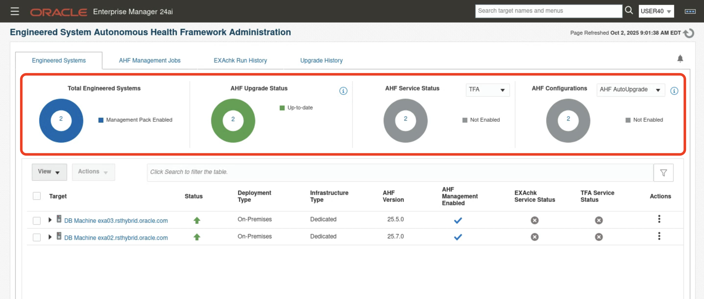
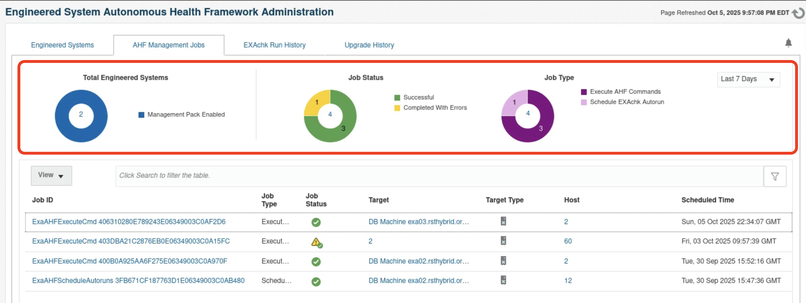

# Autonomous Health Framework Administration
## Introduction
Autonomous Health Framework (AHF) is Oracle’s diagnostic and health management framework for Exadata and Recovery Appliance systems. It helps administrators monitor system health, run compliance checks, and keep diagnostic tools up to date.

**Key Features:**
- Fleet-wide Monitoring: View AHF installation details, upgrade status, service status, auto-run configuration, and Exachk run history across multiple systems.

- Fleet-wide Management: Upgrade AHF across multiple Exadata hosts on demand or via scheduled auto-upgrades, configure and update AHF upgrade settings across clusters.

- Compliance & Commands: Schedule or run Exachk compliance checks across systems.

- Execute AHF-related commands (ahfctl, tfactl, exachk) on multiple hosts at once.

### Objectives

- Learn how to monitor AHF across the fleet 
- Explore how to manage AHF across the fleet
- Learn how to run Exachk compliance checks across systems

## Task 1: Explore AHF Management 

Identify cluster databases whose performance is potentially impacted by other databases or other operating system processes.

1. Log into Enterprise Manager using the credentials **sysman/Cloud2025**. 

    

2. Navigate to **Targets > Exadata**.

    

3. Click on **Actions > Engineered System Autonomous Health Framework Administration**

    

4. Explore **Engineered Systems Tab**

   Engineered Systems tab presents an overview that can be used to determine whether AHF is configured on Engineered System targets according to Oracle-recommended standards.

   - **Total Engineered Systems** – Number of monitored systems, with breakdown of management pack enabled/disabled.
   - **AHF Upgrade Status** – Current upgrade status across all systems.
   - **AHF Service Status** – Enablement status of TFA and Exachk services.
   - **AHF Configurations** – Count of systems with auto-upgrade and autorun turned on or off.

    

    Expand the **DB Machine exa03.rsthybrid.oracle.com** and check the status of AHF, AHF version, Exachk and TFA service status for its virtual nodes.

    

5. Select the **DB Machine exa03.rsthybrid.oracle.com** and click on **Actions**

     Enterprise Manager provides the below actions to manage AHF. 
    - Upgrade AHF 
    - Execute AHF Commands
    - Upgrade Configuration
    - Schedule Exachk Autorun
    - Enable AHF Metrics

    

6. Click on **AHF Management Jobs** tab

    AHF Management Jobs provides a summary of all the Oracle Enterprise Manager AHF management jobs run across all Engineered System hosts.

    - Ring charts shows total Engineered Systems, job Status & job type
    - Table view provides very detailed view of each job that have been run

    

## Learn More

  - [Autonomous Health Framework Administration](https://docs.oracle.com/en/enterprise-manager/cloud-control/enterprise-manager-cloud-control/24.1/emxad/engineered-system-autonomous-health-framework-administration.html)
  - [Engineered Systems Packs](https://docs.oracle.com/en/enterprise-manager/cloud-control/enterprise-manager-cloud-control/24.1/emxad/preface.html)
  - [Enterprise Manager 24ai Documentation Library](https://docs.oracle.com/en/enterprise-manager/cloud-control/enterprise-manager-cloud-control/24.1/index.html)
  - [Enterprise Manager 24ai Tech Forum Video Playlist](https://www.youtube.com/playlist?list=PLiuPvpy8QsiXvGYMP_N3WA6bddXvUH-Y0)

## Acknowledgements
- **Author** - Anand Prabhu, Principal Member of Technical Staff, Enterprise Manager
- **Contributors** - Swapnil Sinvhal, Bjorn Bolltoft, Mahesh Sharma - Enterprise Manager Team, Michael Reed, Maury Edmonds, Geoffrey Grandstaff - Oracle Solution Center
- **Last Updated By/Date** - Anand Prabhu, Principal Member of Technical Staff, Enterprise Manager September 2025