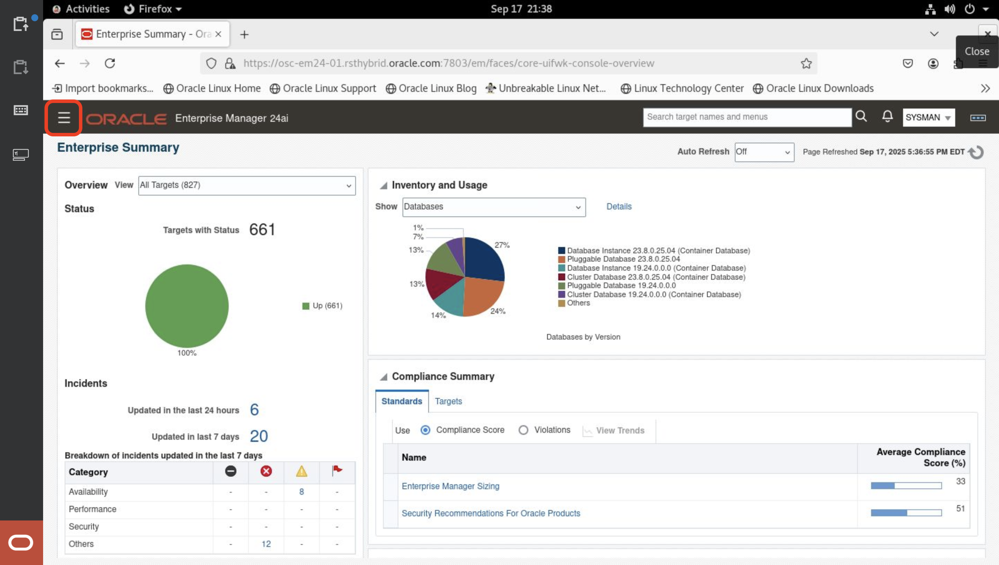
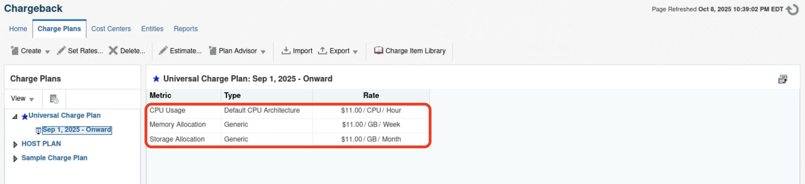
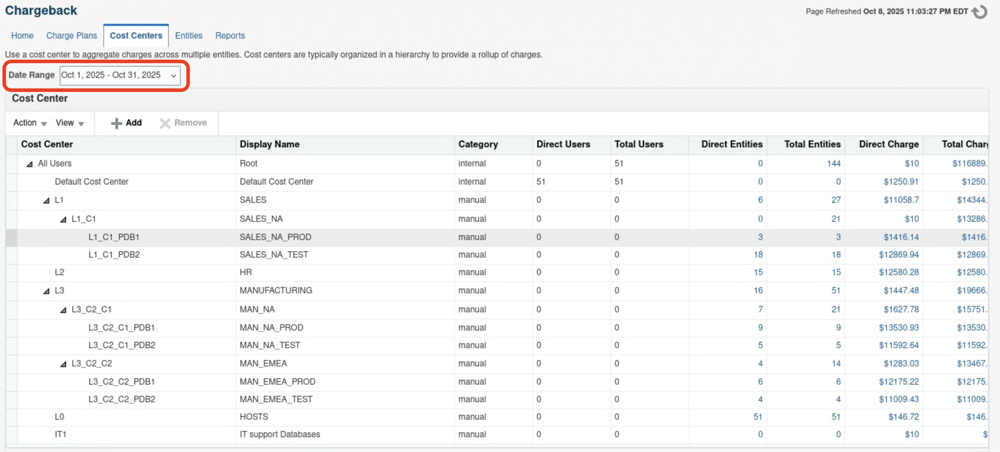
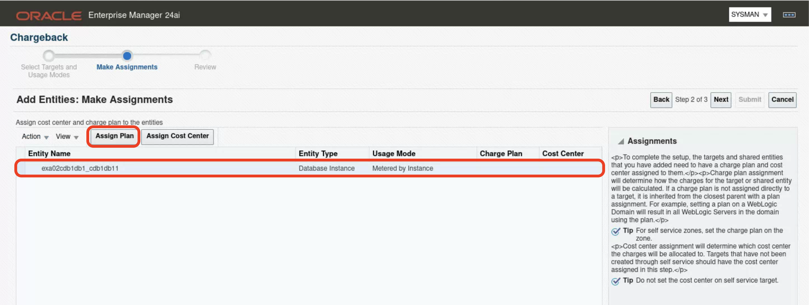
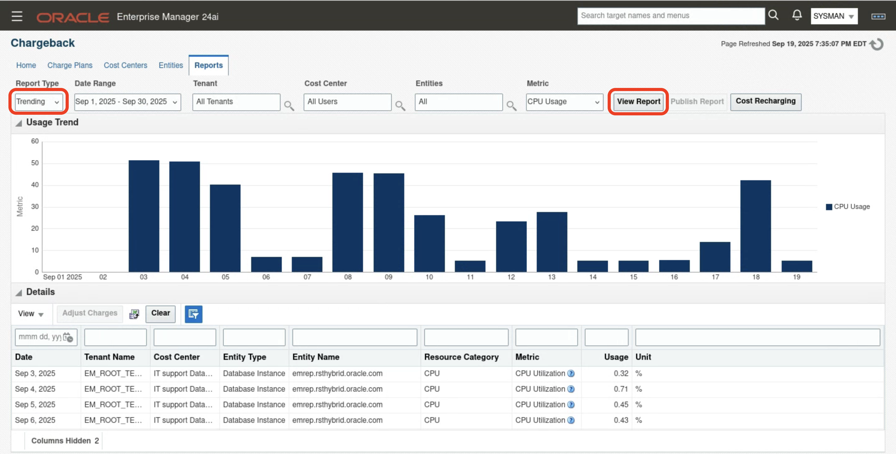

# Chargeback Administration
## Introduction
Chargeback is used to allocate the costs of IT resources to the people or organizations who consume them. Organizations are adopting consolidation platforms such as Oracle Exadata, where there are multiple applications running on a shared hardware platform. There needs to be a way to meter the resources consumed by each application so charges can be applied accordingly. This, in turn, helps to measure the business value of IT investments so that priority can be given to the applications with the greatest return on investment (ROI)

Adopting a Chargeback (or Showback) model can deliver significant benefits to both IT and Line of Business users:
- Chargeback benefits consumers by placing them in control of their IT costs.
- Chargeback benefits IT by helping to drive up utilization rates, thus reducing the number of physical resources they need to manage.

### Objectives
To enable users to configure and implement chargeback for their Exadata Systems within Oracle Enterprise Manager
- Learn how to create a charge plan, cost center and associate a target to a specific charge plan
- Analyze reports detailing the consumption and associated charges

## Task 1: Launch Chargeback Home page

1. Log into Enterprise Manager using the credentials **sysman/Cloud2025**. 

    

2. Click the **hamburger menu** icon.

    

3. Navigate to **Enterprise > Chargeback**.

    

4. Minimize the **Getting Started** as shown below 
    
    

5. Explore **Chargeback homepage**

    Provides the summary of the chargeback showing number of different target types that are assigned to a charge plan, number of cost centers and users & entities that are being tracked for the chargeback.

    

    Chargeback dashboard provides an overview of monthly CPU utilization and charge trends across top-level cost centers.

    
    

    In the lower-left corner, you can find information about data collection, problems, and settings.
    You can define peak and off-peak hours and change the currency symbol. Note that the currency symbol is only a display sign and does not affect calculations. In this environment, the symbol used is **$**.

    

## Task 2: Explore charge plans and cost center tabs 

1. Click on the **Charge Plans** tab 

    
    
    We are using the universal charge plan, which allows us to set rates for CPU, memory, and storage. An extended plan can also be used to provide more flexibility in defining rates.
    
    In this example, the rate is set to $1:
    - CPU is charged per hour
    - Memory is charged per GB/week
    - Storage is charged per GB/month
    
    Both the rate and the time interval can be modified as needed.

    

2. Click on the **Cost Centers** tab 
    

    Cost centers follow a hierarchical structure, with all costs rolled up to the All Users cost center.
    You can import the cost center hierarchy from a legacy LDAP system or create a separate hierarchy in Chargeback with suitable names.

    

    To expand the cost center hierarchy, select **View > Expand All**.
    

    We can now see three groups of cost centers: **SALES, HA, and Manufacturing**.
    Both SALES and Manufacturing are organized into regional hierarchies, and within each region, there are separate prod and test environments.
    
    
    
    The table shows how much each cost center is charged for a specific month, based on the rates defined in the universal charge plan.
    *In this environment, chargeback was enabled starting in September. Therefore, you can view charges only for the month of September.*

    

## Task 3: Add entity by associating a Charge Plan and Cost Center

1. Click on the **Entities** tab 
    

    The Entity tab displays all targets that have been added to chargeback.
    By default, it shows the following details: Entity Name, Entity Type, Charge Plan, Cost Center, Charge Trend, and whether the last data collection succeeded.

    

2. Click on **Add**

    

3. Workflow of adding entities starts and now click on **Add** to select the target 

    

    In the pop-up window for selecting a target, filter by Target Type. First, uncheck **All**, and then check only **Database Instance**.
    

    Click **Search**
    

    Select one target of your choice and then click **Select**
    

    Click **Next**
    

    Select the target and then Click on **Assign Plan**
    

    Select **Universal Charge Plan** and click **OK**
    

    Select the target and then Click on **Assign Cost Center**
    

    Select **SALES_NA_PROD** cost center and click **OK**
    

    Select **Next**
    
    
    **Note:**
    *Since all workshop attendees are using the same Enterprise Manager environment, it is not possible to click Submit. Instead, click Cancel.*
    

    Metrics for the targets that have been added to Chargeback are collected from the Enterprise Manager repository on a daily schedule. Hence, it may take up to 24 hours before charge data appears for any targets that have been added.
    After the collection job has run, the usage and charge data for configured targets will be available from the Reports tab.

4. Review other tabs in the **Entities** page 

    Select the target **emrep.rsthybrid.oracle.com** and on selection shows the collected data under different tabs within Entities page as explained below 
    

    - Metered Data (Chart) :  View a times series graph of data metrics for the entity
        

    - Metered Data (Table) :  View the raw metric data collected
        

    - Show Hierarchy : View the hierarchical relationships of a container entity and its chargeable entities
        

    - Collection Status : View statistical data such as error count and when metric data was last collected
        

    - Problems : View any problems related to the selected entity such as with the data collection process
        

    - Rate of Recovery : View if an entity is on-track to meet the projected monthly figure the Plan Advisor calculated
        

    - Audit : View who performed certain tasks such as assigning a cost center to the entity and when
        

## Task 4: Chargeback Reports

Chargeback provides resource and charge reports at different levels. By default, the summary report displays the total usage for the current month.

1. Click on the **Reports** tab
    
    
    Design your report from the following options:
    - Use the current report cycle or customize a date range to report on.
    - Choose between summary and trending report types. A summary report presents a pie-chart breakdown, while a trending report uses a y-axis multiple bar chart to denote usage trends.
    - Select specific or all tenants.
    - Select specific cost centers or report on all users.
    - Select specific entities or entity types or report on all entities within all entity types.
    - Choose the metric to report on.

    **Charge Summary**: Includes three pie charts that show the breakdown of charges by Cost Center level, Entity Type level, Resource type
        

    **Details**: Provides report details and allows to filter by detail level 
        

2. Change metric to **CPU Usage** and click **View Report**
    

    You can see that there are only two pie charts: one by **Cost Center** and the other by **Entity Type**.
    In this configuration, all hosts are also chargeable entities. The majority of CPU usage is attributed to hosts because all hosts in Chargeback are database hosts, and the CPU consumed by databases is included in the host CPU consumption. However, even after subtracting the database CPU from the host CPU, there is still a substantial amount of CPU time spent outside the database.    

    

    

3. Change report type to **Trending** and click **View Report**

    The report now shows total CPU utilization on a day-by-day basis, based on the filters applied in the top section.
    By applying filters, you can view CPU utilization for individual cost centers and/or entity types.
    
    

    **Note:** Publishing Report option is enabled only when Oracle Analytical Server is installed and integrated with Enterprise Manager. Enterprise Manager uses BI Publisher to generate reports in a variety of formats, including Excel, PowerPoint, HTML, and PDF.

## Learn More

  - [Chargeback Administration](https://docs.oracle.com/en/enterprise-manager/cloud-control/enterprise-manager-cloud-control/24.1/emclo/chargeback-administration.html)
  - [Exadata Fleet Dashboards](https://docs.oracle.com/en/enterprise-manager/cloud-control/enterprise-manager-cloud-control/24.1/emxad/exadata-fleet-dashboards.html)
  - [Enterprise Manager 24ai Documentation Library](https://docs.oracle.com/en/enterprise-manager/cloud-control/enterprise-manager-cloud-control/24.1/index.html)
  - [Enterprise Manager 24ai Tech Forum Video Playlist](https://www.youtube.com/playlist?list=PLiuPvpy8QsiXvGYMP_N3WA6bddXvUH-Y0)

## Acknowledgements
- **Author** - Anand Prabhu, Principal Member of Technical Staff, Enterprise Manager
- **Contributors** - Swapnil Sinvhal, Bjorn Bolltoft, Mahesh Sharma - Enterprise Manager Team, Michael Reed, Maury Edmonds, Geoffrey Grandstaff - Oracle Solution Center
- **Last Updated By/Date** - Anand Prabhu, Principal Member of Technical Staff, Enterprise Manager September 2025

