# Database Impact Advisor
## Introduction
Database Impact Advisor can be run against an individual Exadata system to perform system-wide database CPU usage noisy-neighbor analysis in order to identify databases whose performance is potentially impacted by other databases or other operating system processes.
With the increased number of cores available on Exadata, it becomes possible to place more databases on a single machine. However, this ability comes with a tradeoff of packing databases too tightly into a cluster can lead to erratic or poor performance, while packing 
them too loosely results in unnecessary hardware and Oracle license costs.

### Objectives

- Learn how to use the Database Impact Advisor for effective cluster sizing
- Understand best practices for database placement within clusters
- Configure CPU allocation to optimize performance
- Identify and resolve noisy neighbor issues when databases interfere with each other
- Determine the optimal level of oversubscription on clusters to minimize performance impact across databases

## Task 1: Explore Database Impact Advisor

Identify cluster databases whose performance is potentially impacted by other databases or other operating system processes.

1. Log into Enterprise Manager using the credentials **sysman/Cloud2025**. 

    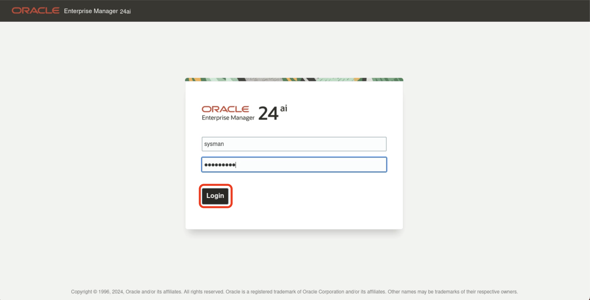

    

2. Click the **hamburger menu** icon.

    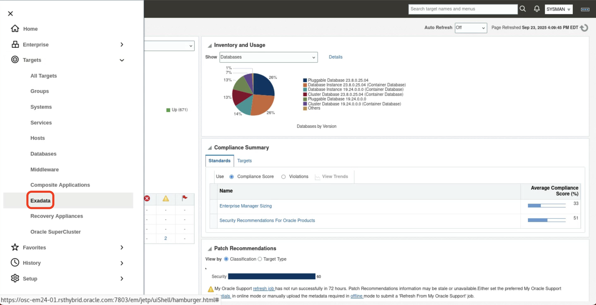

3. Click on the DB Machine **DB Machine exa03.rsthybrid.oracle.com**.

    **DB Machine exa03.rsthybrid.oracle.com** is a half-rack Exadata system consisting of 12 clusters of various sizes, where some clusters run a single database and others have multiple databases. The goal is to analyze these clusters to identify whether any databases are exposed or impacted by the activity of other databases (noisy-neighbors).

    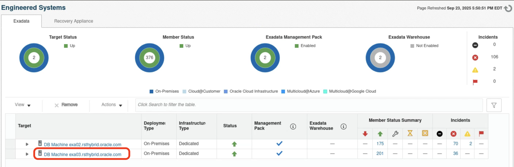

4. Navigate to **Database Machine**, click on the **Database Impact Advisor**

    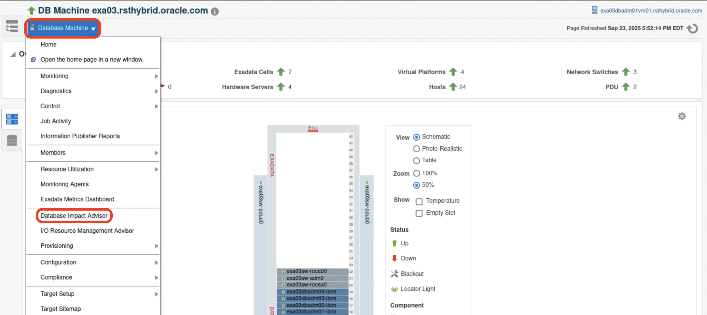

5. Explore **Database Impact Advisor** summary

    Database Impact Advisor is divided into 3 parts as shown below 
    1. Shows the count of impacted and exposed databases

        - **Exposed Status**: A database is exposed when it tries to use more CPU than what is guaranteed to it. This means it might face noisy neighbor issues if other databases are also demanding CPU at the same time.
        - **Impacted Status**: A database is impacted when it is exposed and the machine’s overall CPU usage is very high (above 70%). In this case, it is very likely experiencing noisy neighbor issues.

    2. Pie charts show the summary of the number of clusters, cluster databases, database instances, and hosts

        We can see that there are 12 clusters, 23 cluster databases and 46 databases instances running on 24 hosts showing statuses **PASS or INFO**

        - **PASS:** The cluster is not over-provisioned. No exposed or impacted hours are possible.
        - **INFO:** Database is running normally. No exposed or impacted hours were found.
        - **WARNING:** Database had exposed hours (it tried to use more CPU than guaranteed). It might face noisy neighbor issues.
        - **FAIL:** Database had impacted hours (exposed and host CPU >70%). It is very likely experiencing noisy neighbor issues.
    
    3. Incident summary displays the number of incidents grouped by status: fatal, warning, critical, and escalated.

    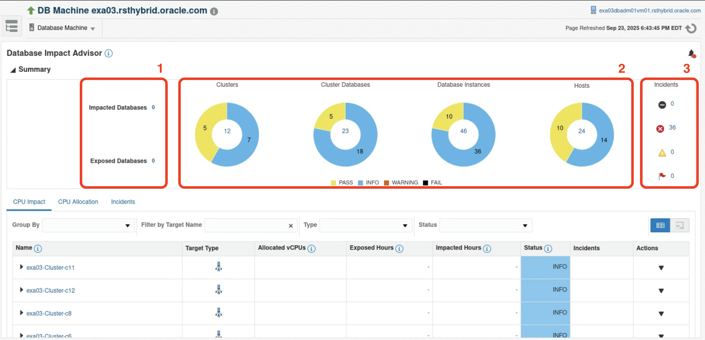

## Task 2: Analyze the CPU allocated and the impact on overall CPU usage for a cluster database

1. Click on the **CPU Allocation** tab

    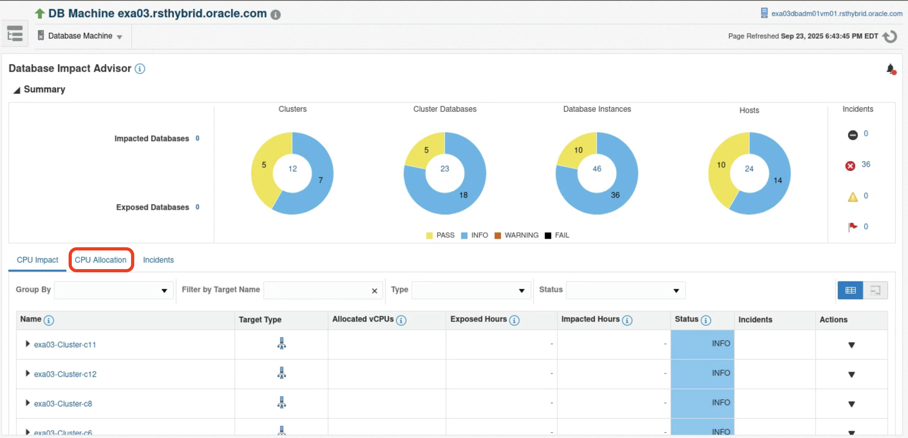

    Here we can see that there are 12 clusters: the largest cluster has 32 cores per node, while the smallest has 12 cores per node.
    In this lab, we will be analyzing the cluster **exa03-Cluster-c12** and current status of this cluster shows as **INFO**.

    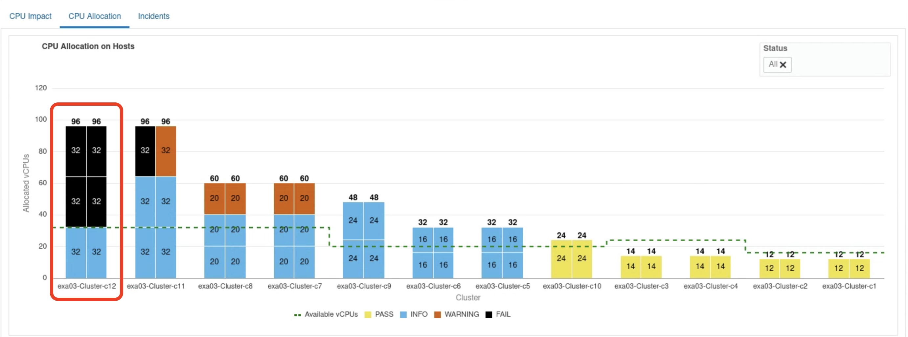

2. Expand the cluster **exa03-Cluster-c12** 

    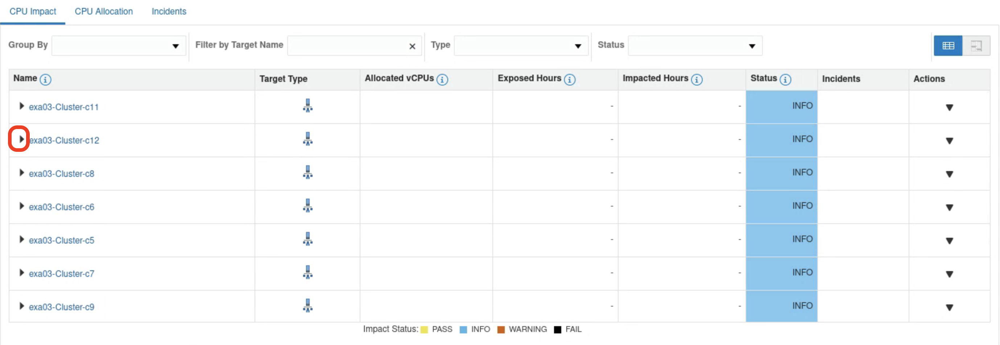

3. Select the database **exa03cdb1db12** and scroll down on selection to view the CPU Usage

    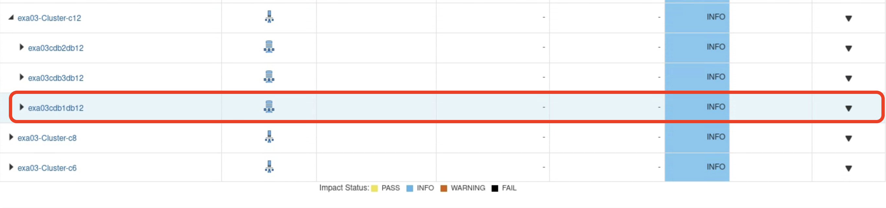

    Chart now shows CPU utilization in cores for this database. Since no CPU_COUNT is set, the database can use all available CPUs when needed. 
    However, the guaranteed limit is 10.67 cores because there are two other databases on the cluster. The light peach area indicates when the database exceeds its guaranteed limit. 
    If this happens, the database may be impacted by other databases and might need to wait for CPU resources.

   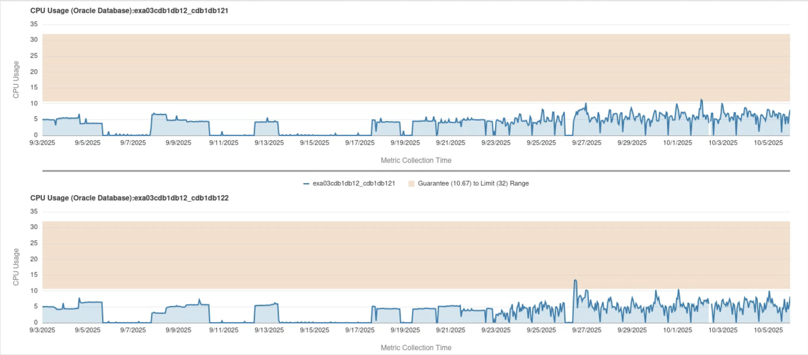

4. Now, select the instance **exa03cdb1db12_cdb1db122** and scroll down on selection to view the CPU Usage for the instance

    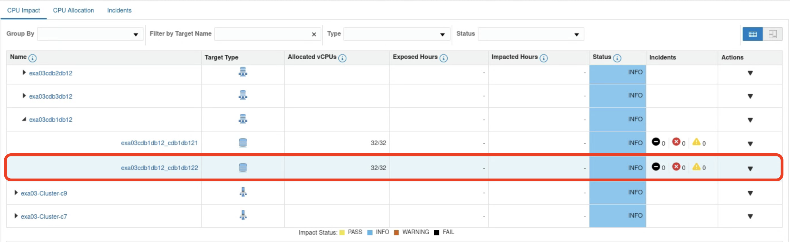

    Checkout the CPU usage for the instance instance **exa03cdb1db12_cdb1db122** which is operating within its guaranteed CPU limits of 10.67 cores. 
    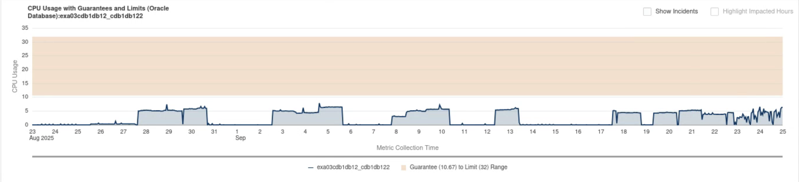

    In the lower graph, you can observe details about other instances running on the same cluster node, along with non-database CPU consumption. This view helps to understand how your database may be impacted by other databases and processes running on the same host.
    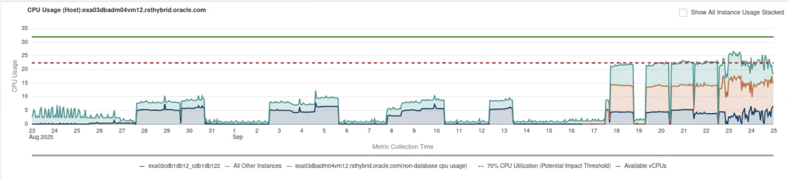

    - Blue line indicates the cpu usage of the instance **exa03cdb1db12_cdb1db122**
        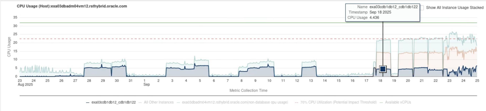

    - Brown line indicates the cpu usage of other instances running on the same node
        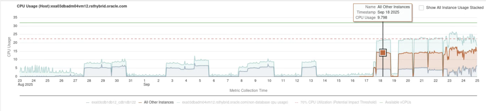

    - Teal line indicates the non-database processes running on the same node 
        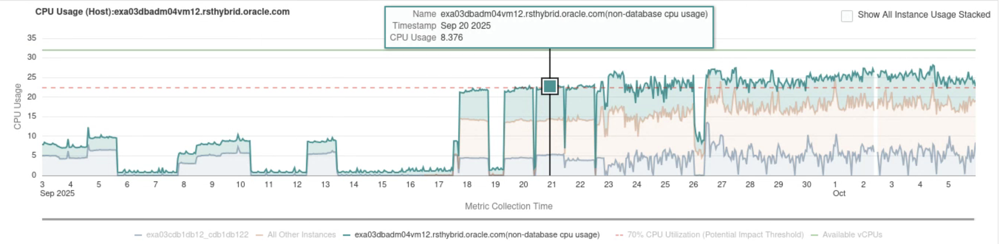

5. Now, check the box **Show All Instance Usage Stacked**

    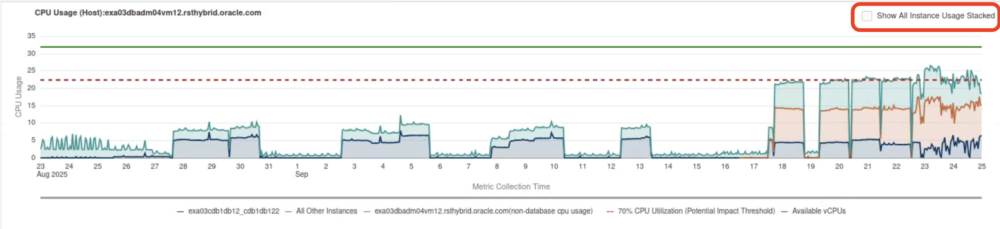

    We can now see the total CPU consumption in the graph and how much each instance is using. The dashed red line represents the 70% utilization level. When the total utilization goes above this threshold, it indicates that one or more databases are impacted. 
    If a database’s CPU usage is below its guaranteed allocation, but other databases are consuming more, the database may still experience performance impact.
    
    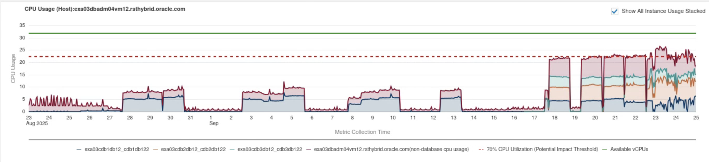

6. Now, select **exa03cdb2db12\_cdb2db122** and then select **exa03cdb3db12\_cdb3db122** to review their CPU consumption

    Review the CPU consumption for each of these databases to compare their usage and understand how they are affected relative to the total consumption on the node.

    Select database instance **exa03cdb2db12_cdb2db122** as shown below
    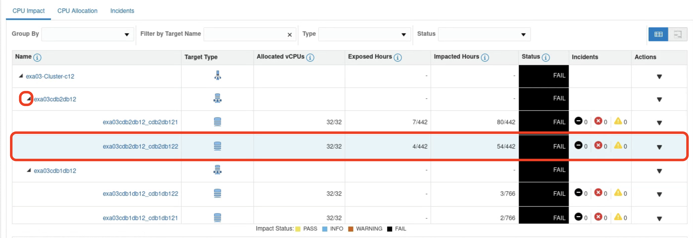

    **CPU Usage of the instance exa03cdb2db12_cdb2db122**
    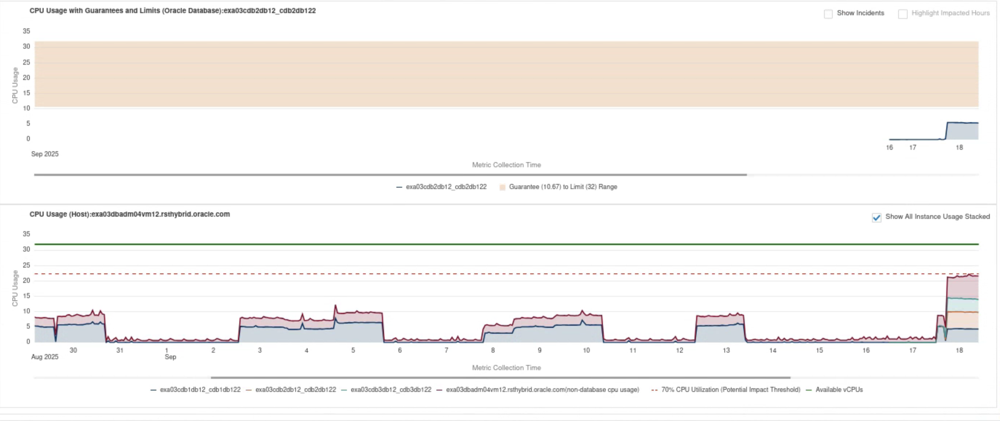

    Select database instance **exa03cdb3db12_cdb3db122** as shown below
    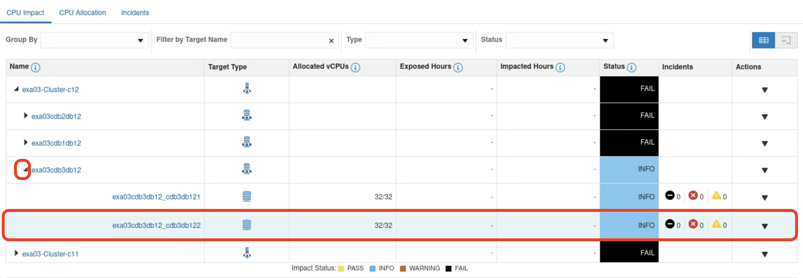

    **CPU Usage of the instance exa03cdb3db12_cdb3db122**
    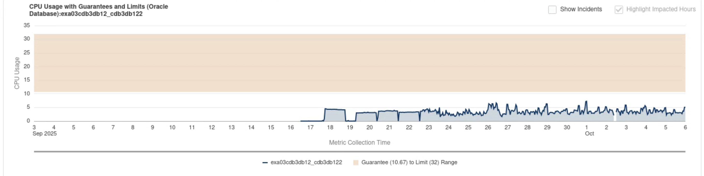

    As we can see, there are times when the databases impact each other, resulting in one or more databases not receiving enough CPU resources.
    
    There are two ways to address the issue of **Noisy Neighbor**:
    - Increase the number of CPUs
    - Adjust the CPU_COUNT to minimize conflicts, using recommendations from the AHF Balancing Report

    Since increasing CPUs can lead to wasted resources, adjusting CPU_COUNT based on AHF balancing report will be our preferred approach.
    
7. Generate AHF Balancing Report 

    Database Impact Advisor provides the ability to generate AHF Balance Reports for clusters, cluster databases, and database instances, helping you identify noisy neighbors. To generate these reports, ensure that AHF (Autonomous Health Framework) is installed on the Exadata nodes.
    AHF Balancing Report uses CPU statistics from all databases in the cluster over the last 30 days. It analyzes both peak and low workloads to recommend an optimal CPU_COUNT setting.

    Select the database cluster **exa03cdb2db12** and click on the arrow as shown below 
    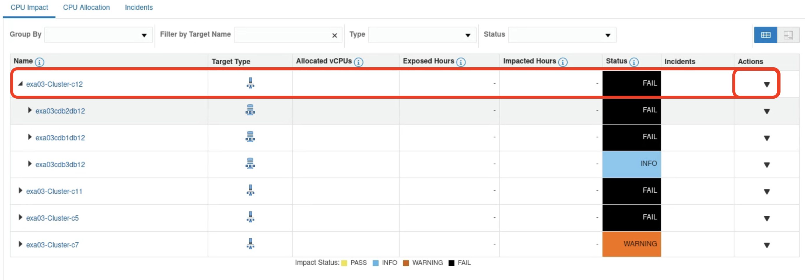

    Click on the **Generate AHF Balance Report**
    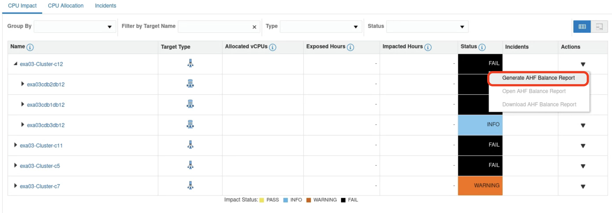

    Click **Yes**
    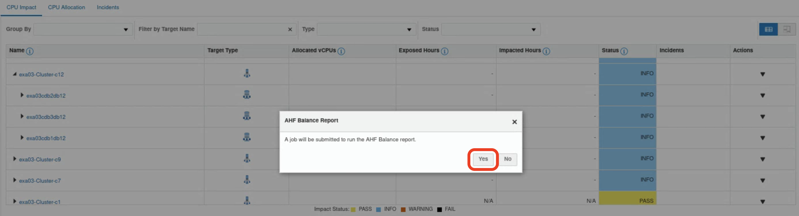

    A job will be submitted and it takes sometime for the job to be completed. So, we have provided a sample report for this lab.
    
    
    **Sample AHF Balance Report**
    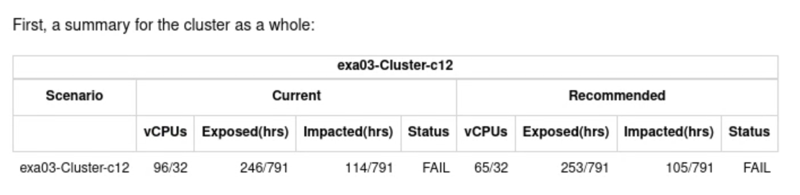
    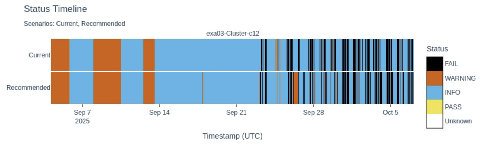

    **Note:**

    *Increasing the Amount of CPUs*
    
    If there is a need to increase the number of CPUs, we should first look at clusters marked as “Pass.” These clusters do not have workloads exceeding 70% of their capacity.
    
    1. Select the yellow section of the pie diagram for clusters.
        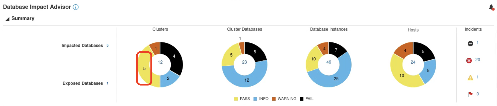
    
    2. This filters the view to only show clusters that pass.
        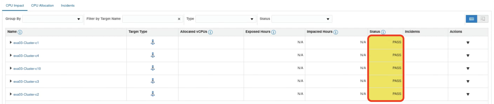
    
    3. Expand cluster **exa03-Cluster-C10**.
        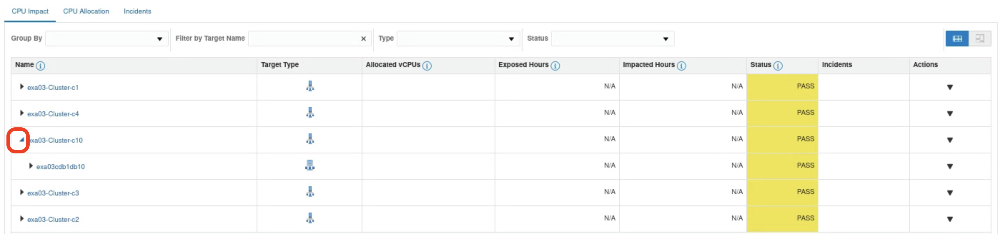

    4. This cluster contains a single database **exa03cdb1db10**
        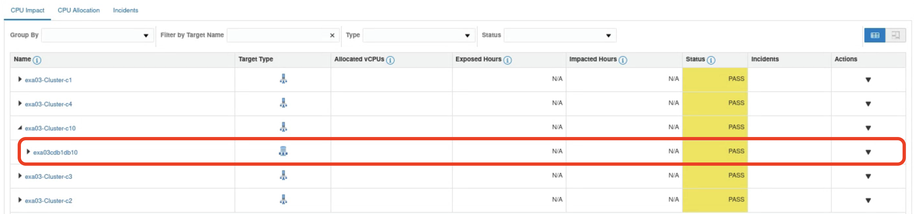

    5. Expand the database **exa03cdb1db10** and select the instance **exa03cdb1db10_cdb1db102**
        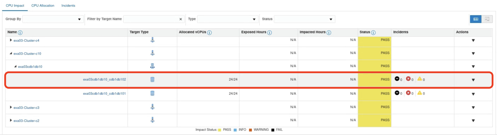

    6. As we can see, this database never exceeds the red striped line, meaning there are available CPU resources. This allows us to release CPUs from this cluster and reallocate them to exa03-Cluster-C12 without increasing the overall number of allocated CPUs.

        

        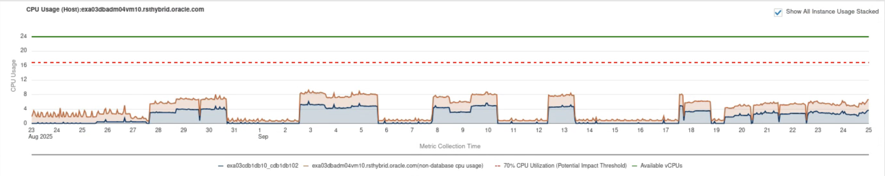

## Appendix

- **CPU Allocation:** CPUs are allocated to databases by setting the database’s CPU\_COUNT parameter, which limits the number of CPUs that the database is permitted to use simultaneously. By default, the database is permitted to use all the CPUs in the machine. Setting CPU_COUNT to 16 (for example) gives a database permission to use up to 16 CPUs simultaneously.

- **Partitioning:** A cluster is said to be partitioned when each database running in the cluster has dedicated CPUs. Each database gets a specific number of CPUs for its exclusive use, and those CPUs are always available to the database, regardless of whether the database needs those CPUs at a point in time or not.
Dedicating CPUs to databases provides perfect performance isolation between databases. When predictable database performance is a primary concern, partitioning is an appropriate database packing strategy. But it comes at a cost: low CPU utilization across the cluster. Many database workloads are ‘spikey’, with high peak CPU consumption that only occurs occasionally.

    Dedicating enough CPUs to each database to support its peak CPU consumption leaves most of the CPUs idle most of the time.
    Oversubscription. Better overall CPU utilization can be achieved when database workloads are spikey by oversubscribing the machines in a cluster. A machine is said to be 

## Learn More

  - [Database Impact Advisor](https://docs.oracle.com/en/enterprise-manager/cloud-control/enterprise-manager-cloud-control/24.1/emxad/database-impact-advisor.html)
  - [Engineered Systems Packs](https://docs.oracle.com/en/enterprise-manager/cloud-control/enterprise-manager-cloud-control/24.1/emxad/preface.html)
  - [Enterprise Manager 24ai Documentation Library](https://docs.oracle.com/en/enterprise-manager/cloud-control/enterprise-manager-cloud-control/24.1/index.html)
  - [Enterprise Manager 24ai Tech Forum Video Playlist](https://www.youtube.com/playlist?list=PLiuPvpy8QsiXvGYMP_N3WA6bddXvUH-Y0)

## Acknowledgements
- **Author** - Anand Prabhu, Principal Member of Technical Staff, Enterprise Manager
- **Contributors** - Swapnil Sinvhal, Bjorn Bolltoft, Mahesh Sharma - Enterprise Manager Team, Michael Reed, Maury Edmonds, Geoffrey Grandstaff - Oracle Solution Center
- **Last Updated By/Date** - Anand Prabhu, Principal Member of Technical Staff, Enterprise Manager September 2025

