# Database Impact Advisor
## Introduction
Database Impact Advisor can be run against an individual Exadata system to perform system-wide database CPU usage noisy-neighbor analysis in order to identify databases whose performance is potentially impacted by other databases or other operating system processes.
With the increased number of cores available on Exadata, it becomes possible to place more databases on a single machine. However, this ability comes with a tradeoff of packing databases too tightly into a cluster can lead to erratic or poor performance, while packing 
them too loosely results in unnecessary hardware and Oracle license costs.

### Objectives

- Learn how to use the Database Impact Advisor for effective cluster sizing
- Understand best practices for database placement within clusters
- Configure CPU allocation to optimize performance
- Identify and resolve noisy neighbor issues when databases interfere with each other
- Determine the optimal level of oversubscription on clusters to minimize performance impact across databases

*Estimated Time*: 25 minutes

## Task 1: Explore Database Impact Advisor

*Note: This is a live environment, so the charts and data shown in the screenshots may vary from what you see in Enterprise Manager when you perform the workshop.*

1. Log into Enterprise Manager using the credentials provided in the portal

    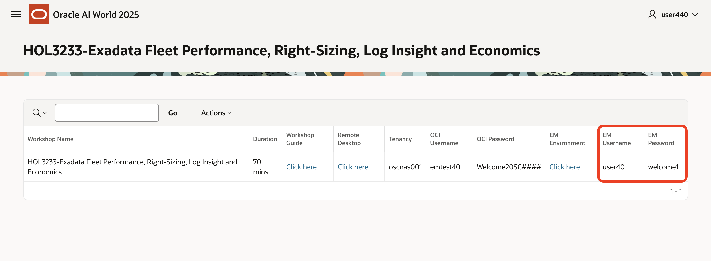

    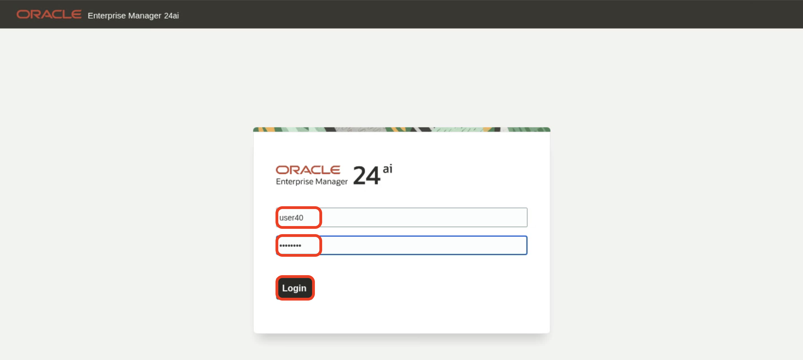

    

2. Navigate to **Targets > Exadata**.

    

3. Click on the DB Machine **DB Machine exa03.rsthybrid.oracle.com**.

    **DB Machine exa03.rsthybrid.oracle.com** is a half-rack Exadata system consisting of 12 clusters of various sizes, where some clusters run a single database and others have multiple databases. 
    
    **Goal:** 
    
    In this lab, you will analyze cluster performance and identify databases experiencing noisy neighbor conditions. You will review CPU allocation across the cluster, compare CPU usage among databases, and determine the impacted time periods. 
    
    The lab also shows how to use the DB Impact Advisor to detect noisy neighbor issues and how to generate CPU allocation recommendations using the AHF balance report.

    

4. Navigate to **Database Machine**, click on the **Database Impact Advisor**

    

5. Explore **Database Impact Advisor** summary

    Database Impact Advisor is divided into 3 parts as shown below 
    1. Shows the count of impacted and exposed databases

        - **Exposed Status**: A database is exposed when it tries to use more CPU than what is guaranteed to it. This means it might face noisy neighbor issues if other databases are also demanding CPU at the same time.
        - **Impacted Status**: A database is impacted when it is exposed and the machine’s overall CPU usage is very high (above 70%). In this case, it is very likely experiencing noisy neighbor issues.

    2. Pie charts show the summary of the number of clusters, cluster databases, database instances, and hosts

        We can see that there are 12 clusters, 23 cluster databases and 46 databases instances running on 24 hosts showing statuses **PASS, INFO, WARNING & FAIL**

        - **PASS:** The cluster is not over-provisioned. No exposed or impacted hours are possible.
        - **INFO:** Database is running normally. No exposed or impacted hours were found.
        - **WARNING:** Database had exposed hours (it tried to use more CPU than guaranteed). It might face noisy neighbor issues.
        - **FAIL:** Database had impacted hours (exposed and host CPU >70%). It is very likely experiencing noisy neighbor issues.
    
    3. Incident summary displays the number of incidents grouped by status: **fatal, warning, critical, and escalated**.

    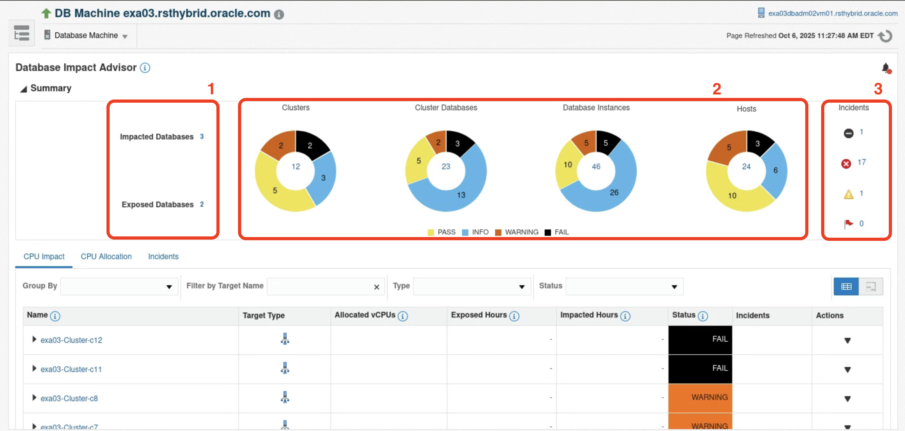

## Task 2: Analyze the CPU allocated and the impact on overall CPU usage for a cluster database

1. Click on the **CPU Allocation** tab

    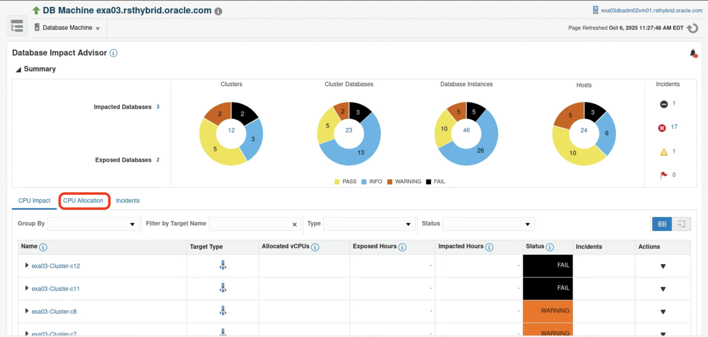

    Here we can see that there are 12 clusters: the largest cluster has 32 cores per node, while the smallest has 12 cores per node.

    
    In this lab, we will be analyzing the cluster **exa03-Cluster-c12** and current status of this cluster shows as **FAIL &  INFO**.

    The **green dashed line** indicates how many cores are allocated to the cluster. For the largest cluster, **exa03-Cluster-c12**, it is 32 cores per instance. Each block of 32 represents a database and its corresponding CPU\_COUNT per instance. 
    
    In this case, the CPU\_COUNT is also 32, which means it is either set to the same value as the total number of cores in the cluster or not set at all. Here, it is not set. With three databases having CPU\_COUNT not set, overallocation occurs because the total allocated cores amount to 96, while only 32 cores are available. 
    
    This results in a **3x overallocation.**

    

2. Now click on **CPU Impact** & Expand the cluster **exa03-Cluster-c12** 

    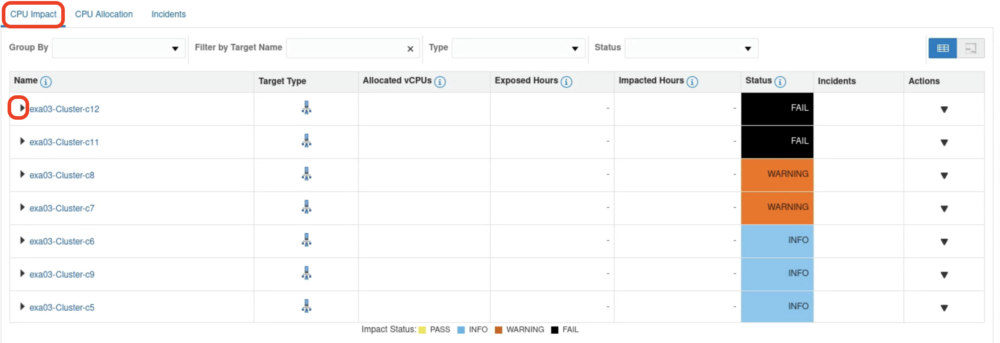

3. Select the database cluster **exa03cdb1db12 by clicking on its row** *(Clicking on the cluster name opens the cluster home page)*, then scroll down to view the CPU usage.

    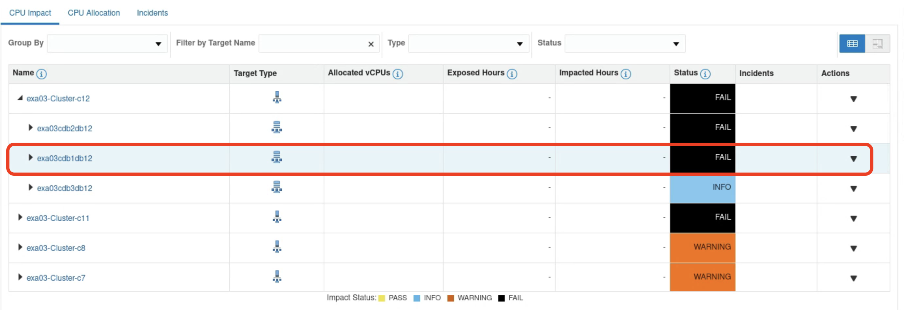

    Chart now shows CPU utilization in cores for this database. Since no CPU_COUNT is set, the database can use all available CPUs when needed. 
    However, the **guaranteed limit is 10.67 cores** because there are two other databases on the cluster. 
    
    The **orange area** indicates when the **database exceeds its guaranteed limit**. 
    
    If this happens, the database may be impacted by other databases and might need to wait for CPU resources.

   

4. Now, expand the database cluster **exa03cdb1db12**, select the instance **exa03cdb1db12_cdb1db122 by clicking on its row** *(Clicking on the instance name opens the instance home page)* and scroll down on selection to view the CPU Usage for the instance

    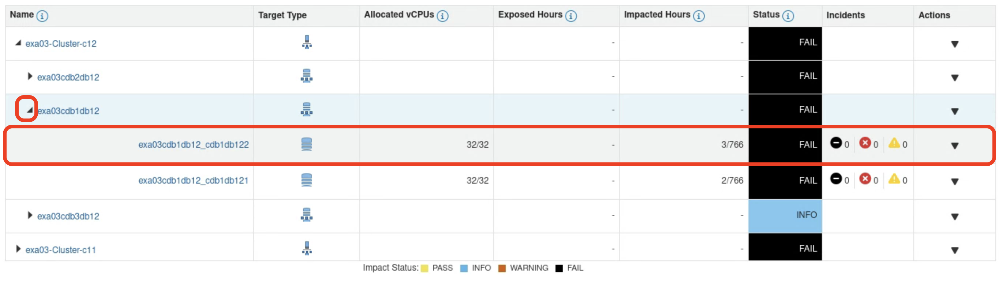

    Checkout the CPU usage for the instance instance **exa03cdb1db12_cdb1db122** is utilizing CPU resources beyond the guaranteed limit of 10.67 cores.
    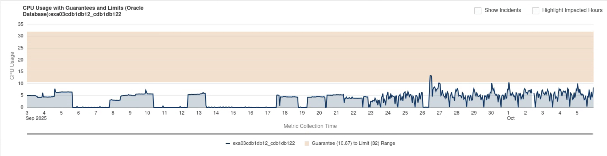

    To identify exactly the impacted hours check **Highlight Impacted Hours** and analyze graph

    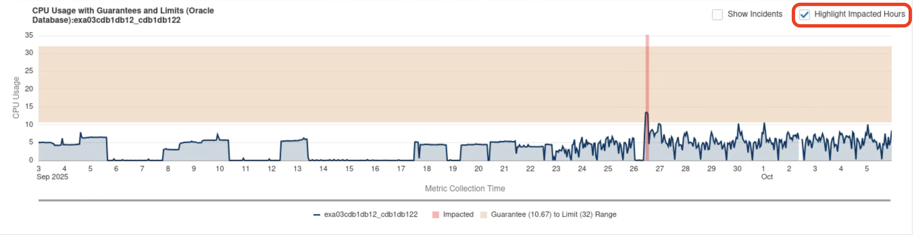

    In the lower graph, you can observe details about other instances running on the same cluster node, along with non-database CPU consumption. This view helps to understand how your database may be impacted by other databases and processes running on the same host.
    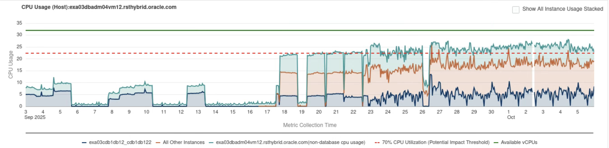

    - Blue line indicates the cpu usage of the instance **exa03cdb1db12_cdb1db122**
        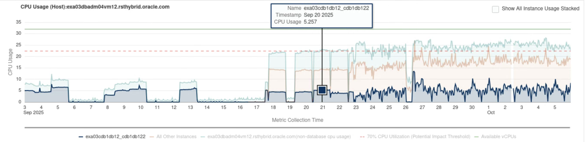

    - Brown line indicates the cpu usage of other instances running on the same node
        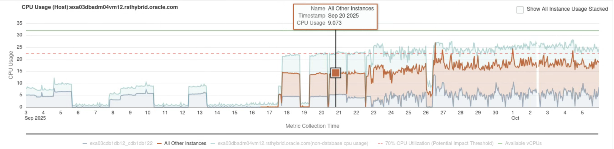

    - Teal line indicates the non-database processes running on the same node 
        

5. Now, check the box **Show All Instance Usage Stacked**

    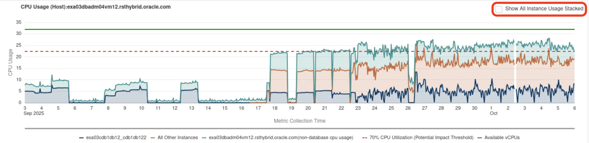

    We can now see the total CPU consumption in the graph and how much each instance is using. The dashed red line represents the 70% utilization level. When the total utilization goes above this threshold, it indicates that one or more databases are impacted. 
    If a database’s CPU usage is above its guaranteed allocation, but other databases are consuming more, the database is experiencing performance impact.
    
    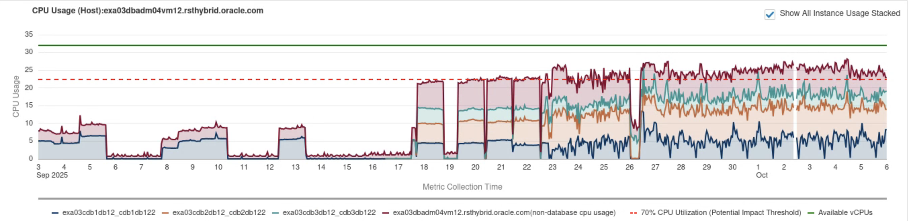

6. Now, select **exa03cdb2db12\_cdb2db122** and then select **exa03cdb3db12\_cdb3db122** to review their CPU consumption

    Review the CPU consumption for each of these databases to compare their usage and understand how they are affected relative to the total consumption on the node.

    Select database instance **exa03cdb2db12_cdb2db122 by clicking on its row** *(Clicking on the instance name opens the instance home page)* as shown below
    

    **CPU Usage of the instance exa03cdb2db12_cdb2db122**
    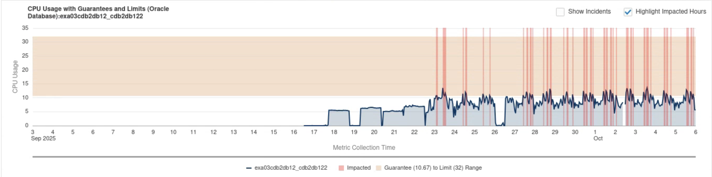
    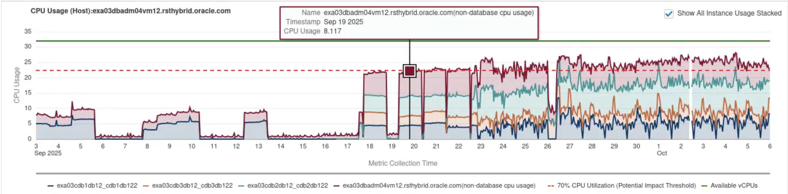

    Select database instance **exa03cdb3db12_cdb3db122 by clicking on its row** *(Clicking on the instance name opens the instance home page)* as shown below
    

    **CPU Usage of the instance exa03cdb3db12_cdb3db122**
    
    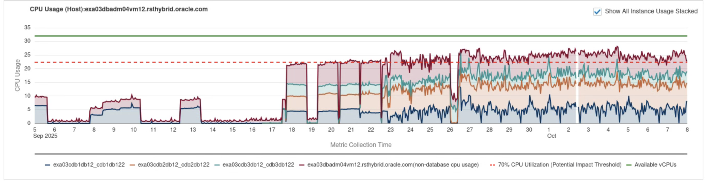

    As shown, the databases **exa03cdb1db12\_cdb1db122** and **exa03cdb2db12\_cdb2db122** are operating above their guaranteed CPU limits, while **exa03cdb3db12\_cdb3db122** is within its limit. All three databases run on the same cluster, which also has non-database CPU usage. 
    
    As a result, **exa03cdb1db12\_cdb1db122 and exa03cdb2db12\_cdb2db122** are impacted and experiencing noisy neighbor conditions. **Database Impact Advisor** detects these issues and marks such databases status as **FAIL**, indicating that these databases need attention and require CPU adjustment.

    There are two ways to address the issue of **Noisy Neighbor**:
    - Increase the number of CPUs on the node (virtual machine)
    - Adjust the CPU_COUNT on the database instance using recommendations from the AHF Balance Report

    Since increasing CPUs can lead to wasted resources, adjusting CPU_COUNT based on AHF Balance report will be our preferred approach.
    
7. Generate AHF Balance Report 

    Database Impact Advisor provides the ability to generate AHF Balance reports for clusters, cluster databases and database instances.
    AHF Balance Report uses CPU statistics from all databases in the cluster over the last 30 days. It analyzes both peak and low workloads to recommend an optimal CPU_COUNT setting.

    On the cluster **exa03-Cluster-c12**, click on the arrow under **Actions** column as shown below.
    

    Click on the **Generate AHF Balance Report**
    

    When generating for the first time, you will be prompted to enter the Enterprise Manager password.
    Enter password **welcome1** and then click **Yes**
    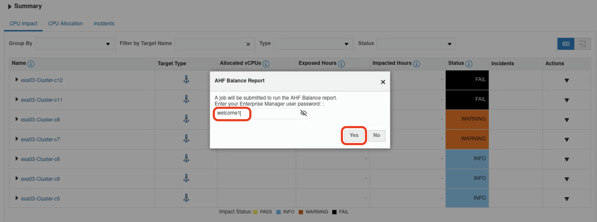

    A job will be submitted and it takes sometime for the job to be completed.

    Once completed, you can choose to either download or open the AHF balance report.
    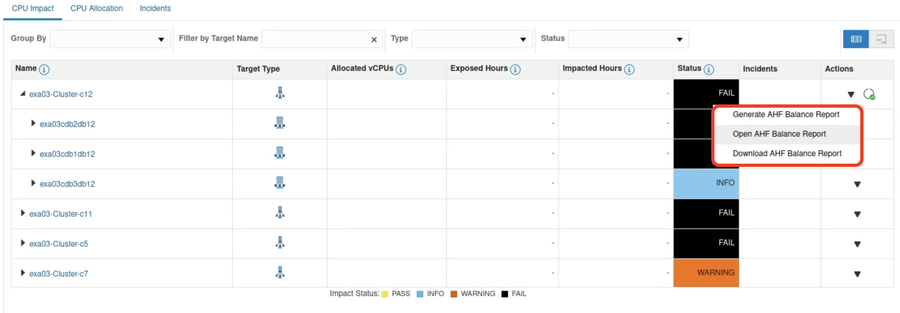

    
    **We have generated the AHF Balance report beforehand for the lab, and the details of the report are explained below.**

    The report contains two parts Summary and Actions.
    
    **Cluster summary for exa03-Cluster-c12** shows that, after adjusting CPUs according to the recommended values, the exposed hours increased and impacted hours are reduced. 
    
    However, the database workloads are still operating above their guaranteed limits, which means they may continue to compete for additional CPU resources. So the status under recommendation shows as **FAIL**.
    
    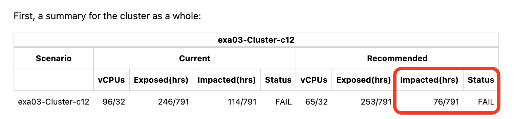
    
    Status Timeline: showing statuses over last 30 days.
    
    
    **Action plan** shows that the CPU to be reduced for the databases **exa03cdb3db12 & exa03cdb2db12** and no recommendations are shown for additions.

    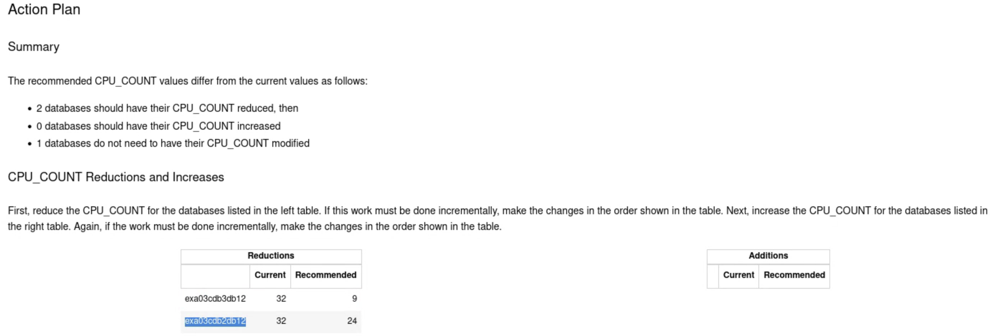

    With these recommended CPU values for each database, the report shows the exposed and impacted hours after the changes, and you can see that both have been reduced for **exa03cdb1db12 & exa03cdb2db12** but increased for **exa03cdb3db12** . However, the database workloads are still operating above their guaranteed limits, which means they may continue to compete for additional CPU resources.

    Ideally, the cluster should be allocated more CPUs, or the databases should be moved to a cluster with available capacity.

    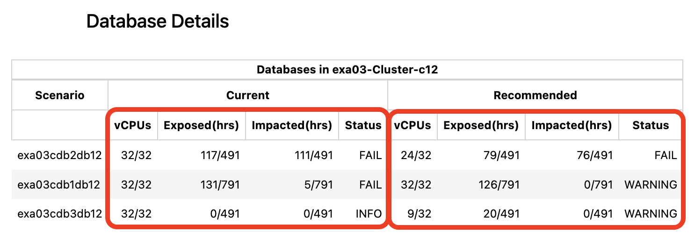

## Task 3: Increasing the Amount of CPUs

If there is a need to increase the number of CPUs, start by examining clusters marked as **Pass**. If these clusters have workloads below 70% of their capacity, you can adjust their CPU allocation based on the AHF Balance Report. This helps ensure that the right amount of CPU is allocated to database workloads. Free up CPUs from underutilized clusters and allocate them to clusters that need additional resources.

1. Select the yellow section of the pie diagram for clusters.
    
    
2. This filters the view to only show clusters that pass.
    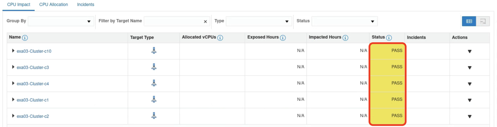
    
3. Expand cluster **exa03-Cluster-C10**.
    

4. This cluster contains a single database **exa03cdb1db10**
    

 5. Expand the database **exa03cdb1db10** and select the instance **exa03cdb1db10_cdb1db102 by clicking on its row** *(Clicking on the instance name opens the instance home page)*
    

6. As we can see, this database never exceeds the red striped line, meaning there are available CPU resources. This allows us to release CPUs from this cluster and reallocate them to **exa03-Cluster-C12** without increasing the overall number of allocated CPUs.

    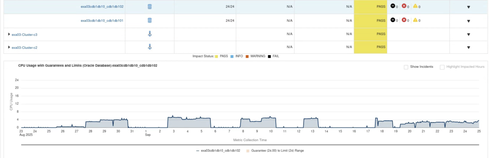

    

## Appendix

- **CPU Allocation:** CPUs are allocated to databases by setting the database’s CPU\_COUNT parameter, which limits the number of CPUs that the database is permitted to use simultaneously. By default, the database is permitted to use all the CPUs in the machine. Setting CPU_COUNT to 16 (for example) gives a database permission to use up to 16 CPUs simultaneously.

- **Partitioning:** A cluster is said to be partitioned when each database running in the cluster has dedicated CPUs. Each database gets a specific number of CPUs for its exclusive use, and those CPUs are always available to the database, regardless of whether the database needs those CPUs at a point in time or not.
Dedicating CPUs to databases provides perfect performance isolation between databases. When predictable database performance is a primary concern, partitioning is an appropriate database packing strategy. But it comes at a cost: low CPU utilization across the cluster. Many database workloads are ‘spikey’, with high peak CPU consumption that only occurs occasionally.

    Dedicating enough CPUs to each database to support its peak CPU consumption leaves most of the CPUs idle most of the time.
    Oversubscription. Better overall CPU utilization can be achieved when database workloads are spikey by oversubscribing the machines in a cluster. A machine is said to be 

## Learn More

  - [Database Impact Advisor](https://docs.oracle.com/en/enterprise-manager/cloud-control/enterprise-manager-cloud-control/24.1/emxad/database-impact-advisor.html)
  - [Engineered Systems Packs](https://docs.oracle.com/en/enterprise-manager/cloud-control/enterprise-manager-cloud-control/24.1/emxad/preface.html)
  - [Enterprise Manager 24ai Documentation Library](https://docs.oracle.com/en/enterprise-manager/cloud-control/enterprise-manager-cloud-control/24.1/index.html)
  - [Enterprise Manager 24ai Tech Forum Video Playlist](https://www.youtube.com/playlist?list=PLiuPvpy8QsiXvGYMP_N3WA6bddXvUH-Y0)

## Acknowledgements
- **Author** - Anand Prabhu, Principal Member of Technical Staff, Enterprise Manager
- **Contributors** - Swapnil Sinvhal, Bjorn Bolltoft, Mahesh Sharma - Enterprise Manager Team, Michael Reed, Maury Edmonds, Geoffrey Grandstaff - Oracle Solution Center
- **Last Updated By/Date** - Anand Prabhu, Principal Member of Technical Staff, Enterprise Manager September 2025

