# Exadata Fleet Dashboards
## Introduction
Exadata Fleet Dashboards provide a unified, high-level view of resource usage, capacity, and performance across an entire fleet of Exadata systems. They enable administrators to quickly identify systems that need attention, analyze component-level usage, and track metric trends, supporting proactive management of both on-premises and cloud-based Exadata and Recovery Appliance environments.

### Objectives
To enable users to efficiently navigate and utilize the Exadata Fleet Configuration Dashboards within Oracle Enterprise Manager, they can
- Gain a high-level overview of resource usage across the fleet
- Identify Exadata systems that require attention
- Analyze usage of individual components within an Exadata system (by consulting the Exadata Fleet Component Capacity dashboard)
- Review and analyze metric trends

## Task 1: Explore Fleet Configuration Dashboard

Exadata Fleet Configuration dashboard shows the Exadata hardware and software configurations across the Exadata and Recovery Appliance fleet, based on the last known metric collection. You can apply the filters to limit the display to a subset of systems.

1. Log into Enterprise Manager using the credentials **sysman/Cloud2025**. 

    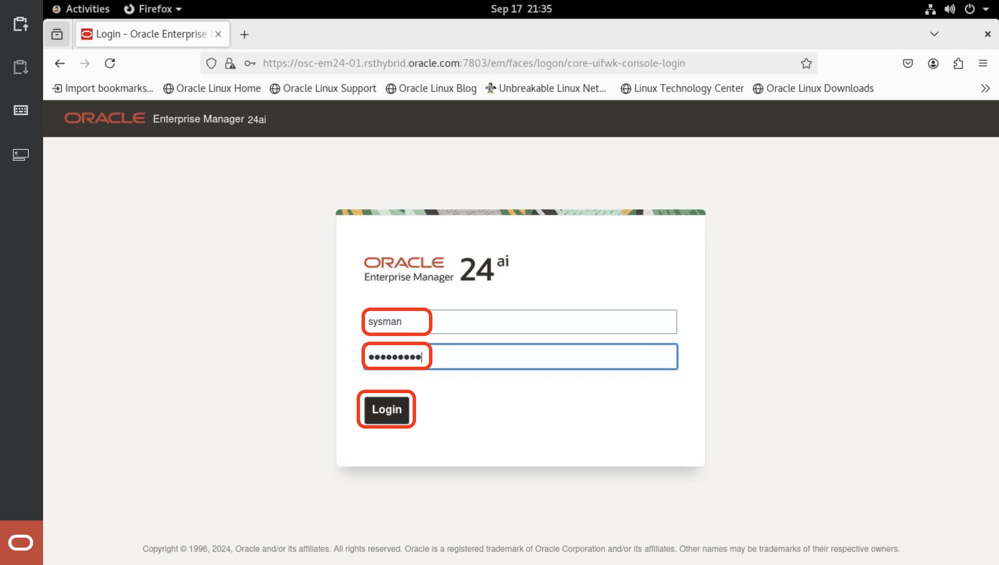

    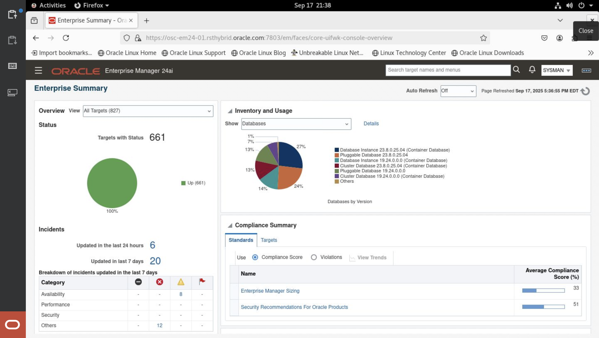

2. Click the **hamburger menu** icon.

    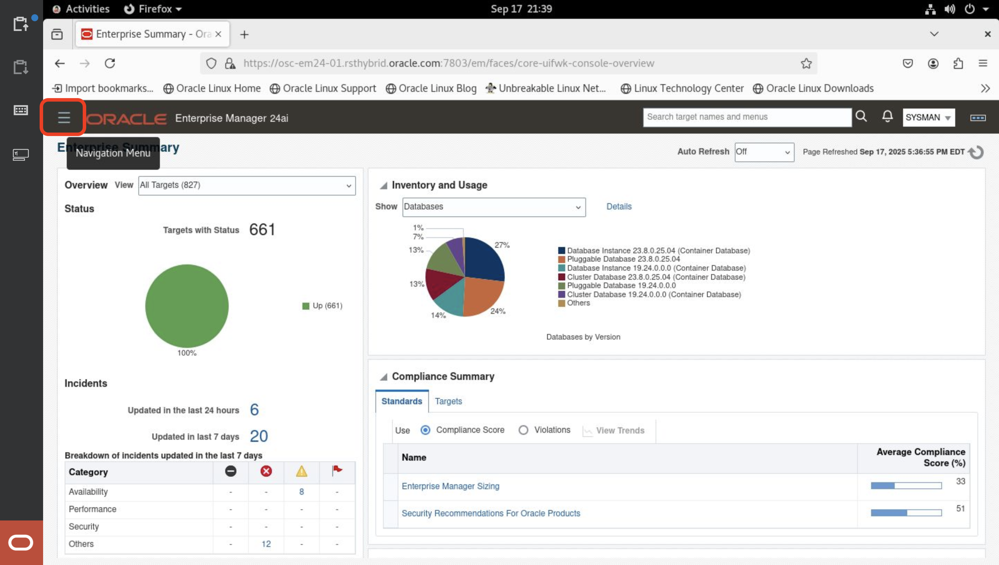

3. Navigate to **Enterprise > Dashboards**.

    

4. On the **Dashboards** page, click on the **Exadata Fleet Configuration** dashboard.

    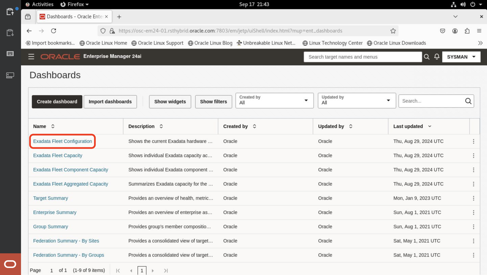

5. Explore **Exadata Fleet Configuration Dashboard**

    **Filters:** Allows to filter content on dashboard using target name, engineered system type, deployment type, generation, DB Server OS, Major version and also allows to filter using the target properties which include Location, Line of Business, Department, Lifecycle status & others. 

    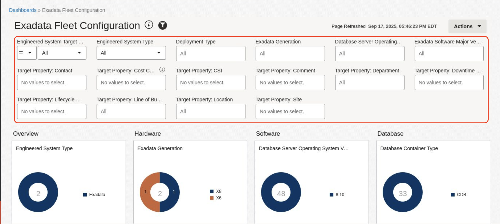

    Exadata Fleet Configuration dashboard provides a structured way to view and analyze the configuration of your Engineered System fleet. It is divided into four vertical sections:
    
    - **Overview:** Provides a high-level summary of your Engineered System fleet. It displays ring charts showing the distribution by system type, deployment type, service type, database deployment option, and fabric type. This helps quickly identify how systems are deployed and configured across environments.

        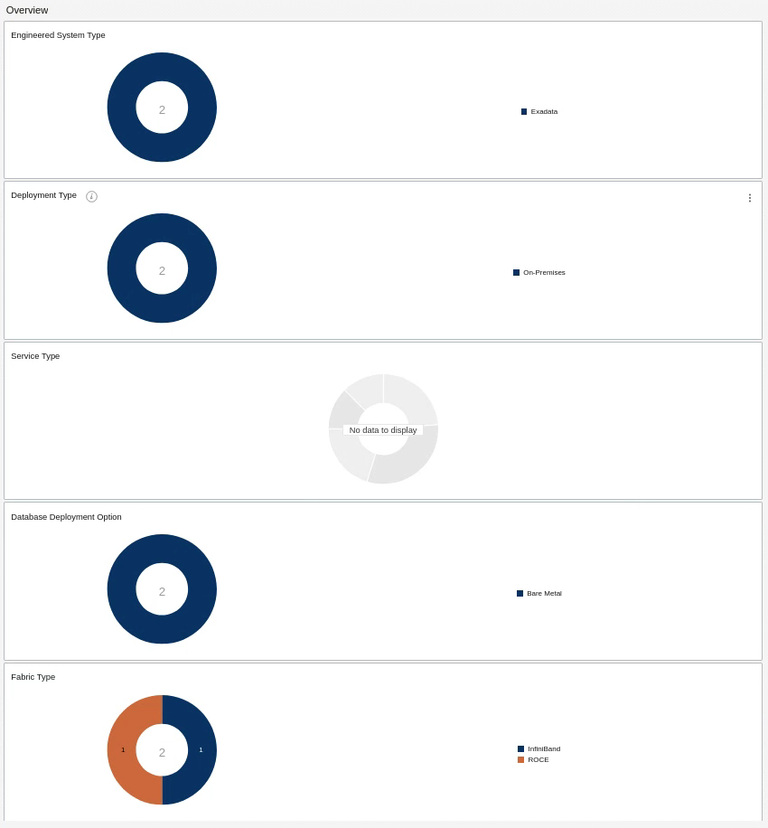

    - **Hardware:** Shows the physical characteristics of the fleet. Ring charts display Exadata generations, server models, storage types, and switch models. This helps assess hardware diversity and standardization.

        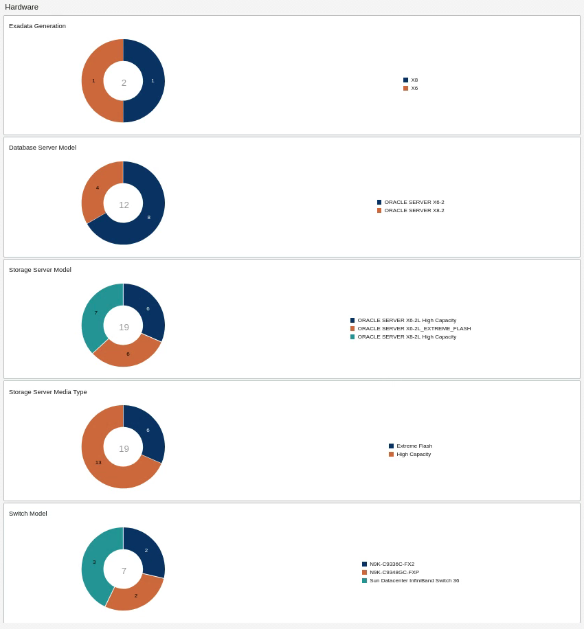

    - **Software:** Summarizes the software landscape across components. It shows distributions of OS versions, ILOM versions, Exadata software versions, and switch firmware versions. This helps track consistency and upgrade needs.

        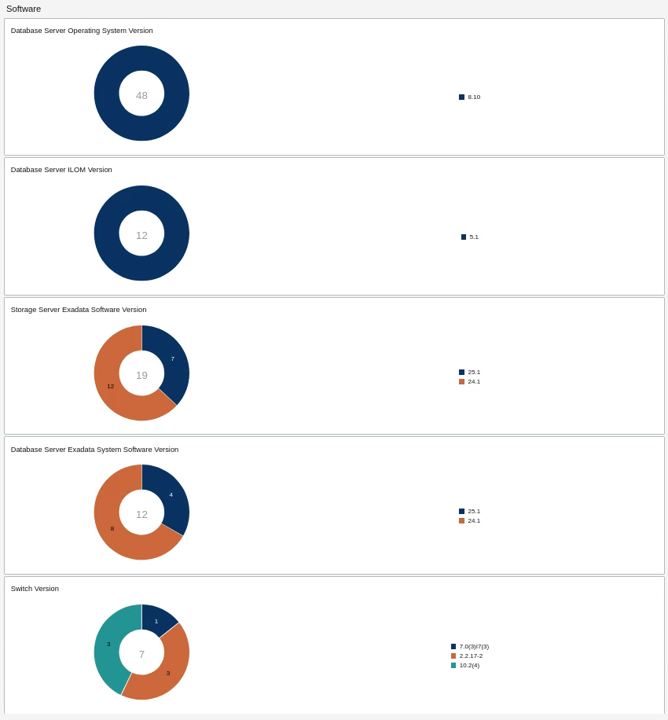

    - **Database:** Provides insights into deployed databases. It shows CDB vs. Non-CDB usage, database and PDB versions, ASM redundancy levels, and Grid Infrastructure versions. This helps monitor database standardization and lifecycle status.

        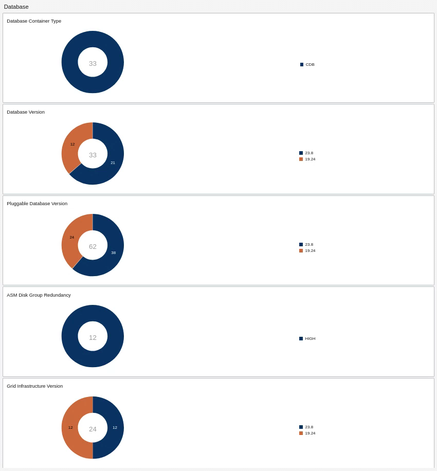

6. Apply the "Target Property: Department" Filter by selecting **HR** department

    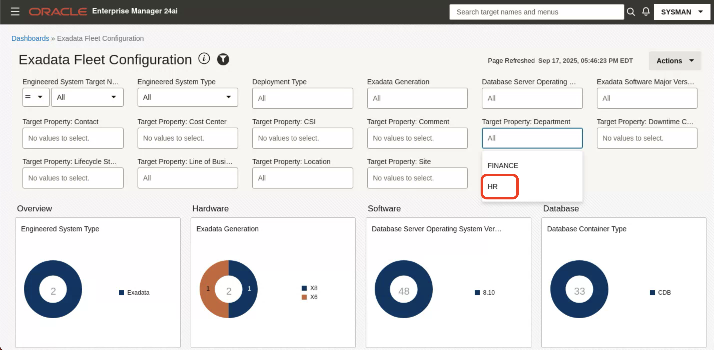

7. Analyze the filtered results 

    HR department operates one X6 generation Exadata system on-premises, running Database Server OS version 8.10 with InfiniBand connectivity and a multitenant database on DB version 19.24.

    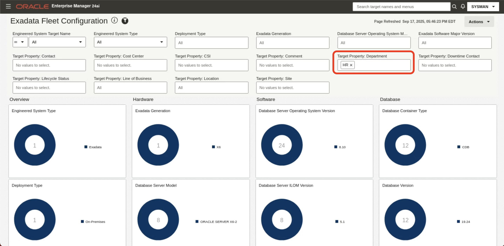

## Task 2: Explore Fleet Aggregated Capacity Dashboard

Exadata Fleet Configuration dashboard shows the Exadata hardware and software configurations across the Exadata and Recovery Appliance fleet, based on the last known metric collection. You can apply the filters to limit the display to a subset of systems.

1. Click on  **Dashboards**.

    

2. On the **Dashboards** page, click on the **Exadata Fleet Aggregated Capacity** dashboard.

    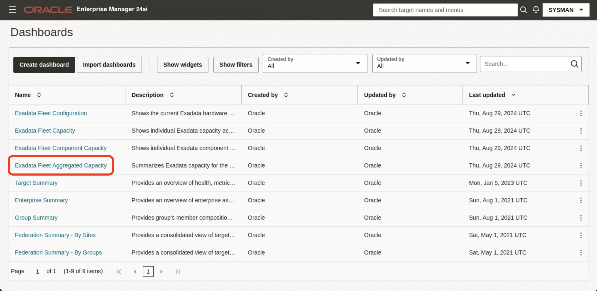

5. Explore **Fleet Aggregated Capacity Dashboard**

    **Filters:** Allows to filter content on dashboard using target name, engineered system type, deployment type, generation, DB Server OS, Major version and also allows to filter using the target properties which include Location, Line of Business, Department, Lifecycle status & others. 

    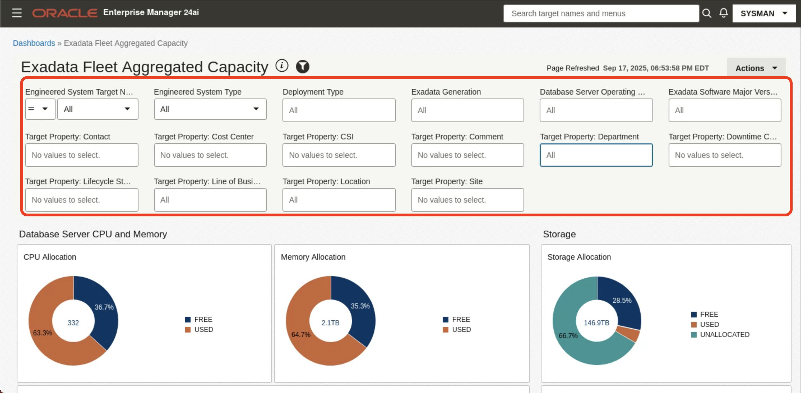

    Exadata Fleet Aggregated Capacity dashboard summarizes the capacity averaged over the last 31 days for the Exadata and Recovery Appliance fleet or filtered subset of the fleet. It provides a high level summary of fleet resource usage indicating overall average utilization. This dashboard is organized into two sections.
    
    - **Database Server CPU and Memory, and Storage:** The CPU, memory, and storage charts summarize 31 day resource allocation and trends across the Engineered System fleet to highlight usage patterns and potential anomalies.

        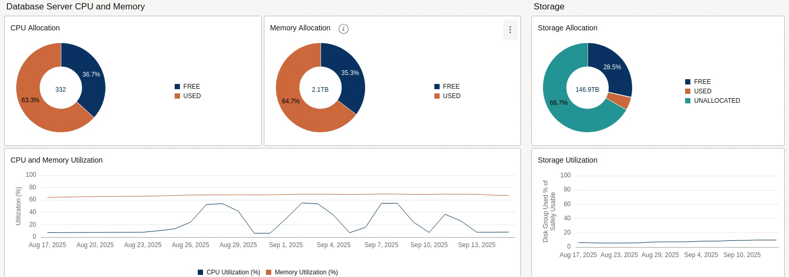

    - **Storage Server I/O:** Provides line charts with aligned timelines to correlate key storage server performance metrics such as latency, throughput, IOPS, I/O load, and utilization—helping diagnose performance issues by viewing related values together.

        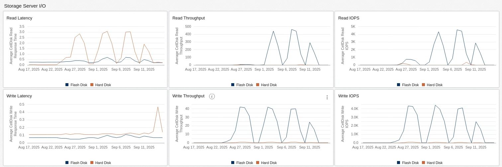
        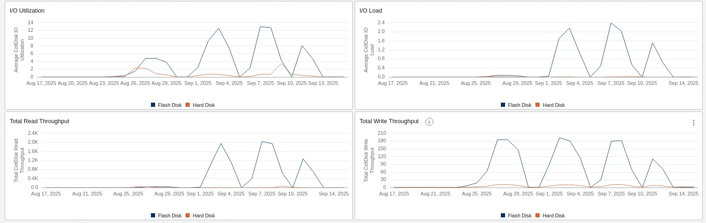

## Task 3: Explore Exadata Fleet Capacity Dashboard

Exadata Fleet Capacity dashboard shows individual Exadata capacity averaged over the last 31 days across the Exadata and Recovery Appliance fleet or filtered subset of the fleet, allowing comparison by system.

1. Click on  **Dashboards**.

    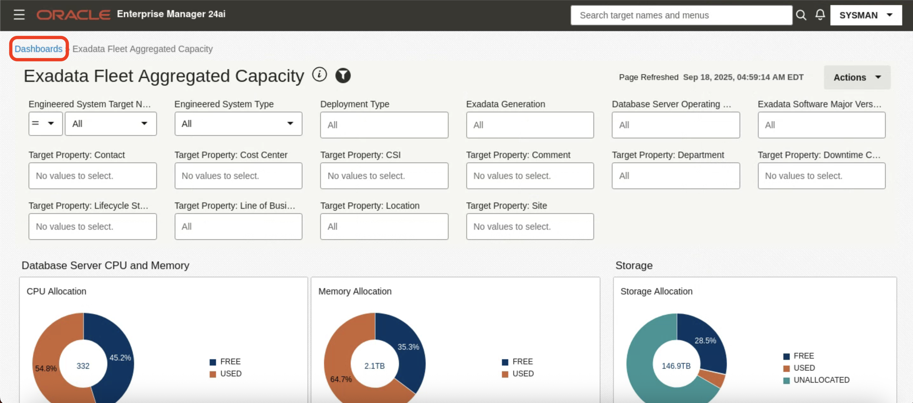

2. On the **Dashboards** page, click on the **Exadata Fleet Capacity** dashboard.

    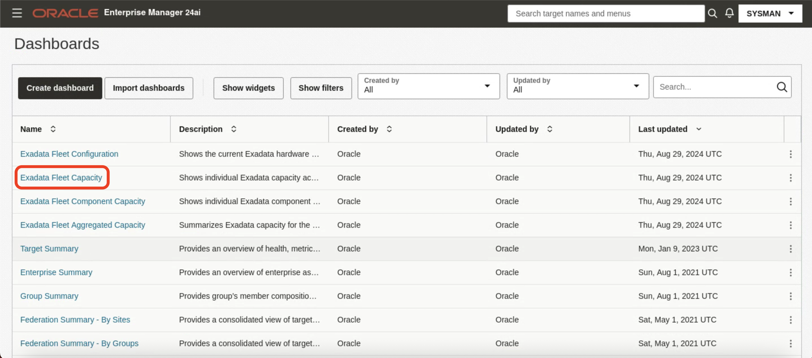

5. Explore **Exadata Fleet Capacity Dashboard**

    **Filters:** Allows to filter content on dashboard using target name, engineered system type, deployment type, generation, DB Server OS, Major version and also allows to filter using the target properties which include Location, Line of Business, Department, Lifecycle status & others. 

    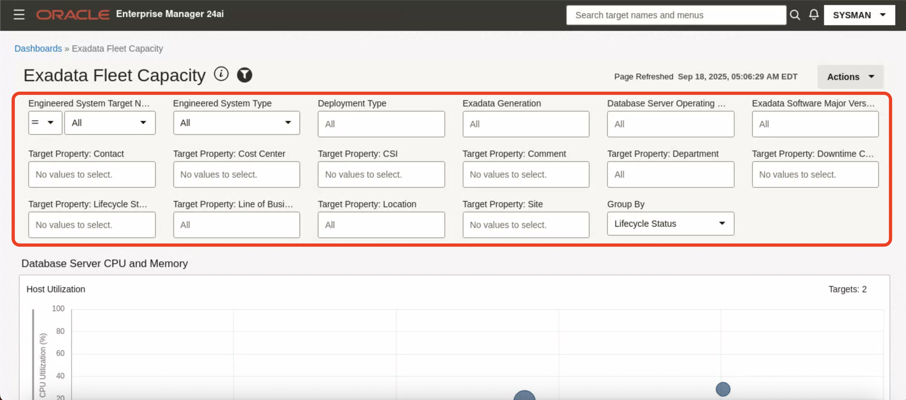

    Exadata Fleet Capacity dashboard includes multiple sections that provides detailed insights into specific dimensions of fleet resource capacity like host utilization, storage utilization, I/O performance, CPU, memory, disk usage, and IOPS (input/output operations per second).Detailed descriptions for each section are provided below:
    
    - **Database Server CPU and Memory:** Host Utilization bubble chart in this section visualizes the average utilization of CPU and memory across all hosts (database servers) in an Engineered Systems over the past month.

        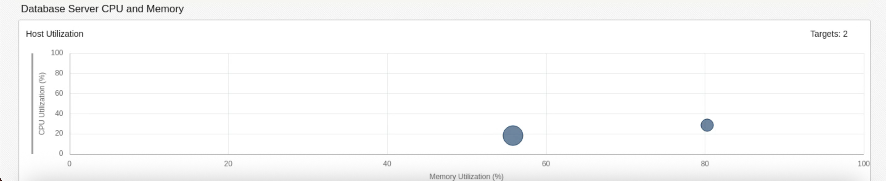

    - **Storage:** Provides an overview of the storage utilization through four scatter plots, offering insights into disk space usage and growth.

        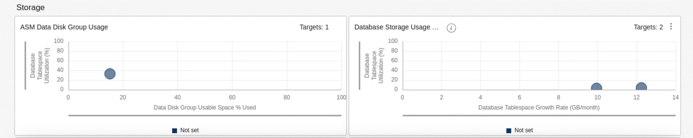

        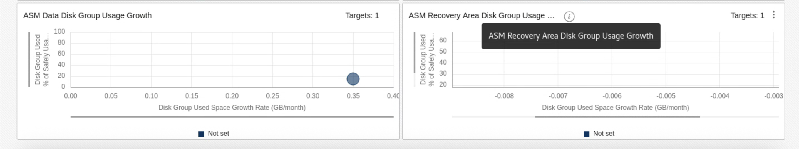

    - **Storage Sever I/O:** Provides an overview of the various performance metrics related to I/O serviced by flash and hard disks across all Engineered System storage servers. Each chart provides detailed insights into different aspects of storage performance, including latency, utilization, IOPS, and throughput. Each bubble on the charts represents an Engineered System. The size of the bubble is proportional to the number of storage servers on the Engineered System.

        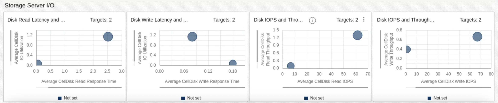
        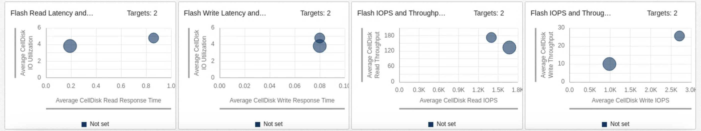
        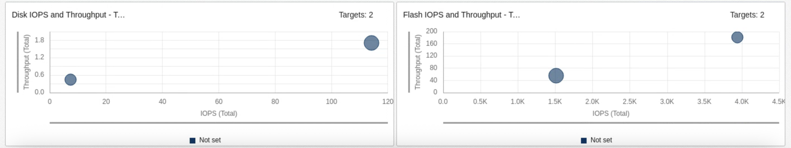

    - **Database Server CPU and Memory Details:** Summarizes CPU and memory utilization for Engineered Systems. This table allows comparison of resource usage across different systems, which can be useful for performance monitoring, capacity planning, and identifying potential bottlenecks in CPU and memory utilization.

        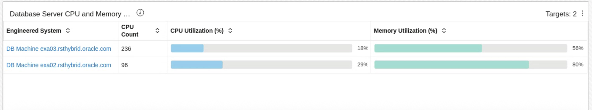

    - **Storage Details:** Provides an overview of the storage details for Engineered Systems. This table allows comparison of storage utilization across different systems, which can provide insights into free space availability, content distribution, and the efficiency of space utilization in both general storage and specific database tablespaces.

        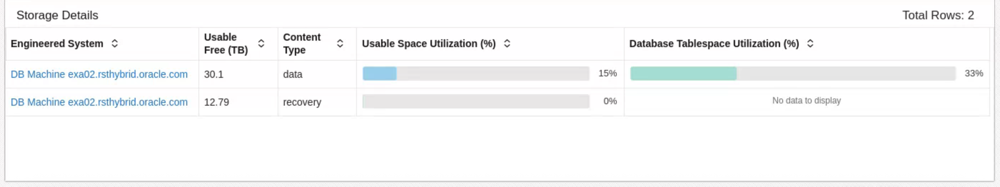

    - **Storage Server I/O Details:** Provides a detailed overview of I/O performance metrics for various Engineered Systems in tabular format. This table allows comparison of I/O performance and utilization across different systems, which can provide insights into storage efficiency and performance bottlenecks in both disk and flash storage.

        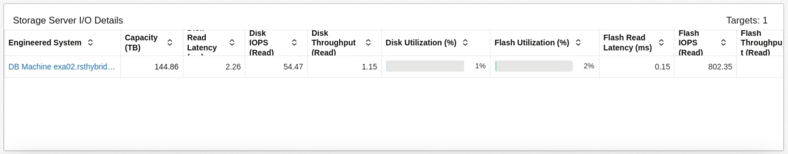

## Task 4: Explore Exadata Fleet Component Capacity

Exadata Fleet Component Capacity dashboard provides a holistic view of fleet capacity and performance metrics at the individual component level. It allows for the identification and comparison of over or under-utilized components, with data averaged over the last 31 days.

1. Click on  **Dashboards**.

    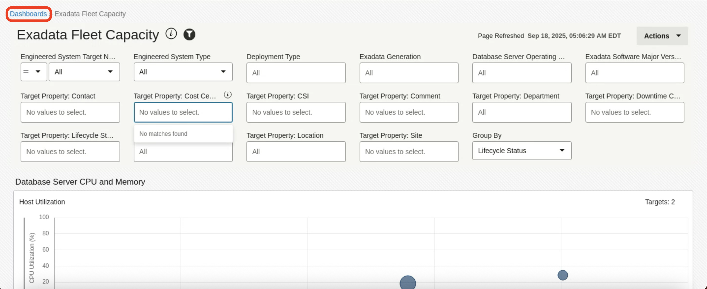

2. On the **Dashboards** page, click on the **Exadata Fleet Component Capacity** dashboard.

    

5. Explore **Exadata Fleet Component Capacity**

    **Filters:** Allows to filter content on dashboard using target name, engineered system type, deployment type, generation, DB Server OS, Major version and also allows to filter using the target properties which include Location, Line of Business, Department, Lifecycle status & others. 

    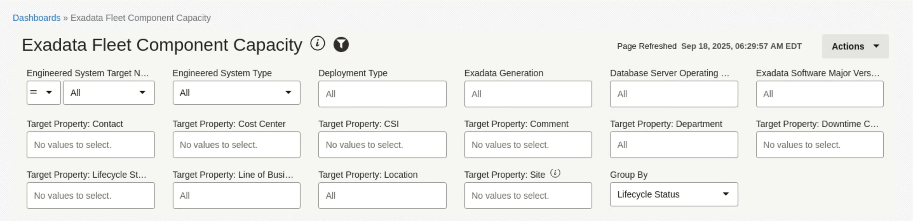

    Exadata Fleet Component Capacity dashboard includes multiple sections that provides detailed insights into specific dimensions of component capacity like host utilization, storage utilization, I/O performance, CPU, memory, disk usage, and IOPS (input/output operations per second).Detailed descriptions for each section are provided below:
    
    - **Database Server CPU and Memory:** Host Utilization bubble chart in this section visualizes the average utilization of CPU and memory of each host in an Engineered Systems over the past month.

        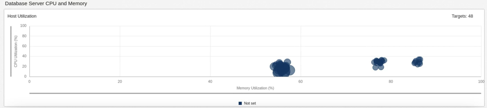

    - **Storage:** Provides an overview of the storage utilization through four scatter plots, offering insights into disk space usage and growth.

        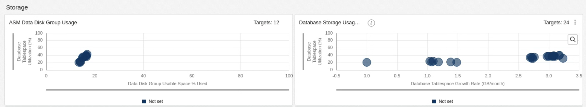

        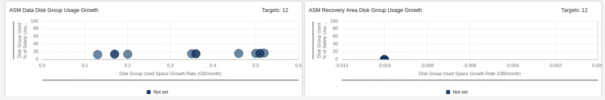

    - **Storage Sever I/O:** Provides an overview of the various performance metrics related to I/O serviced by flash and hard disks of all Engineered System storage servers. Each chart provides insights into different aspects of latency, utilization, IOPS, and throughput. Each bubble represents a storage server in the Engineered System fleet. The size of the bubble is proportional to the storage capacity of the storage server.

        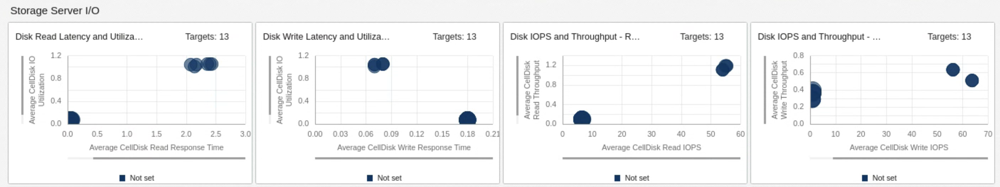
        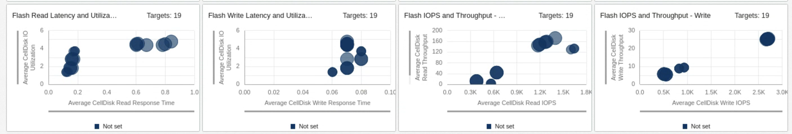
        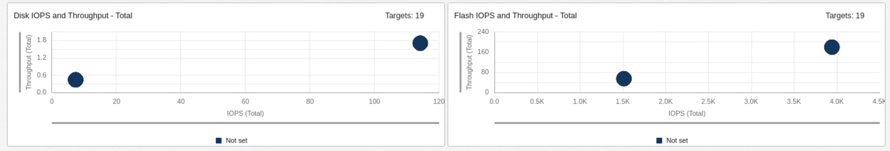

    - **Database Server CPU and Memory Details:** Summarizes CPU and memory utilization of hosts in the Engineered System fleet. This table allows comparison of CPU and memory usage across different hosts, aiding in the identification of systems that may require resource reallocation or optimization. The visual representation of utilization percentages makes it easy to spot potential bottlenecks or under-utilized resources at an individual host level.

        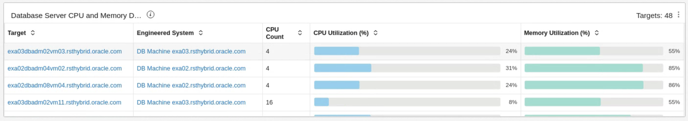

    - **Storage Details:** Provides an overview of the storage details for the ASM clusters in the Engineered System fleet. This table provides insights into free space availability, content distribution, and the efficiency of space utilization in both general storage and specific database tablespaces at the ASM cluster level.

        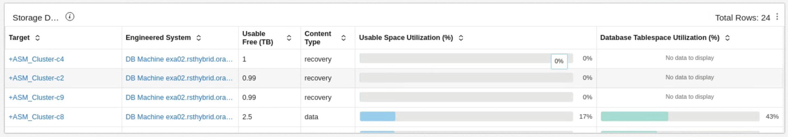

    - **Storage Server I/O Details:** Provides a detailed overview of I/O performance metrics for various Engineered Systems in tabular format. This table allows comparison of I/O performance and utilization across different systems, which can provide insights into storage efficiency and performance bottlenecks in both disk and flash storage.

        

## Learn More

  - [Exadata Fleet Dashboards](https://docs.oracle.com/en/enterprise-manager/cloud-control/enterprise-manager-cloud-control/24.1/emxad/exadata-fleet-dashboards.html)
  - [Enterprise Manager 24ai Documentation Library](https://docs.oracle.com/en/enterprise-manager/cloud-control/enterprise-manager-cloud-control/24.1/index.html)
  - [Enterprise Manager 24ai Tech Forum Video Playlist](https://www.youtube.com/playlist?list=PLiuPvpy8QsiXvGYMP_N3WA6bddXvUH-Y0)

## Acknowledgements
- **Author** - Anand Prabhu, Principal Member of Technical Staff, Enterprise Manager
- **Contributors** - Swapnil Sinvhal, Bjorn Bolltoft, Mahesh Sharma - Enterprise Manager Team, Michael Reed, Maury Edmonds, Geoffrey Grandstaff - Oracle Solution Center
- **Last Updated By/Date** - Anand Prabhu, Principal Member of Technical Staff, Enterprise Manager September 2025

