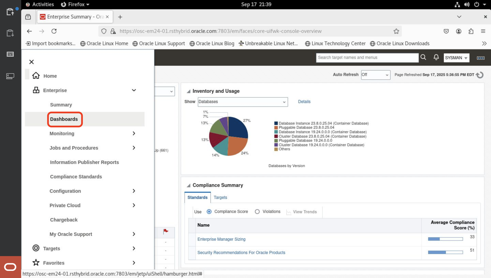
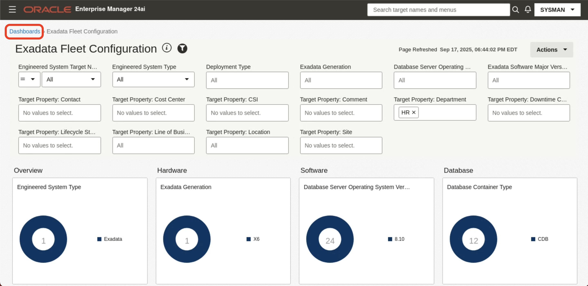

# Exadata Fleet Dashboards
## Introduction
Exadata Fleet Dashboards provide a unified, high-level view of resource usage, capacity, and performance across an entire fleet of Exadata systems. They enable administrators to quickly identify systems that need attention, analyze component-level usage, and track metric trends, supporting proactive management of both on-premises and cloud-based Exadata and Recovery Appliance environments.

### Objectives
To enable users to efficiently navigate and utilize the Exadata Fleet Configuration Dashboards within Oracle Enterprise Manager, they can
- Gain a high-level overview of resource usage across the fleet
- Identify Exadata systems that require attention
- Analyze usage of individual components within an Exadata system (by consulting the Exadata Fleet Component Capacity dashboard)
- Review and analyze metric trends

## Task 1: Explore Fleet Configuration Dashboard

Exadata Fleet Configuration dashboard shows the Exadata hardware and software configurations across the Exadata and Recovery Appliance fleet, based on the last known metric collection. You can apply the filters to limit the display to a subset of systems.

1. Log into Enterprise Manager using the credentials **sysman/Cloud2025**. 

    

    

2. Click the **hamburger menu** icon.

    

3. Navigate to **Enterprise > Dashboards**.

    

4. On the **Dashboards** page, click on the **Exadata Fleet Configuration** dashboard.

    

5. Explore Exadata Fleet Configuration Dashboard 

    **Filters:** Allows to filter content on dashboard using target name, engineered system type, deployment type, generation, DB Server OS, Major version and also allows to filter using the target properties which include Location, Line of Business, Department, Lifecycle status & others. 

    

    Exadata Fleet Configuration dashboard provides a structured way to view and analyze the configuration of your Engineered System fleet. It is divided into four vertical sections:
    
    - **Overview:** Provides a high-level summary of your Engineered System fleet. It displays ring charts showing the distribution by system type, deployment type, service type, database deployment option, and fabric type. This helps quickly identify how systems are deployed and configured across environments.

        

    - **Hardware:** Shows the physical characteristics of the fleet. Ring charts display Exadata generations, server models, storage types, and switch models. This helps assess hardware diversity and standardization.

        

    - **Software:** Summarizes the software landscape across components. It shows distributions of OS versions, ILOM versions, Exadata software versions, and switch firmware versions. This helps track consistency and upgrade needs.

        

    - **Database:** Provides insights into deployed databases. It shows CDB vs. Non-CDB usage, database and PDB versions, ASM redundancy levels, and Grid Infrastructure versions. This helps monitor database standardization and lifecycle status.

        

6. Apply the "Target Property: Department" Filter by selecting **HR** department

    

7. Analyze the filtered results 

    HR department operates one X6 generation Exadata system on-premises, running Database Server OS version 8.10 with InfiniBand connectivity and a multitenant database on DB version 19.24.

    

## Task 2: Explore Fleet Aggregated Capacity Dashboard

Exadata Fleet Configuration dashboard shows the Exadata hardware and software configurations across the Exadata and Recovery Appliance fleet, based on the last known metric collection. You can apply the filters to limit the display to a subset of systems.

1. Click on  **Dashboards**.

    

2. On the **Dashboards** page, click on the **Exadata Fleet Aggregated Capacity** dashboard.

    

5. Explore Fleet Aggregated Capacity Dashboard 

    **Filters:** Allows to filter content on dashboard using target name, engineered system type, deployment type, generation, DB Server OS, Major version and also allows to filter using the target properties which include Location, Line of Business, Department, Lifecycle status & others. 

    

    Exadata Fleet Aggregated Capacity dashboard summarizes the capacity averaged over the last 31 days for the Exadata and Recovery Appliance fleet or filtered subset of the fleet. It provides a high-level summary of fleet resource usage indicating overall average utilization. This dashboard is organized into two sections.
    
    - **Database Server CPU and Memory, and Storage:** The CPU, memory, and storage charts summarize 31-day resource allocation and trends across the Engineered System fleet to highlight usage patterns and potential anomalies.

        

    - **Storage Server I/O:** Provides line charts with aligned timelines to correlate key storage server performance metrics—such as latency, throughput, IOPS, I/O load, and utilization—helping diagnose performance issues by viewing related values together.

        
        

## Learn More

  - [Exadata Fleet Dashboards](https://docs.oracle.com/en/enterprise-manager/cloud-control/enterprise-manager-cloud-control/24.1/emxad/exadata-fleet-dashboards.html)
  - [Enterprise Manager 24ai Documentation Library](https://docs.oracle.com/en/enterprise-manager/cloud-control/enterprise-manager-cloud-control/24.1/index.html)
  - [Enterprise Manager 24ai Tech Forum Video Playlist](https://www.youtube.com/playlist?list=PLiuPvpy8QsiXvGYMP_N3WA6bddXvUH-Y0)

## Acknowledgements
- **Author** - Anand Prabhu, Principal Member of Technical Staff, Enterprise Manager
- **Contributors** - Bjorn Bolltoft, Mahesh Sharma - Enterprise Manager Product Management
- **Last Updated By/Date** - Anand Prabhu, Principal Member of Technical Staff, Enterprise Manager September 2025

