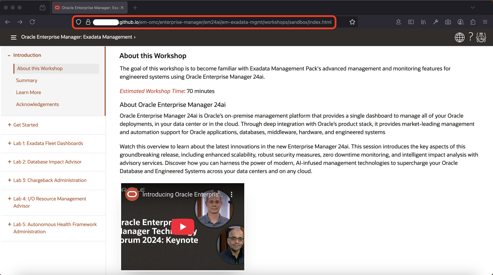
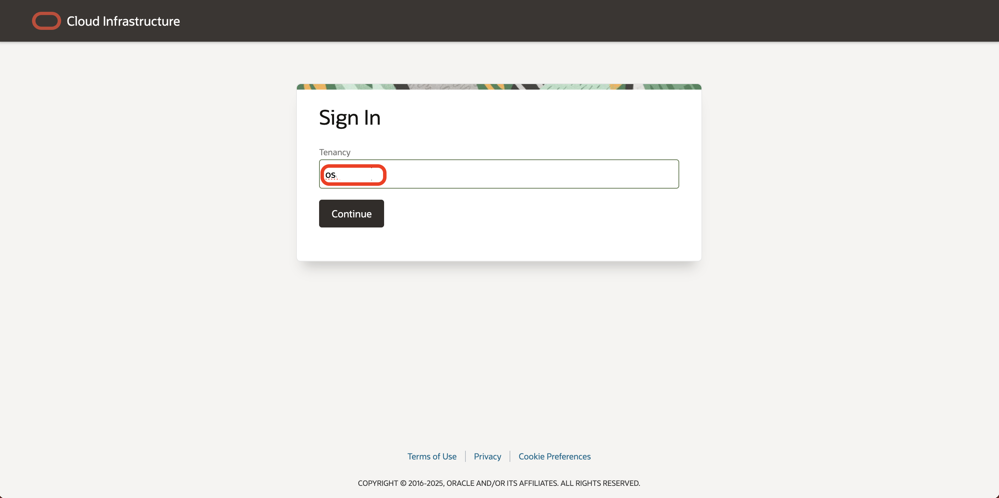
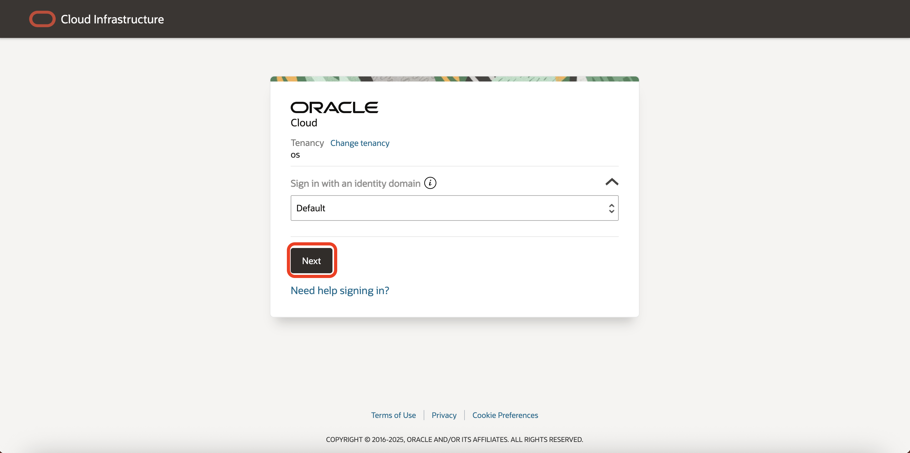
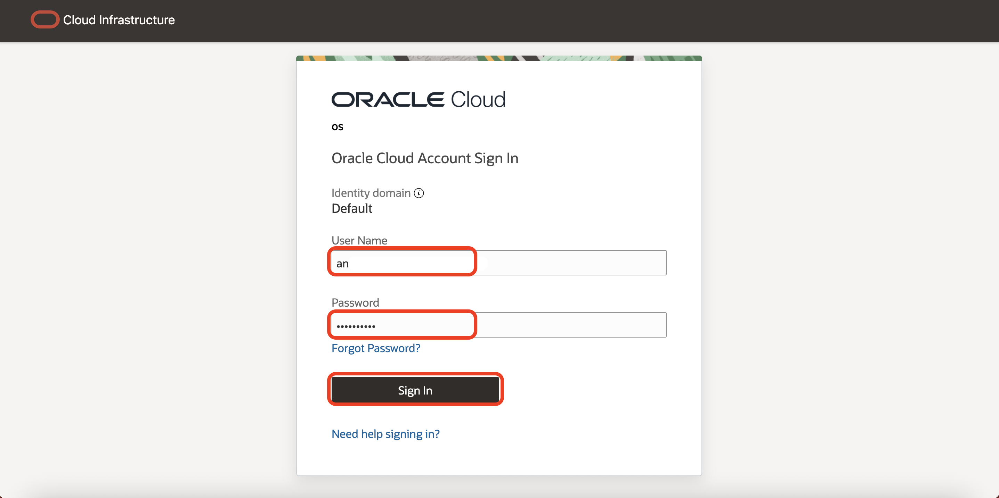
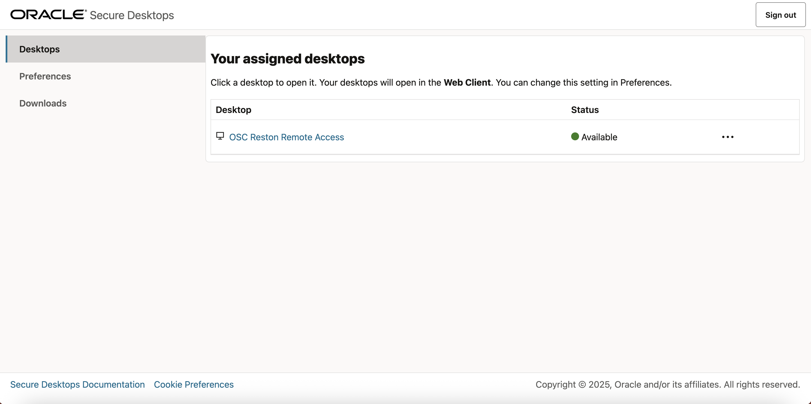
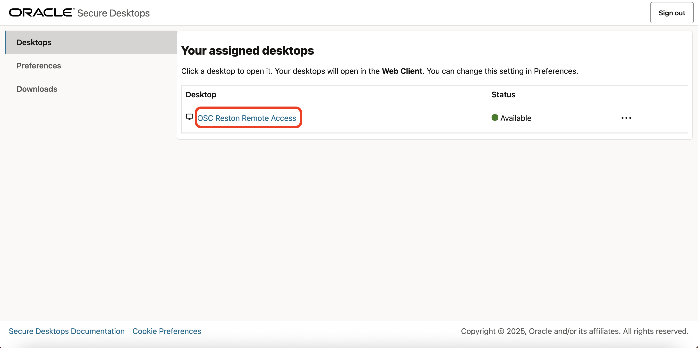
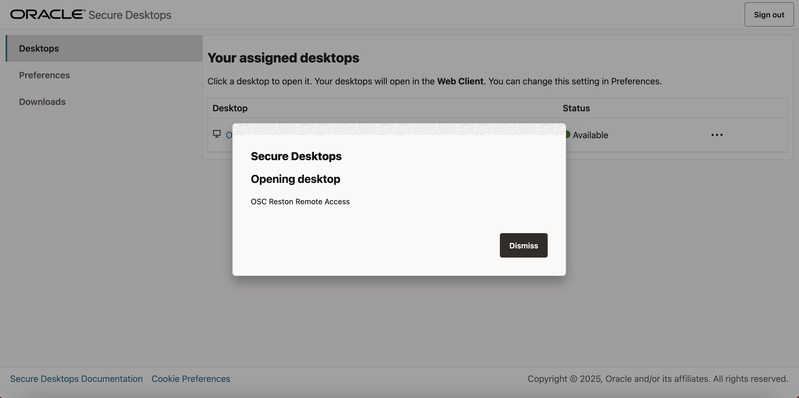
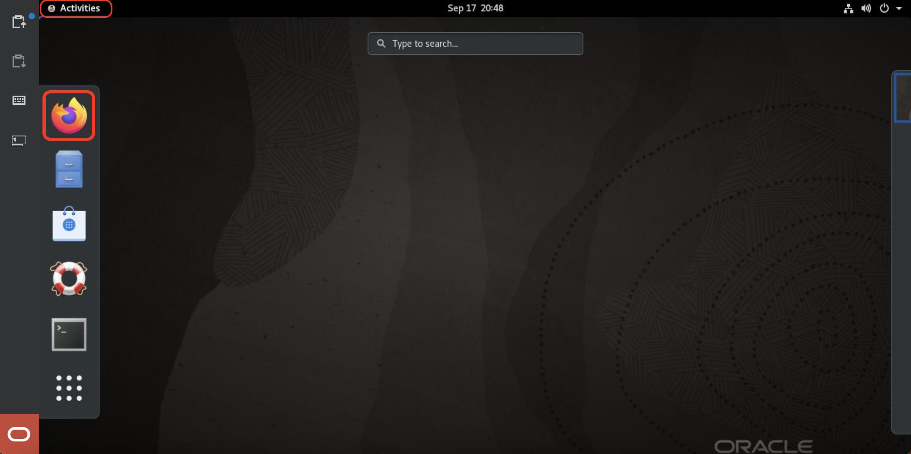
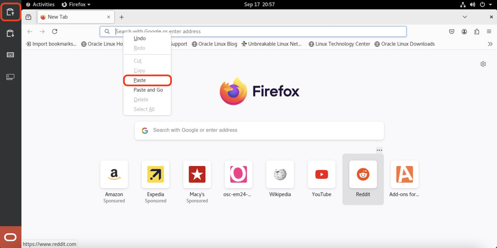
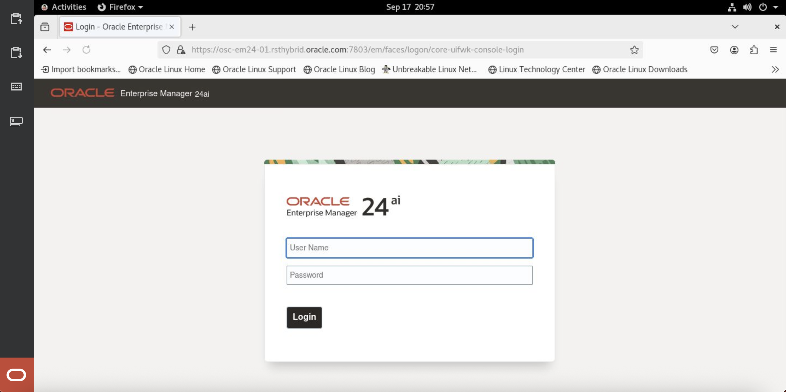

# Use remote desktop to access Enterprise Manager

## Introduction
This lab will show you how to get started with your workshop with a remote desktop session.

Estimated Time: 10 minutes

### Objectives
In this lab, you will:
- Open the workshop guide in the other browser
- Start the remote desktop session
- Launch Enterprise Manager 24ai

### Prerequisites

## Task 1: Open the workshop guide in the other browser 

1. For the best experience, open the workshop guide in a browser other than Chrome (Firefox is recommended). Copy the link provided below and paste it into the Firefox address bar, as shown.

    ```
    <copy>
    https://anand-gith.github.io/em-omc/enterprise-manager/em24ai/em-exadata-mgmt/workshops/sandbox/index.html
    </copy>
    ```

    

## Task 2: Start the remote desktop session 

1. Click on the link below and launch it in Chrome.

    [Click here to launch the remote desktop session](https://published.desktops.us-ashburn-1.oci.oraclecloud.com/client)

2. Login to the tenancy using the details provided

    Enter the **name of the tenancy** provided 
    

    Click **next**
    

    Enter **User Name** and **Password** provided and then click **Sign In**
    

    On **Sign In** a landing page shows **Your assigned desktops**
    

3. Click on the desktop shown to start the remote desktop session

    
    
    

## Task 3: - Launch Enterprise Manager 24ai

1. Launch Firefox by clicking on **Activities-->Firefox**
    

2. Copy the Enterprise Manager 24ai Console URL shown 

    ```
    <copy>
    https://osc-em24-01.rsthybrid.oracle.com:7803/em
    </copy>
    ```

3. Paste the Enterprise Manager 24ai URL to the Firefox browser as shown below 

    Click on the **Send Clipboard** and right click on Firefox address bar and click **paste** and then press **enter**

    

    EM Console is launched and now login with **User Name** and **Password** provided to get started with the workshop.

    


You may now **proceed to the next lab**.

## Acknowledgements
- **Author** - Anand Prabhu, Principal Member of Technical Staff, Enterprise Manager
- **Contributors** - Bjorn Bolltoft, Mahesh Sharma - Enterprise Manager Product Management
- **Last Updated By/Date** - Anand Prabhu, Principal Member of Technical Staff, Enterprise Manager September 2025

