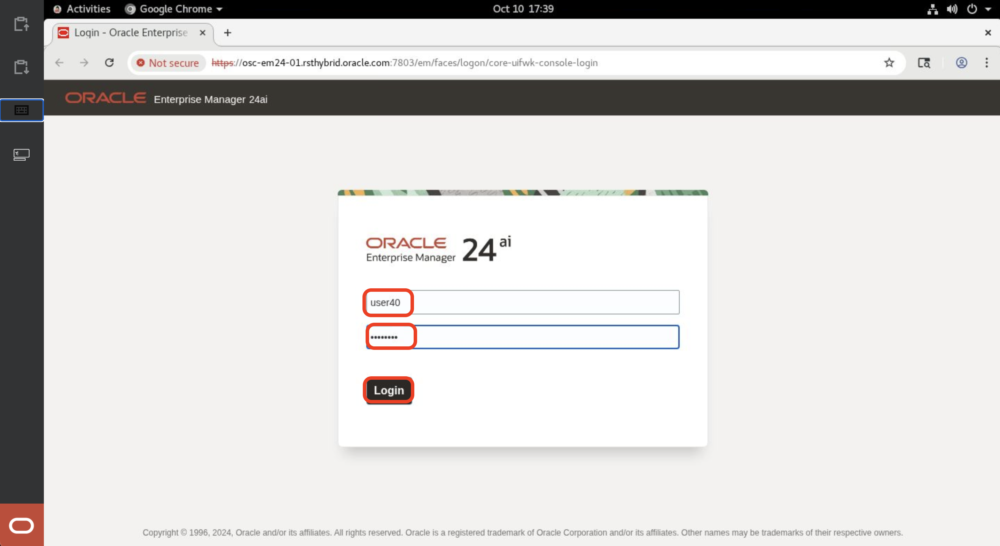

# Use remote desktop to access Enterprise Manager

## Introduction
This lab will show you how to get started with your workshop with a remote desktop session.

### Objectives
In this lab, you will:
- Start the remote desktop session
- Login to Enterprise Manager 24ai

*Estimated Time*: 10 minutes

### Prerequisites

***Ensure that your browser’s pop-up blocker is disabled before starting the lab, as the remote desktop session will open in a new tab.***

## Task 1: Start the remote desktop session

1. Click on the remote desktop link in the Apex app

    

2. Enter the tenancy name provided in the Apex app and click **Continue**
 
    

    

3. Select the identity domain as **OracleIdentityCloudService** and click **Next**

    

4. Enter **OCI User Name** and **OCI Password** provided in the Apex app and then click **Sign In**


    

    

5. Click on **Enable Secure Verification**

    

6. Choose method as **Mobile App** 
    

    **Note: This step requires using Oracle Mobile Authenticator App or any other authenticator app available on your Mobile**

7. Scan the QR Code 

    **Option 1: Using Oracle Mobile Authenticator App**
    Scan the QR Code
    

    **Option 2: Using Other Authenticator App**
    Scan the QR Code and enter passcode generated by the other Authenticator App & click **Verify**
    

    Once verification is complete it shows as **Successfully Enrolled**, Now click on **Done**
    

8. Click on the desktop shown to start the remote desktop session

    

    Remote desktop session is getting started
    

    Once ready it opens a remote desktop session in a new tab with EM console launched in the chrome.

    *Note: **Ensure that your browser’s pop-up blocker is disabled before starting the lab, as the remote desktop session will open in a new tab.***
    
    

## Task 2: Login to Enterprise Manager 24ai

1. Maximize the Chrome browser window

    Right-click on the Chrome browser by placing your mouse cursor on the area shown below.
    

    Click on **Maximize**
    

    **Note:** 
    
    If you accidentally close the Chrome browser, use the following URL to reopen the EM24ai Console:
    
    ```
    <copy>
    https://osc-em24-01.rsthybrid.oracle.com:7803/em
    </copy>
    ```

    Open Chrome and enter the above URL in the address bar to launch EM24ai again.

2. Login with **EM Username** and **EM Password** provided in the Apex app to get started with the workshop.

    

    


You may now **proceed to Lab 1**.

## Acknowledgements
- **Author** - Anand Prabhu, Principal Member of Technical Staff, Enterprise Manager
- **Contributors** - Bjorn Bolltoft, Mahesh Sharma - Enterprise Manager Product Management
- **Last Updated By/Date** - Anand Prabhu, Principal Member of Technical Staff, Enterprise Manager September 2025

