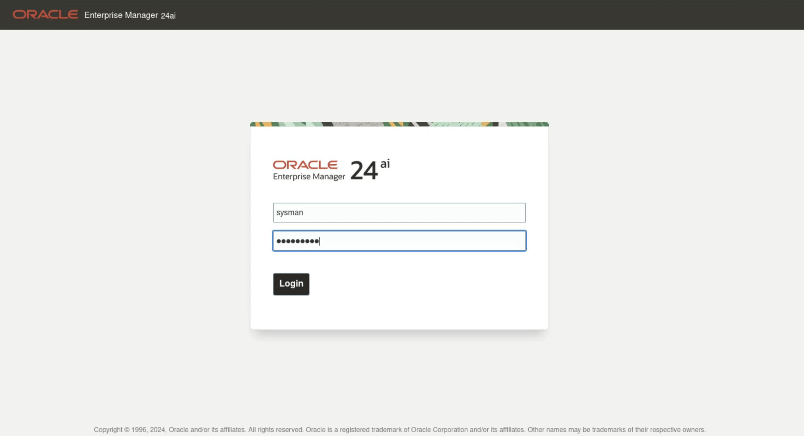

# IORM Impact Advisor
## Introduction
Database Impact Advisor can be run against an individual Exadata system to perform system-wide database CPU usage noisy-neighbor analysis in order to identify databases whose performance is potentially impacted by other databases or other operating system processes.
With the increased number of cores available on Exadata, it becomes possible to place more databases on a single machine. However, this ability comes with a tradeoff of packing databases too tightly into a cluster can lead to erratic or poor performance, while packing 
them too loosely results in unnecessary hardware and Oracle license costs.

### Objectives

- Learn how to use the Database Impact Advisor for effective cluster sizing
- Understand best practices for database placement within clusters
- Configure CPU allocation to optimize performance
- Identify and resolve noisy neighbor issues when databases interfere with each other
- Determine the optimal level of oversubscription on clusters to minimize performance impact across databases

## Task 1: Explore Database Impact Advisor

Identify cluster databases whose performance is potentially impacted by other databases or other operating system processes.

1. Log into Enterprise Manager using the credentials **sysman/Cloud2025**. 

    