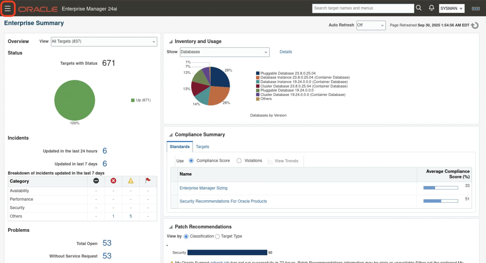
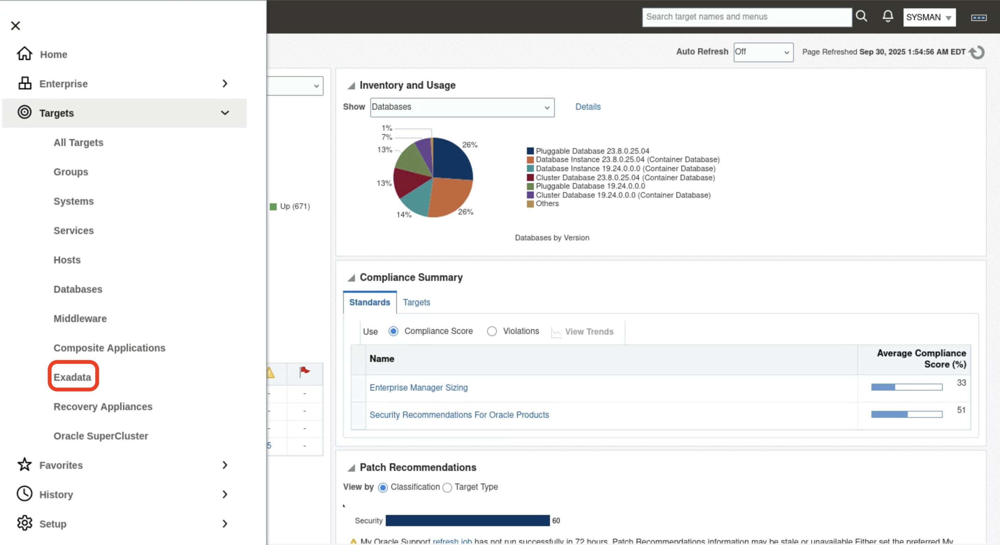
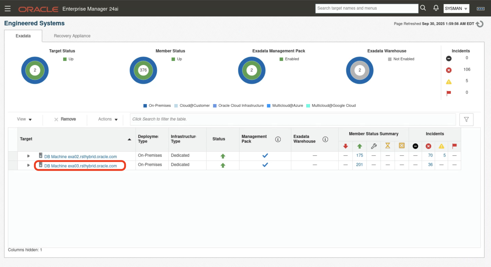
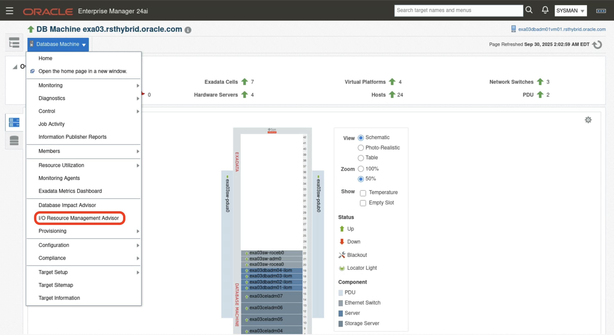
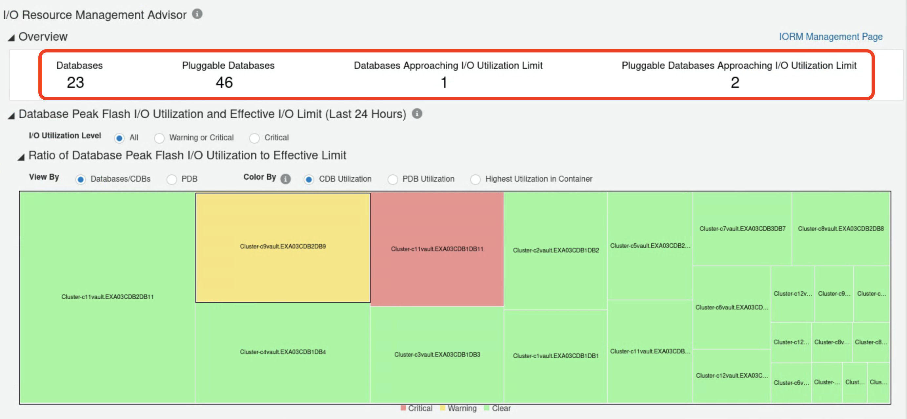
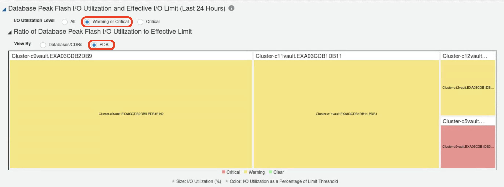
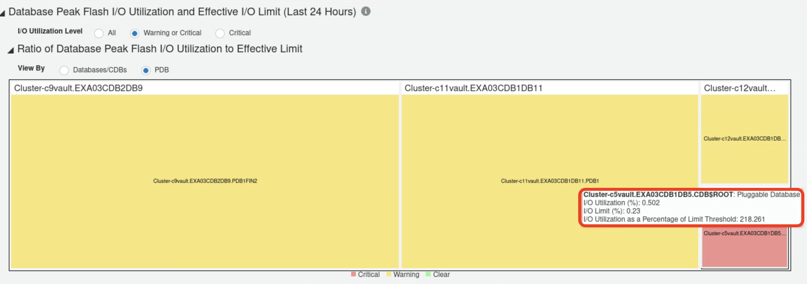
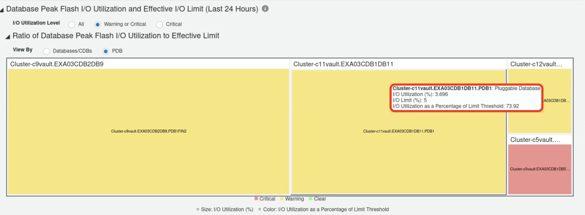

# I/O Resource Management Advisor
## Introduction

Enterprise Manager I/O Resource Management Advisor facilitates effective usage of Exadata I/O Resource Management (IORM) by providing tools to analyze flash I/O utilization across all databases running on an Exadata system and to identify potential measures to optimize system I/O resource usage. 

It provides the following capabilities:

- **Comprehensive System-Level I/O Overview:** Treemaps, tables, and charts show IORM settings and I/O utilization across Exadata, helping identify CDBs, PDBs, or non-CDBs impacted by flash I/O throttling from system limits or neighboring databases.

- **Detailed Database-Level I/O Analysis:** Drill-down views provide historical I/O metrics (utilization, throughput, latency) for a database and its neighbors, helping confirm throttling, assess performance impact, and decide if the IORM plan needs updates.

### Objectives

- Identify databases needing more I/O bandwidth
- Detect and throttle excessive I/O consumption
- Analyze historical usage to spot performance issues from concurrent high activity

## Task 1: Identify Databases Approaching Their I/O Limit 

1. Log into Enterprise Manager using the credentials **sysman/Cloud2025**. 

    

    

2. Navigate to **Targets > Exadata**.

    

3. Click on the DB Machine **DB Machine exa03.rsthybrid.oracle.com**.

    

4. Navigate to **Database Machine**, click on the **I/O Resource Management Advisor**

    

5. Explore I/O Resource Management Advisor Overview

    Overview section summarizes I/O usage for all databases on the Exadata system, including those not monitored by Oracle Enterprise Manager

    - Shows the number of databases/CDBs that crossed the flash I/O critical threshold in the last 24 hours.
    - Shows the number of PDBs that crossed the flash I/O critical threshold in the last 24 hours.

    In this Exadata machine there are **23 databases/CDBs** and **46 pluggable databases** with **1 database/cdb approaching I/O utilization limit** and **2 PDBs approaching I/O utilization limit** in the last 24 hours. 

    

6. Use Database Peak Flash I/O Utilization Heatmap to find databases approaching I/O limit

    Apply filters **I/O Utilization level as Warning or Critical** and **View By PDB**

    

    Heatmap shows I/O usage for all databases, helping you quickly spot over or under-utilized resources. Each tile represents a database:
    
    - Tile Size: Proportional to flash I/O utilization.
    - Tile Color: Indicates peak I/O usage over the last 24 hours:
        - Red (Critical): >75% utilization
        - Yellow (Warning): 50–75% utilization
        - Green (Clear): <50% utilization

    Hover mouse on the red tile **Cluster-c5vault.EXA03CDB1DB5.CDB$ROOT** shows that the PDB **Cluster-c5vault.EXA03CDB1DB5.CDB$ROOT** has 0.502 I/O utilization(%) when compared to its I/O limit (%) 0.23 which is over utilized.

    

    Hover mouse on the yellow tile **Cluster-c11vault.EXA03CDB1DB11.PDB1** shows that the PDB **Cluster-c11vault.EXA03CDB1DB11.PDB1** has **3.696** I/O utilization (%) when compared to its I/O limit (%) 5 which is nearing high utilization.

    

    Primary goal of heatmap is to ensure that the most important databases, such as those serving production applications, are in green or yellow. Heatmap provides a visual way to quickly identify databases approaching their I/O limits. For databases in red, consider increasing I/O limits, reviewing consolidation, or analyzing workloads.

## Task 2: Identify Databases Approaching Their I/O Limit 