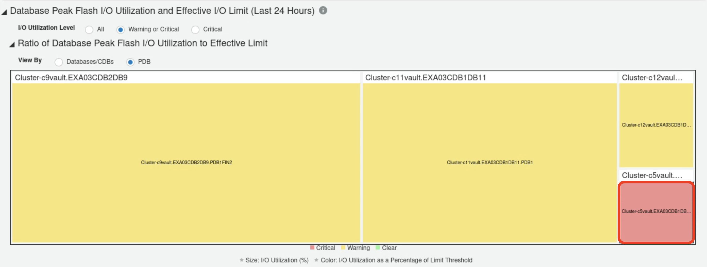
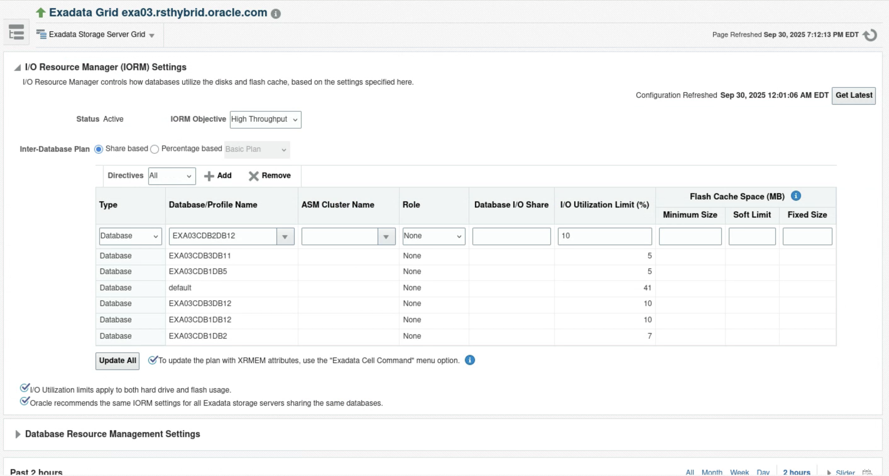

# I/O Resource Management Advisor
## Introduction

Enterprise Manager I/O Resource Management Advisor facilitates effective usage of Exadata I/O Resource Management (IORM) by providing tools to analyze flash I/O utilization across all databases running on an Exadata system and to identify potential measures to optimize system I/O resource usage. 

It provides the following capabilities:

- **Comprehensive System-Level I/O Overview:** Treemaps, tables, and charts show IORM settings and I/O utilization across Exadata, helping identify CDBs, PDBs, or non-CDBs impacted by flash I/O throttling from system limits or neighboring databases.

- **Detailed Database-Level I/O Analysis:** Drill-down views provide historical I/O metrics (utilization, throughput, latency) for a database and its neighbors, helping confirm throttling, assess performance impact, and decide if the IORM plan needs updates.

### Objectives

- Identify databases needing more I/O bandwidth
- Detect and throttle excessive I/O consumption
- Analyze historical usage to spot performance issues from concurrent high activity

## Task 1: Identify Databases Approaching Their I/O Limit 

1. Log into Enterprise Manager using the credentials **sysman/Cloud2025**. 

    

    

2. Navigate to **Targets > Exadata**.

    

3. Click on the DB Machine **DB Machine exa03.rsthybrid.oracle.com**.

    

4. Navigate to **Database Machine**, click on the **I/O Resource Management Advisor**

    

5. Explore I/O Resource Management Advisor Overview

    Overview section summarizes I/O usage for all databases on the Exadata system, including those not monitored by Oracle Enterprise Manager

    - Shows the number of databases/CDBs that crossed the flash I/O critical threshold in the last 24 hours.
    - Shows the number of PDBs that crossed the flash I/O critical threshold in the last 24 hours.

    In this Exadata machine there are **23 databases/CDBs** and **46 pluggable databases** with **1 database/cdb approaching I/O utilization limit** and **2 PDBs approaching I/O utilization limit** in the last 24 hours. 

    

6. Use Database Peak Flash I/O Utilization Heatmap to find databases approaching I/O limit

    Apply filters **I/O Utilization level as Warning or Critical** and **View By PDB**

    

    Heatmap shows I/O usage for all databases, helping you quickly spot over or under-utilized resources. Each tile represents a database:
    
    - Tile Size: Proportional to flash I/O utilization.
    - Tile Color: Indicates peak I/O usage over the last 24 hours:
        - Red (Critical): >75% utilization
        - Yellow (Warning): 50–75% utilization
        - Green (Clear): <50% utilization

    Hover mouse on the red tile **Cluster-c5vault.EXA03CDB1DB5.CDB$ROOT** shows that the PDB **Cluster-c5vault.EXA03CDB1DB5.CDB$ROOT** has 0.502 I/O utilization(%) when compared to its I/O limit (%) 0.23 which is over utilized.

    

    Hover mouse on the yellow tile **Cluster-c11vault.EXA03CDB1DB11.PDB1** shows that the PDB **Cluster-c11vault.EXA03CDB1DB11.PDB1** has **3.696** I/O utilization (%) when compared to its I/O limit (%) 5 which is nearing high utilization.

    

    Primary goal of heatmap is to ensure that the most important databases, such as those serving production applications, are in green or yellow. Heatmap provides a visual way to quickly identify databases approaching their I/O limits. For databases in red, consider increasing I/O limits, reviewing consolidation, or analyzing workloads.

## Task 2: Gain comprehensive understanding of the I/O utilization before refining IORM plan

1. Select the critical tile **Cluster-c5vault.EXA03CDB1DB5.CDB$ROOT** in the heatmap 

    

    From the heatmap it gives fair idea by **Cluster-c5vault.EXA03CDB1DB5.CDB$ROOT** tile size that the I/O limit percentage is less compared to other PDBs. 

2. On selection, section **Database Peak Flash I/O Utilization and Effective I/O Limit for Last 24 Hours** shows the table view of the I/O utilization and limit for the **Cluster-c5vault.EXA03CDB1DB5.CDB$ROOT**

    After identifying the databases of interest from heatmap, check if they can handle higher I/O workloads. Compare their peak flash I/O utilization with the effective I/O limit to see if there is enough headroom. 
    Along with the heatmap, the **Database Peak Flash I/O Utilization and Effective I/O Limit for Last 24 Hours section** provides a table view showing peak I/O values for each database over the last 24 hours.

    

    - I/O limit at CDB **Cluster-c5vault.EXA03CDB1DB5** 5 but its I/O utilization is at 0.476 shows that there is I/O headroom for additional workload 
    - I/O limit at PDB **Cluster-c5vault.EXA03CDB1DB5.CDB$ROOT** 0.23 but its I/O utilization is at 0.475 shows that there is no I/O headroom for additional workload & has exceeded its I/O utilization limits
    - I/O limit at PDB **Cluster-c5vault.EXA03CDB1DB5.PDB1** 5 but its I/O utilization is at 0.023 shows that there is I/O headroom for additional workload 

    I/O limit at PDB **Cluster-c5vault.EXA03CDB1DB5.CDB$ROOT** is very low so it should be increased using the CDB plan. 

    Now analyze the historical I/O utilization for the PDB **Cluster-c5vault.EXA03CDB1DB5.CDB$ROOT** by changing the time frame to **Last 7 Days** & check Chart Type **Stacked Chart** and Select metric **I/O Throughput** as shown below. 

    

    Examine the historical trends of the metrics to understand whether the peak I/O utilization was seen frequently, and whether these periods of high I/O utilization coincide with high response times and/or high IORM wait times.

    

    Performance Data Distribution section provides a quick view of the I/O utilization at a specific point in time and size of the bubble represents the IORM wait time.

    

    Combining the analysis from both the table data and charts provides a comprehensive view of the I/O utilization of the databases running on the Exadata system. In this lab, we found that the PDB **Cluster-c5vault.EXA03CDB1DB5.CDB$ROOT** shows peak utilization during the given period, indicating performance bottlenecks related to I/O usage. For the PDB **Cluster-c5vault.EXA03CDB1DB5.CDB$ROOT** I/O allocation need adjustment, proceed to the *next task* to learn how to make those changes.

## Task 3: Refine IORM plan 
By analyzing the tables and charts, you can assess database I/O utilization. If I/O allocations need adjustment, you can:
- Update the IORM plan from the Database Machine IORM Management page within Enterprise Manager to change I/O limits or shares.
- Reconfigure the CDB plan from the root PDB.

1. Click on the **IORM Management Page**
    

2. Launches the I/O Resource Manager Settings page to modify the I/O Utilization Limit (%) and I/O Share per database as needed 
    

    **Note: This is a shared EM environment. We will not make any IORM changes. Please proceed to the next lab.**

## Learn More

  - [I/O Resource Management Advisor](https://docs.oracle.com/en/enterprise-manager/cloud-control/enterprise-manager-cloud-control/24.1/emxad/io-resource-management-advisor.html)
  - [Engineered Systems Packs](https://docs.oracle.com/en/enterprise-manager/cloud-control/enterprise-manager-cloud-control/24.1/emxad/preface.html)
  - [Enterprise Manager 24ai Documentation Library](https://docs.oracle.com/en/enterprise-manager/cloud-control/enterprise-manager-cloud-control/24.1/index.html)
  - [Enterprise Manager 24ai Tech Forum Video Playlist](https://www.youtube.com/playlist?list=PLiuPvpy8QsiXvGYMP_N3WA6bddXvUH-Y0)

## Acknowledgements
- **Author** - Anand Prabhu, Principal Member of Technical Staff, Enterprise Manager
- **Contributors** - Swapnil Sinvhal, Bjorn Bolltoft, Mahesh Sharma - Enterprise Manager Team, Michael Reed, Maury Edmonds, Geoffrey Grandstaff - Oracle Solution Center
- **Last Updated By/Date** - Anand Prabhu, Principal Member of Technical Staff, Enterprise Manager September 2025