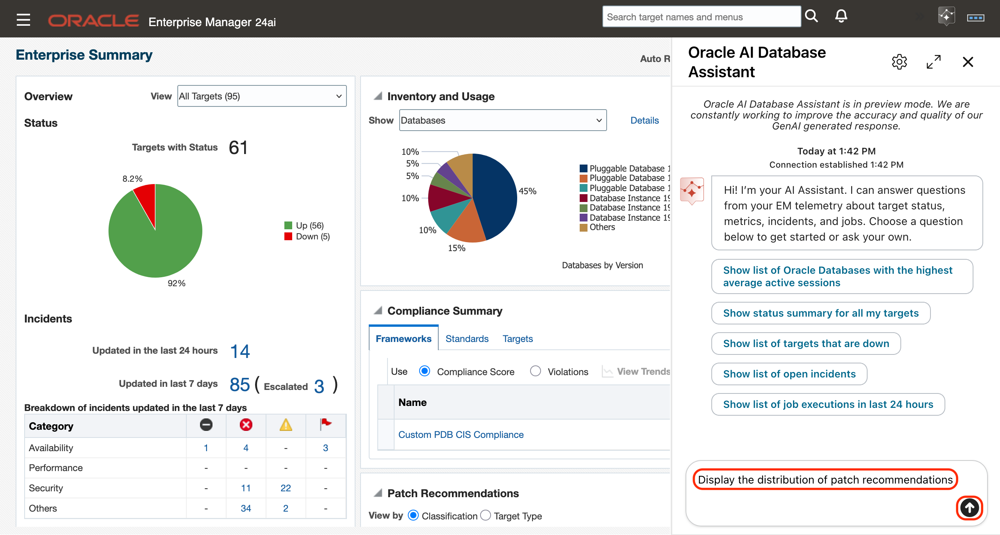
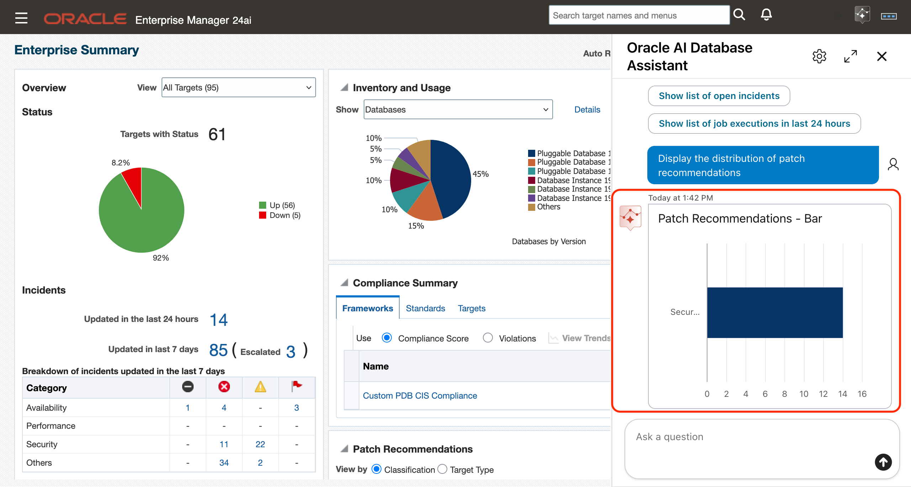

# Oracle Enterprise Manager 24ai: Powered by GenAI
## Introduction
Oracle Enterprise Manager 24ai is designed to help DBAs monitor and manage Oracle Database environments. In this hands-on lab, try the Oracle AI Database Assistant, Enterprise Manager’s agentic AI chatbot for conversational operations. Configure it to use EM’s LLM or your own LLM, manage user access, and ask natural-language questions about the health of your database fleet. You’ll also use Event Compression to reduce alert fatigue and incident volume, explore Dynamic Runbooks with auto-run data collection before incident triage, and try the new AI-based runbook generator that converts existing runbooks into executable triage steps in Enterprise Manager. 

### Objectives
The objective of this lab is to become familiar with the new modernized Enterprise Manager 24ai platform.

### Prerequisites
This lab assumes you have:

- A Free Tier, Paid or LiveLabs Oracle Cloud account

*Estimated Time*: 70 minutes
 

## Task 1A: Oracle AI Database Assistant - Monitoring 

Oracle AI Database Assistant combines Enterprise Manager telemetry with Large Language Models (LLMs) to provide an intuitive conversational experience for monitoring and operational investigations.
Instead of manually searching through Enterprise Manager pages, administrators can ask questions such as:
    •	Show open incidents
    •	Show job executions in the last 24 hours
    •	Show target availability status
    •	Show critical alerts for production databases
The assistant can return rich widgets, tables, and visualizations directly within the chat experience, helping users quickly understand and act on operational information.
 

1. Log into Enterprise Manager using the credentials **emadmin/welcome1**. 

    

2. In the upper right corner click on the **Oracle AI Database Assistant** to start it

    

3. The Oracle AI Database Assistant should appear with a welcome message and out-of-box questions to get you started.

    

4. In the chat window Click on question **Show status summary for all my targets**.

    

5. In the widget click on **3 dots** and choose **Maximize Widget**.

    

6. Click on the **Down** pie slice and review the targets that are down and click on **Close**.

    

7. Click on **minimize** icon on the upper right corner of the widget.

    

8. In the chat window click on **Show list of open incidents**.

    

9. In the widget click on **3 dots** and choose **Maximize Widget** and review the incidents. 

    

10. For the first incident in the list click the **3 dots** and choose **Acknowledge**. 

    

11. In the confirmation dialog click **Acknowledge**.

    

    After doing the acknowledgment table should show current user **EMADMIN** is the owner of the incident.

    

12. Click on **+** button on the upper right corner of the widget and choose **Target Property** 

    

13. Click on Target Property filter and select **Production**. Table of incidents is filtered to show incidents from production targets.

    

14. Click on the **3 dots** for the first incident and choose **Add Comment**

    

15. Add this comment **Will look at this later** and click on **Save**.

    

16. Click on **minimize** icon on the upper right corner of the widget:

    

17. Enter the question **Do I have any escalated incidents?** in the chat window and hit `<`enter`>`:

    


18. In the widget click on **3 dots** and choose **Maximize Widget**: 

    

19. Review the list of escalated incidents and click on **minimize icon** on the upper right corner of the widget.

    

20. Scroll up to the top of the chat window and click on **Show list of Oracle Databases with highest average active sessions** prompt:

    

21. In the widget click on **3 dots** and choose **Maximize Widget** and review the database performance metrics:

    
    
22. Click on **+** button on the upper right corner of the widget and choose **Show label** and **Key Aggregation**:

    

23. In the Metric Column filter change **Average Active Sessions** to **CPU Utilization (%)** and review the CPU Utilization.

    

24. In the widget change the value of these filters:

    Metric Name to **Tablespaces Full**

    

    Metric Column to **Tablespace Space Used (%)**

    

    Key Aggregation to **Max**. The table shows the highest usage of tablespaces for each database.   Review the values shown:

    

25. In the table click on the highest number in value under the **Value** column. This should open a new browser tab showing the All Metrics page showing the tablespace with that high usage value.

    

    

26. Go back to the browser tab with AI Assistant. Click on **minimize icon** on the upper right corner of the widget.

    

## Task 1B: Oracle AI Database Assistant - Database Patching and Compliance

Oracle AI Database Assistant combines Enterprise Manager telemetry with Large Language Models (LLMs) to provide an intuitive conversational experience for monitoring and operational investigations.

In this task, you use the assistant to assess database fleet readiness before a patch window and verify patch compliance after patching. 
Instead of navigating multiple Enterprise Manager pages, you ask targeted questions in the chat window and use the results to identify drift, missing image subscriptions, patch recommendations, compliance gaps, and critical violations.

The prompts in these tasks are organized into two sections:
* **Steps 1–3:** Assess patching readiness before the patch window.
* **Steps 4–5:** Verify compliance after patching is complete.


1. Review **configuration drift**

    Configuration drift can indicate that a target no longer matches its approved configuration baseline. Review drift before patching so that you can resolve or document exceptions.

    In the **Oracle AI Database Assistant chat window, enter the following prompt and press Enter:**
    ```
    <copy>
    Show configuration drift results by target type
    </copy>
    ```

    

    Review the results by target type.
    

2. Check **database subscriptions to gold images**

    Databases must be subscribed to an appropriate gold image to participate in a standardized fleet maintenance patching process. Identify databases that are not subscribed and enroll them before patching.

    In the chat window, **enter the following prompt and press Enter:**
    ```
    <copy>
    Display databases not subscribed to gold image for patching
    </copy>
    ```

    

    Review the distribution of subscribed and unsubscribed databases.
    

3. Review **patch recommendations**

    Patch recommendations are grouped by classification to help you understand the type and scope of patches required across the database fleet.

    Use these recommendations to update the appropriate gold images. Create a new version of the gold image with the recommended patches so that it is ready for use during the patching cycle.

    In the chat window, **enter the following prompt and press Enter:**
    ```
    <copy>
    Display the distribution of patch recommendations
    </copy>
    ```

    

    Review the distribution of patch recommendations by classification.

    

4. Review **database patch compliance** once the patching cycle completes

    Evaluate the fleet after patching to confirm how many databases are patch compliant.

    In the chat window, **enter the following prompt and press Enter:**
    ```
    <copy>
    Display the distribution of databases that are compliant
    </copy>
    ```
    

    Review fleet-level view of database patch compliance.
    

5. Review **critical compliance violations**

    Review critical compliance violations after patching. These violations may identify databases or security controls that require remediation or an approved exception.
    
    In the chat window, **enter the following prompt and press Enter:**
    ```
    <copy>
    How many critical compliance violations exist?
    </copy>
    ```

    

    Review the number of critical violations and investigate the affected databases and controls.
    

## Learn More

  - [Oracle Enterprise Manager](https://www.oracle.com/enterprise-manager/)
  - [Enterprise Manager 24ai Documentation Library](https://docs.oracle.com/en/enterprise-manager/cloud-control/enterprise-manager-cloud-control/24.1/index.html)
  - [Enterprise Manager 24ai Tech Forum Video Playlist](https://www.youtube.com/playlist?list=PLiuPvpy8QsiXvGYMP_N3WA6bddXvUH-Y0)

## Acknowledgements
- **Author** - Sumesh Balakrishnan, Oracle Enterprise Manager Product Management
- **Contributing Author** - Ana McCollum, Anand Prabhu, Oracle Enterprise Manager Product Management