# Enterprise Manager Fundamentals: Monitoring Quick Tour
## Introduction
Oracle Enterprise Manager enables you to get complete monitoring visibility into your IT infrastructure, applications stack and applications that are critical to running your business.

- Single pane of glass to monitor and discover targets, such as Oracle Database, that are running on-premises or in the cloud

- Comprehensive set of predefined performance and health metrics that enables lights-out monitoring of critical components in your environment, such as applications, application servers, databases, as well as the back-end components on which they rely, such as hosts and storage

- Rich set of alerting, incident management and notification capabilities to notify IT staff and integrate with your corporate ticketing systems

- Dynamic Runbooks to triage and resolve your incidents  

- Corrective Actions to auto-correct alerts and minimize service disruption

- Metric Extensions to monitor conditions specific to your environment

- Monitoring Templates to standardize monitoring settings across your fleet

- Administration Groups and Template Collections to enforce monitoring standards and automate monitoring setup in a scalable way  

- Event Compression Policies to reduce your volume of incidents

### Objectives
The objective of this lab is to become familiar with Enterprise Monitoring capabilities using Oracle Enterprise Manager 24ai.

### Prerequistes
This lab assumes you have:

- A Free Tier, Paid or LiveLabs Oracle Cloud account
- All previous labs successfully completed

*Estimated Time*: 120 minutes

### Lab Timing (Estimated)

  | **Step No.** | **Feature**                                   | **Approx. Time** | **Details**                                                                                                                                                                                                                    | **Value proposition**                                                                                                                                                                                                                                                                                                                                                                                                                                                                                                                                                      |
  |--------|-----------------------------------------------|------------------|--------------------------------------------------------------------------------------------------------------------------------------------------------------------------------------------------------------------------------|-----------------------------------------------------------------------------------------------------------------------------------------------------------------------------------------------------------------------------------------------------------------------------------------------------------------------------------------------------------------------------------------------------------------------------------------------------------------------------------------------------------------------------------------------------------------------------|
  | **1**  | Enterprise Summary                              | 5 minutes       | Explore Enterprise Summary page and drill down to see a list of down targets. View the list of critical incidents created for the down targets. Filter the Status pane to display a list of Database Instance targets.                         | Enterprise Summary enables you to get complete visibility into the overall status and health of your managed environment.                                                                                                                                                                                                                                            |
  | **2**  | Incident Manager                                | 10 minutes       | Triage unassigned incidents from Incident Manager and acknowledge then assign an incident.                                                 | Incident Manager enables IT Staff to manage, track, and resolve actionable incidents in a collaborative way.|                                                                                                                                        
  | **3A**  | Use Dynamic Runbooks for Incidents                             | 10 minutes       | Start a Dynamic Runbook session against an incident in Incident Manager.                                                 | Dynamic Runbooks are documented procedures (steps) that IT Staff follow to resolve an issue, enabling consistency in incident response.                                                                                                                                          
  | **3B**  | Create Dynamic Runbooks for Incidents                              | 20 minutes       | Modify and publish a Dynamic Runbook draft.                                                 | Dynamic Runbooks are documented procedures (steps) that IT Staff follow to resolve an issue, enabling consistency in incident response.  
   | **3C**  | Use Dynamic Runbooks for Metrics                               | 10 minutes       | Start a Dynamic Runbook session against a metric in the All Metrics page.                                                 | Dynamic Runbooks are documented procedures (steps) that IT Staff follow to resolve an issue, enabling you to prevent impending issues from becoming incidents.  
  | **3D**  | Dynamic Runbooks for Notification Backlog (Universal Context)                              | 5 minutes       | Start a universal context Dynamic Runbook session against a notifications backlog.                                                 | Dynamic Runbooks are documented procedures (steps) that IT Staff follow to resolve an issue.  Universal context runbooks can be used in any functional area in Enterprise Manager.
  | **3E**  | Access Dynamic Runbook Samples                              | 3 minutes       | View Dynamic Runbook samples available for download.                                                 | Dynamic Runbooks are documented procedures (steps) that IT Staff follow to resolve an issue. These samples enable you to get started immediately with your use of Dynamic Runbooks.
  | **3F**  | Create Dynamic Runbooks from Oracle-provided Runbooks      | 15 minutes      | Create, customize, and publish a Dynamic Runbook based on an Oracle-provided runbook.                         | Dynamic Runbooks enable you to adapt documented best practices to your organization's specific requirements while preserving a consistent operational procedure.
  | **3G**  | Use Dynamic Runbooks Created from Oracle-provided Runbooks | 10 minutes      | Start a universal runbook session and execute the customized runbook created in Task 3F.                     | Dynamic Runbook sessions provide guided, repeatable execution of operational procedures and show how auto-run steps can accelerate triage.
  | **4**  | Metric and Collection Settings                         | 5 minutes       | Change the Warning and Critical threshold of a metric from Metric and Collection Settings page. Go to the All Metrics page and review the metric in context of the thresholds.                                                                                                           | Enterprise Manager provides out-of-box monitoring and alert thresholds for managed targets.  You can still customize these monitoring settings based on your requirements.                                                                                                                                                                                                                                                                                                                                 |
  | **5**  | Corrective Actions                          | 8 minutes       | Create a new Corrective Action and associate it with a metric. | Corrective actions allow you to specify automated responses to metric alerts, saving administrators time and ensuring issues are dealt with before they noticeably impact users.  A corrective action can also be used to gather diagnostic information for an alert.                                                                                                                                                                                                                                                                                                                                                                                                                                                      |
  | **6**  | Metric Extensions                          | 10 minutes       | Test a Metric Extension on a target to see the results then deploy the same Metric Extension to multiple targets. | Metric Extensions let you extend Enterprise Manager's monitoring capabilities to cover conditions specific to your IT environment, thus enabling you to rely on Enterprise Manager as your single monitoring solution.                                                                                                                                                                                                                                                                                                                                                                                                                                                      |
  | **7**  | Monitoring Templates                          | 5 minutes       | Create a Monitoring Template from a Database Instance target. Deploy the Monitoring Template to other Database Instance targets to standardize monitoring settings across the enterprise. | Monitoring Templates enable you to define and implement monitoring standards across all targets in your environment.                                                                                                                                                                                                                                                                                                                                                                                                                                                       |
  | **8**  | Administration Groups and Template Collections                          | 10 minutes       | View the hierarchy of an existing Administrator Group. Update the target property for a new target so it can automatically be added to an Administration Group and inherit monitoring settings from that group. | Administration Groups and Template Collections enable you to enforce monitoring standards and automate monitoring setup in a scalable way.                                                                                                                                                                                                                                                                                                                                                                                                                                                       |
  | **9**  | Incident Rules                          | 10 minutes       | Review out-of-the-box incident rules shipped with Enterprise Manager. View an example of an incident compression rule set. Create a simple incident rule set to email DBA when there is a critical DB alert. | Incident Rules enable you to automate common incident management and notification actions such as creation of incidents based on events, sending email to IT Staff, opening tickets, auto-assigning incidents, escalating incidents, etc.                                                                                                                                                                                                                                                                                                                                                                                                                                                        |
  | **10A** | Event Compression Policies                | 10 minutes |      View the out-of-box Event Compression Policies to reduce your incidents and create your own policy. | Event Compression Policies reduce overall event noise by compressing related events into a smaller set of actionable incidents.|                            
  | **10B** | Event Compression Analysis                | 10 minutes |      Test your policy using the Event Compression Analysis tool. | An Event Compression Analysis assesses the impact Event Compression Policies would have had on events that generated incidents over a selected time range in the past.
  | **10C** | Event Compression Policies using Administration Groups | 10 minutes | Review and edit an Event Compression Policy that groups events from database targets by Administration Group. | Administration Group-based event compression reduces event noise while preserving meaningful groupings for related database targets.
  | **11A** | Dashboards Overview | 5 minutes | Review dashboards, global filters, and available widgets. | Dashboards provide custom operational and business views of Enterprise Manager data.
  | **11B** | Create Dashboard | 15 minutes | Duplicate and edit a dashboard, configure widget inputs, and add local widget filters. | Custom dashboards organize the data and widgets needed for specific operational requirements.
  | **11C** | Share Dashboards with Other Users | 5 minutes | Grant another user permission to view a dashboard. | Dashboard sharing enables users to collaborate while respecting target-level privileges.
  | **11D** | Share Dashboards Across EM Sites | 5 minutes | Export a dashboard and import it into another Enterprise Manager site. | Dashboard export and import support promotion of tested dashboards between environments.
  | **11E** | Create Custom Widget | 15 minutes | Create a query-based widget that displays members of a group and connect it to a dashboard filter. | Custom widgets extend dashboards with focused views of repository or target data.
  | **11F** | Edit a Custom Widget via JSON Editing | 10 minutes | Edit a widget JSON definition to add links from target names to target home pages. | JSON editing enables advanced widget behavior and target-specific drilldowns.
  |

## Task 1: Enterprise Summary

1. Log into an Enterprise Manager VM (using provided IP). The Enterprise Manager credentials are “emadmin/welcome1”. 

    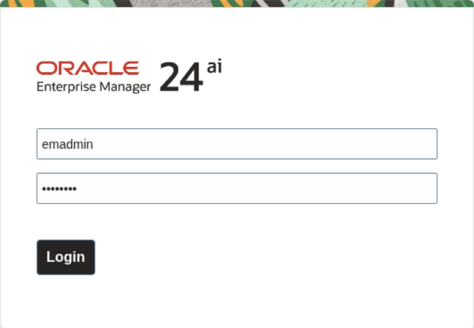

2. Enterprise Summary presents a single pane of glass view of the health of your Enterprise assets. The Overview pane shows the Target Status of your IT estate. The Status section shows aggregated target availability so you can get a sense of what percentage is UP vs DOWN at a quick glance. The Green slice of the pie are your targets that are up. The Red slice of the pie are the targets that are down. Targets in red may be down due to unscheduled outages. Let’s drill down and take a look at them.

     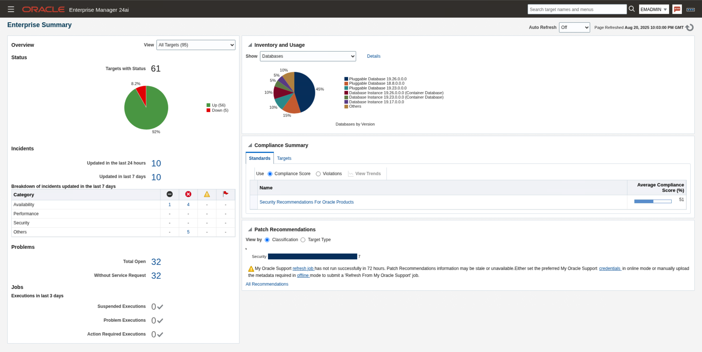 

3. Click on the Red slice of the pie in the “Status” section. **Note:** You can ignore any differences between the count of targets in the screenshots vs. what you see in your lab environment. The number of targets may vary based on your lab environment.

    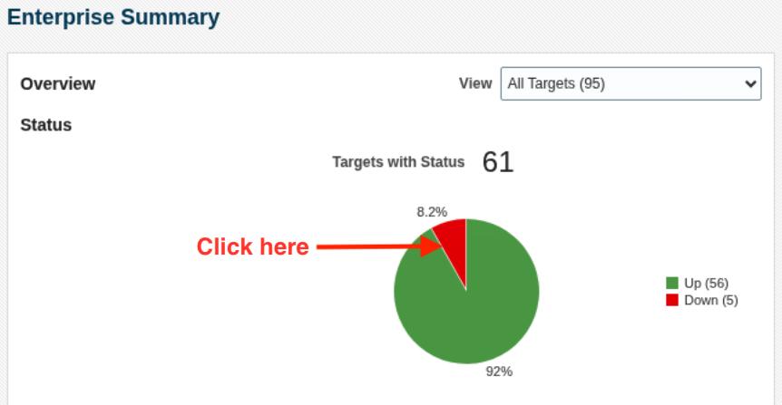  

   If a dialog pops up, click on ‘Down’ again.

    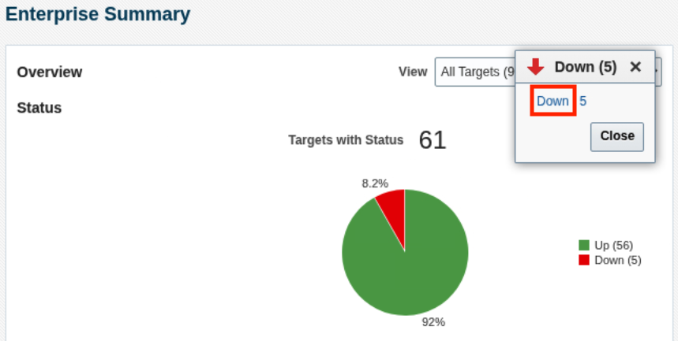   

4. In Enterprise Manager we have an “All Targets” page, which shows all of the targets being monitored by EM. When we clicked on the Red slice of the pie, we essentially placed a filter on the All Targets page to display only Down targets. From here, you can click on the individual target to go to the Target Home Page and take necessary actions such as starting up a Database Instance.

    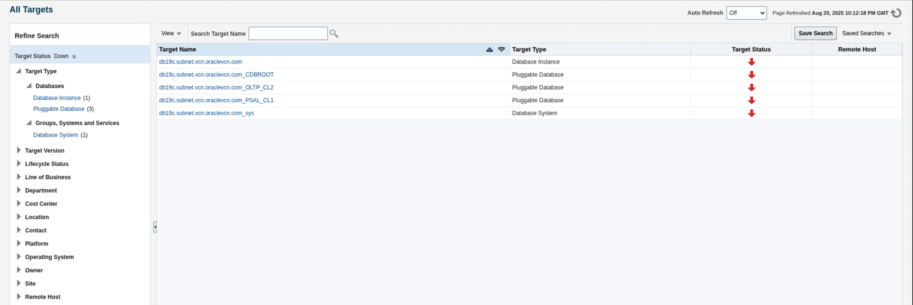


5. Click on the hamburger icon on the top left corner, then click "Enterprise >> Summary" to go back to the Enterprise Summary page.

    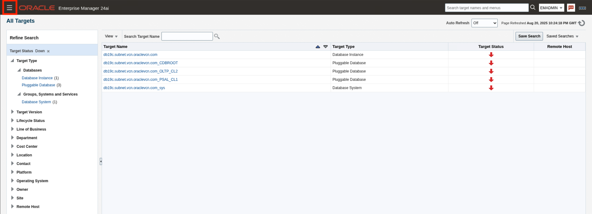

    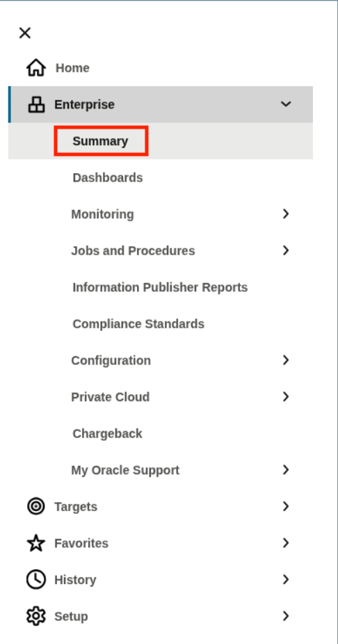

6. In the Incidents table, locate the row for **Availability** and click on the number under ƒƒ.

    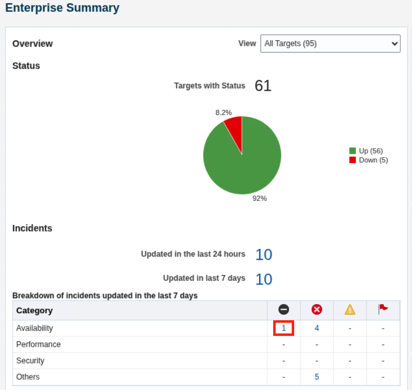

7. A list of incidents with Fatal severity is displayed in Incident Manager. You can manage the incidents by acknowledging, assigning ownership, changing the priority or status, and more.

    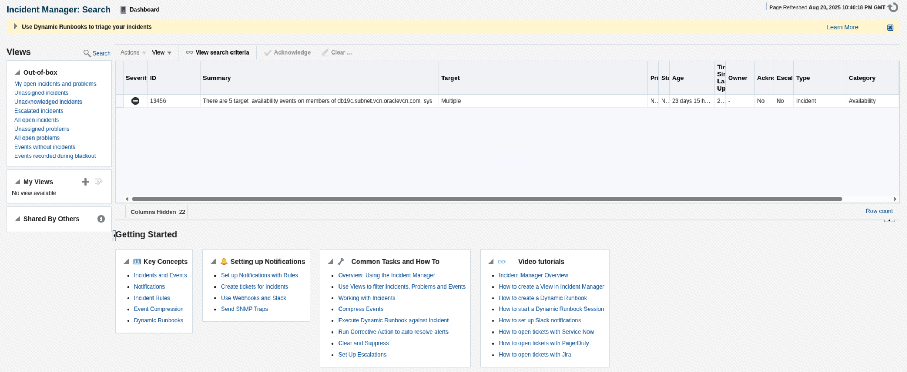

8. Click on the hamburger icon on the top left corner, then click "Enterprise >> Summary" to go back to the Enterprise Summary page.

9. You can also filter the view based on the target type. Click on the View dropdown in the “Overview” pane and select “Database Instance” to look at the database status.

    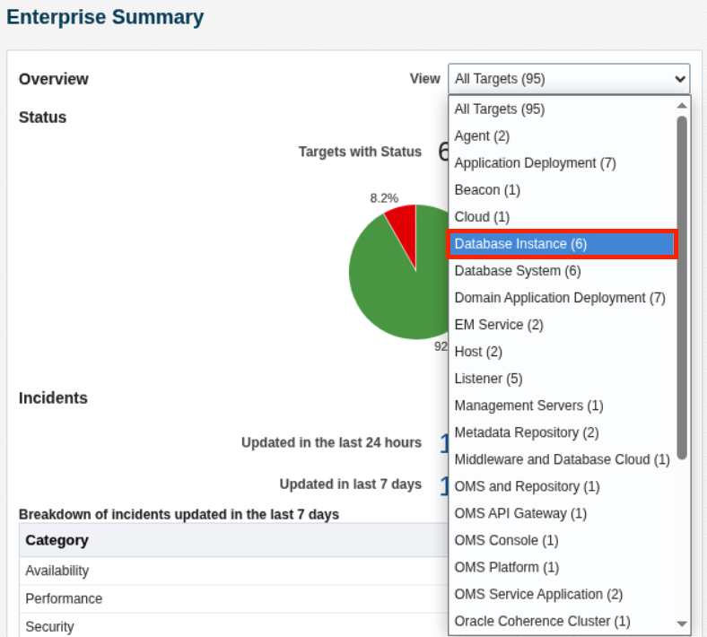

10.	The Status pane is filtered for Database Instance targets and displays a breakdown of the database statuses.

    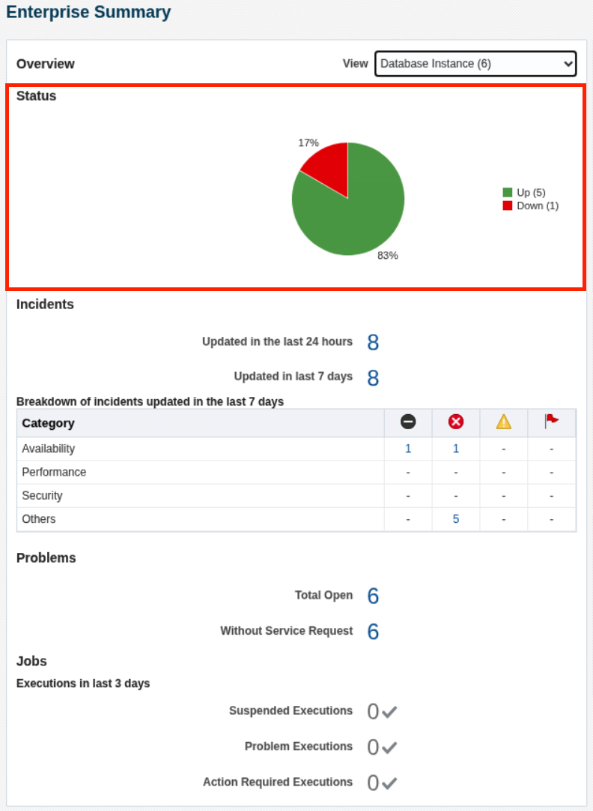

11.	The right hand pane of the Enterprise Summary page also has Inventory and Usage, Compliance Summary, and Patch Recommendations sections. Inventory and Usage shows a breakdown of database inventory by release. Compliance Summary shows the compliance score for the selected targets as well as security recommendations. Patch Recommendations links to MOS and shows the recommended patches for your targets.

     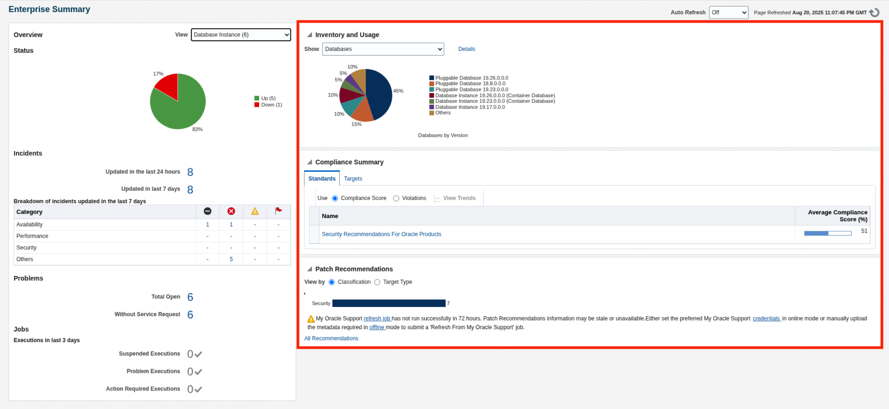


## Task 2: Incident Manager

Incident Manager provides in one location the ability to search, view, manage, and resolve events, incidents and problems impacting your environment.

1. Log into an Enterprise Manager VM (using provided IP). The Enterprise Manager credentials are “emadmin/welcome1”.

    

2. Click the **hamburger menu** icon.

    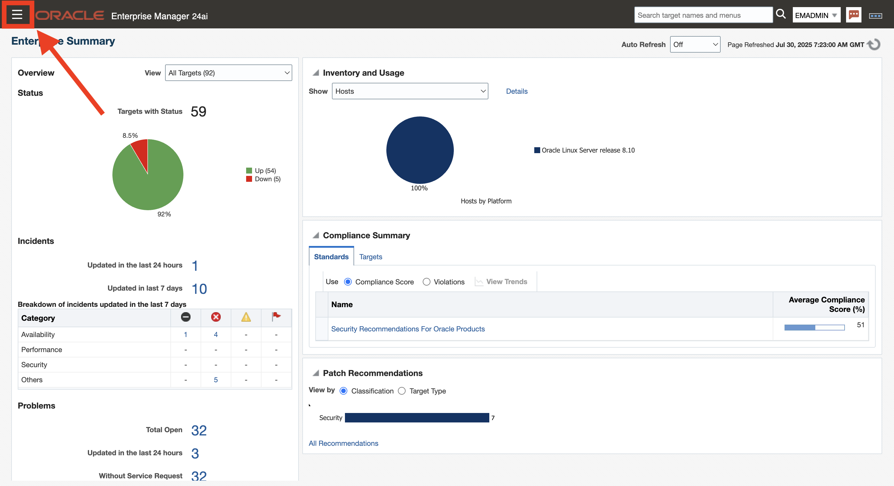

3. Navigate to "Enterprise >> Monitoring >> Incident Manager".

     

4. In Incident Manager, you can use any of the Out-of-box Views to quickly filter the list of incidents to the subset you're interested in, e.g., My open incidents and problems. You can create your own views and share with others as well. By default, “All open incidents” view is displayed.

    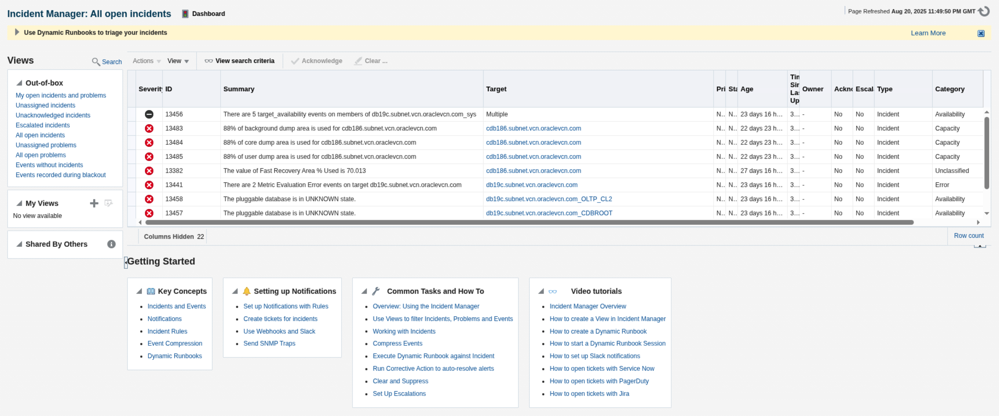

5. We will triage unassigned incidents and then acknowledge and assign an incident to an owner. Click on the incident with Summary text “The database status is UNKNOWN”. Details of the incident will be displayed in the bottom pane.

    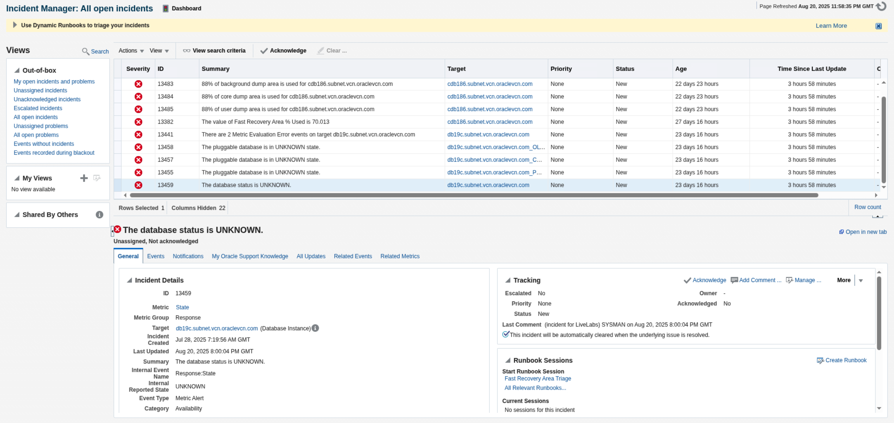

6. Click on “Open in new tab” link to open the incident on a separate tab. You may need to temporarily allow popups in the browser.
    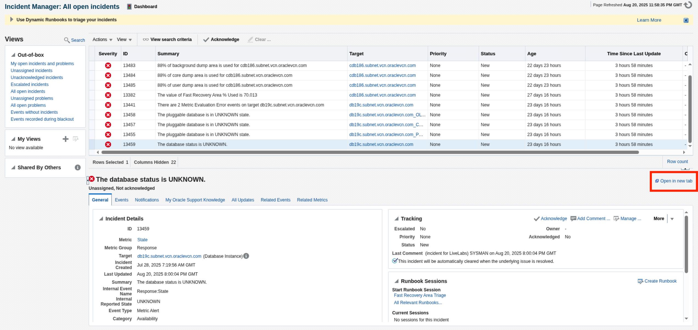


7. The General tab of this incident contains 5 sections.

      - Incident Details contains information about the incident such as target name, creation date, type, and summary.
      - Metric Data shows the warning and critical thresholds and the last known value of this metric alert event.
      - Tracking provides the priority, status, and ability to manage the lifecycle of the incident.
      - Guided Resolution provides the ability to diagnose and take action to resolve the incident.
      - Runbook Sessions provides options to start, create, or view a runbook session against the incident.

     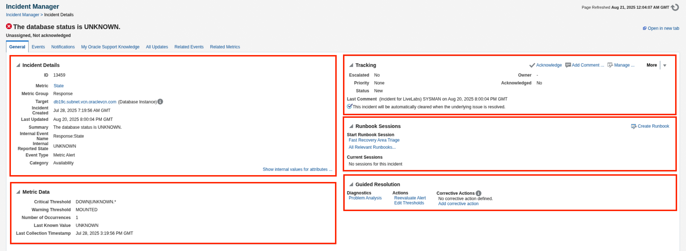

8. Click on “Acknowledge” in the Tracking section to acknowledge the incident. This will automatically assign the incident to the user acknowledging the incident.

     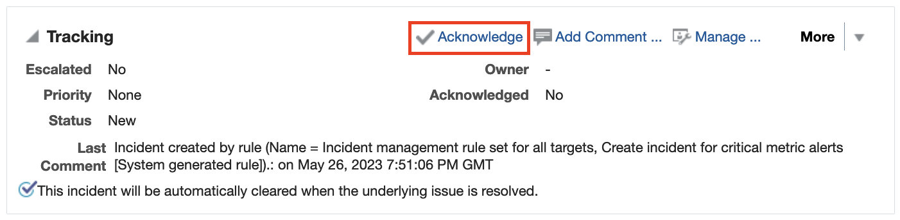

     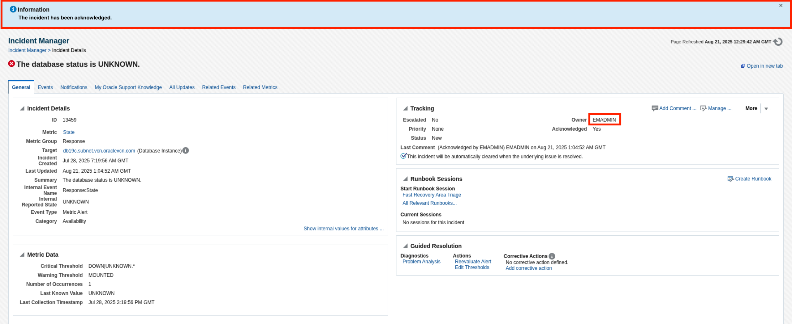

9. Click on “Manage”.

     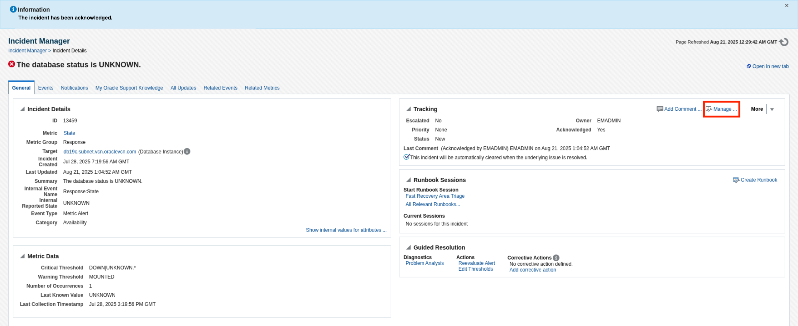

10. Update the Status, Priority, and Escalation fields. Add a short comment and click OK.

     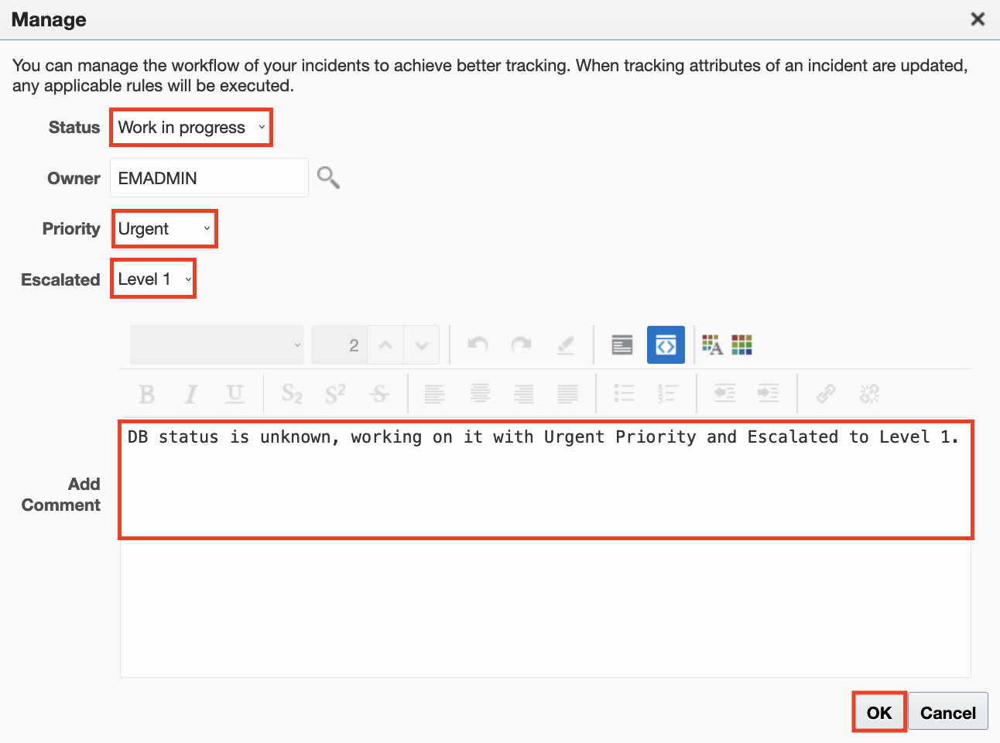

11.	A confirmation is displayed with the Tracking section updated.

     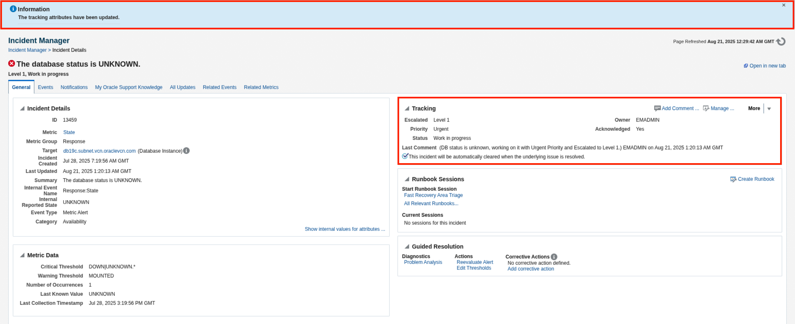

12.	Close the Incident Details tab and go back to the Incident Manager tab.

13.	Click on the Dashboard button next to “Incident Manager: All open incidents”.

     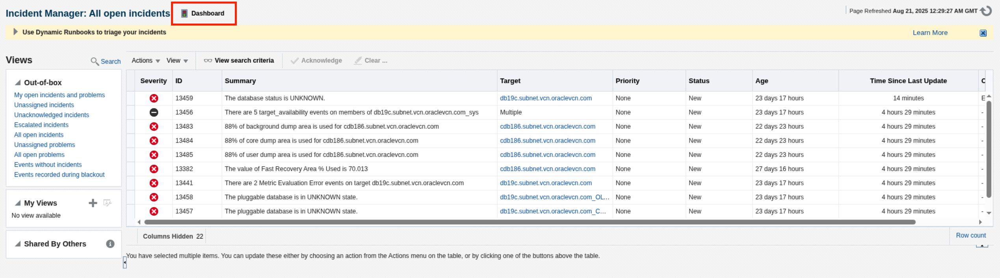

14.	Incident Dashboard provides a holistic view of your incidents. It contains 3 sections:

       - Summary: Count of incidents that are open, fatal, escalated, unassigned, and unacknowledged. These are the incidents that need to be triaged or worked on immediately. Fatal and Escalated count are highlighted in Red by default.
       - Charts: Provides an easy-to-understand look at the current incident distribution and management status for each incident. Drill down capability with stackable filters to slice and dice data any way you like. Customize to add/update/remove charts to provide a personalized view in Incident Manager.
       - Incident List: Shows the open incidents listed in reverse chronological order by last updated time stamp. From this list, you can perform requisite incident lifecycle actions such as escalating, prioritizing, acknowledging, assigning owners, and adding comments to the incident. The incident list will reflect any filters applied.

     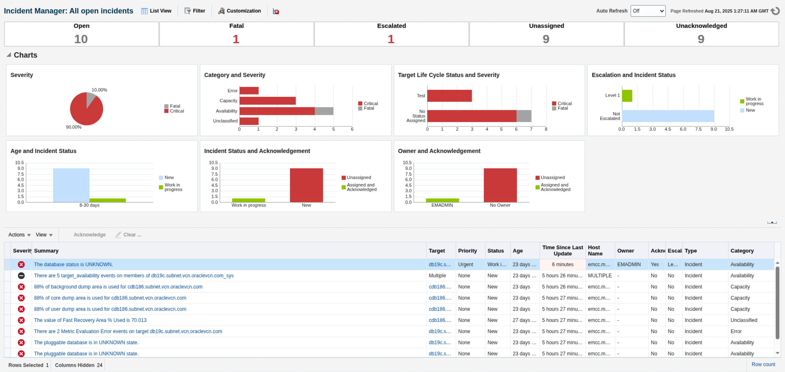

15.	Click on the “Fatal” link to filter the dashboard to only show incidents of Fatal severity.

     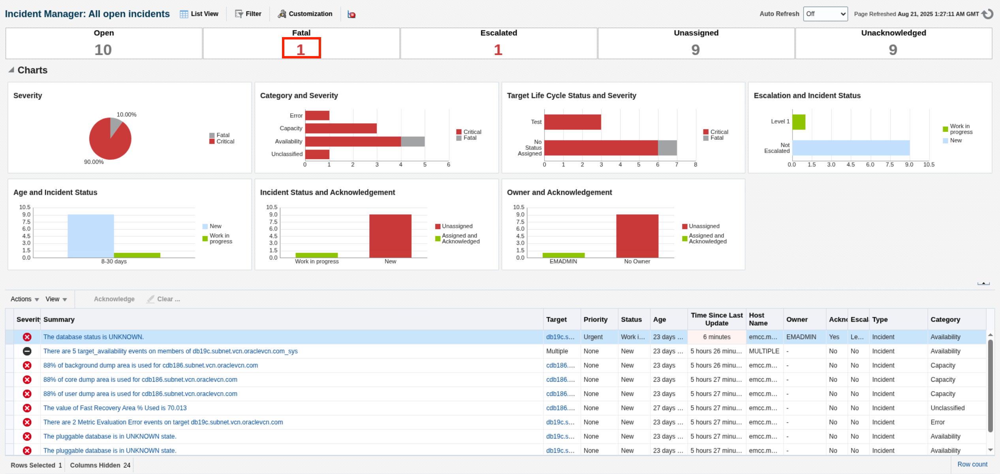

16.	Incident Dashboard is filtered for incidents with “Fatal” severity.

     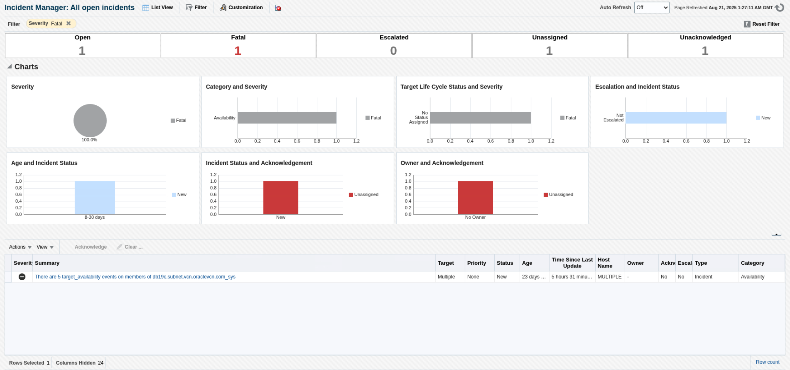

     
## Task 3A: Use Dynamic Runbooks for Incidents

For this task, an Incident-Based Dynamic Runbook has already been published for you to use. You will go through the process of starting a Runbook session against a designated **INCIDENT**.

Dynamic Runbooks are documented best practice procedures that IT staff follow to prevent or resolve an issue. In Enterprise Manager, you can create Dynamic Runbooks to encapsulate your best practice procedures in the form of steps that your ITOps teams can execute inside Enterprise Manager in context of a metric or incident. To use runbooks, you choose a runbook, start a Runbook session against a metric or incident, and then follow the steps in the runbook.

1. Log into an Enterprise Manager VM (using provided IP). The Enterprise Manager credentials are “emadmin/welcome1”.

     

2. Click the **hamburger menu** icon.

    

3. Navigate to "Enterprise >> Monitoring >> Incident Manager".

     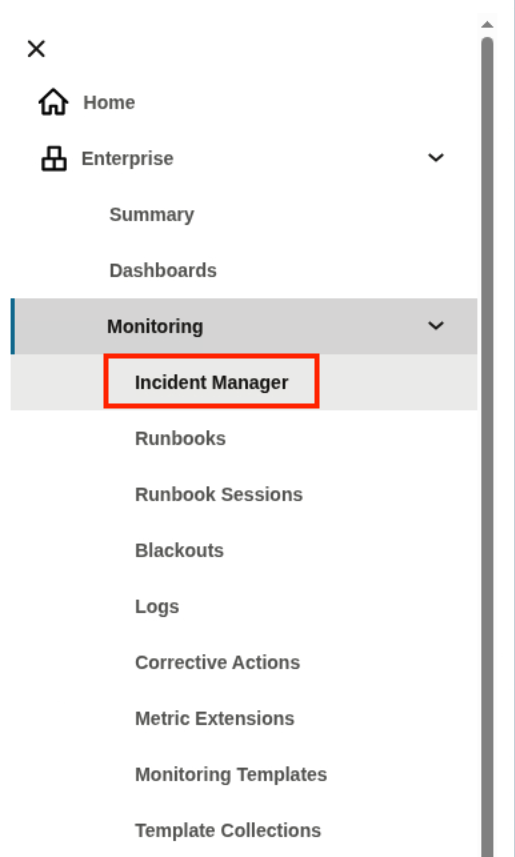

4. In Incident Manager, the “All open incidents” view is displayed by default. 

     Click the incident with Summary text “The value of Fast Recovery Area % Used is 70.013”. Details of the incident will be displayed in the bottom pane.
     **Note**: You can ignore any differences in values that you see for the Fast Recovery Area Used(%) in your lab environment vs. what is shown in this workbook.
     **Note**: The Fast Recovery Area (FRA) is a unified storage location for all Oracle Database files related to recovery.  

     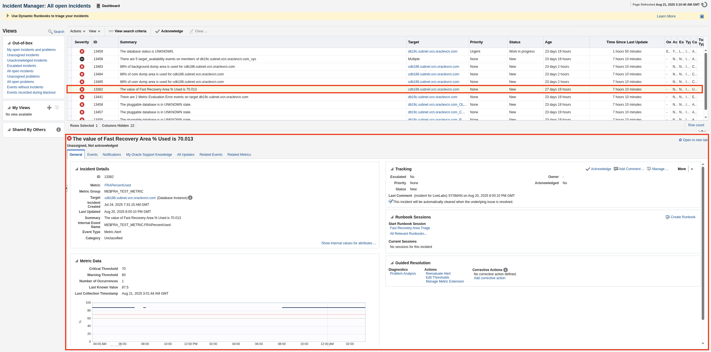

5. In the middle pane on the right, you should see a section called "Runbook Sessions".

     Under "Start Runbook Session", select the runbook named “Fast Recovery Area Triage”.

     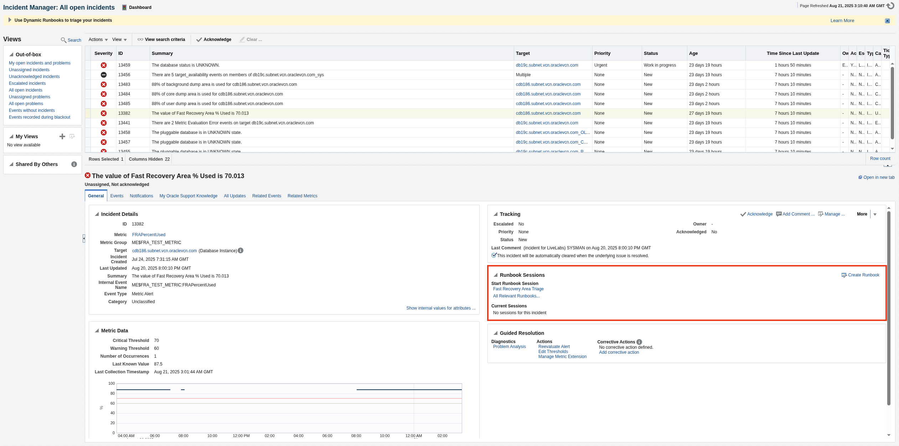

6. You have now started a Runbook session, opened in a new browser tab. Here you can see a detailed view of the steps needed to run the Runbook and triage the issue. Notice incident details are carried over. Also, there is a comments icon next to each step where you can leave comments that can later be accessed by your team.

     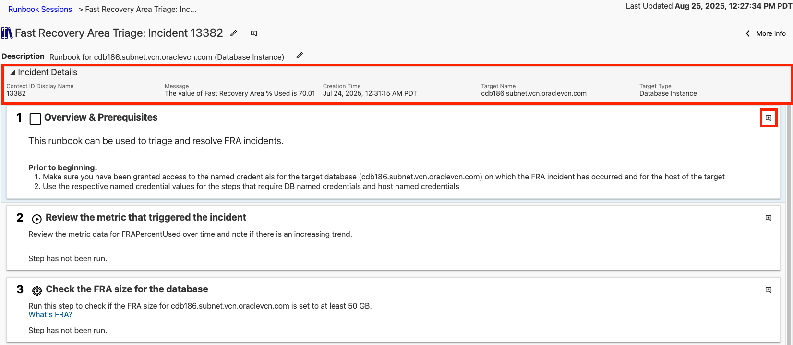

7. The Overview & Prerequisites step describes what the Runbook does, and the prerequisites needed to run it. In this lab, the prerequisites have already been completed for you. You should have access to the named credentials: **CDB186\_SYS**, for the target database and **ORACLE**, for the host of the target. 

     Check the checkbox to indicate you have read and completed the step.  

     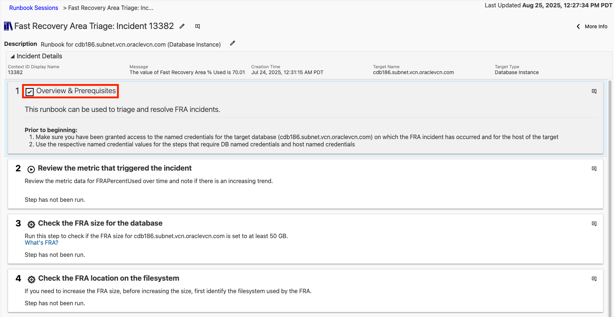

8. Click the play icon in Step 2 to review the metric that triggered the incident. The red vertical dotted line indicates when the incident happened. 

     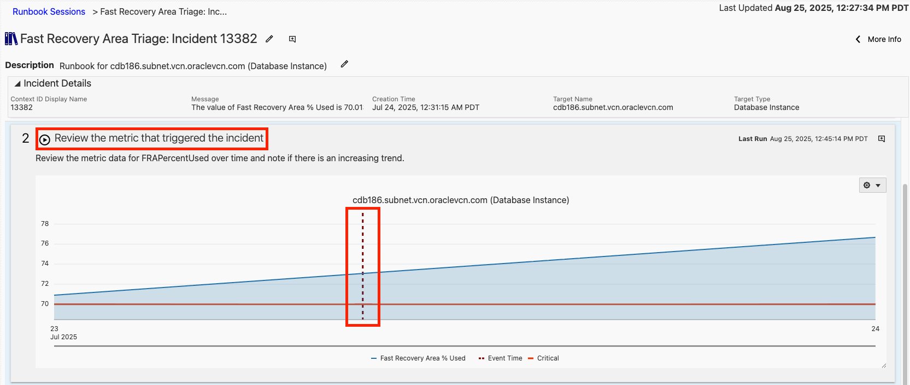 

9. Notice Step 3 has gear icon displayed instead of the play icon. The gear icon means some input properties are required before you can execute the step. 

     Click the gear icon.

     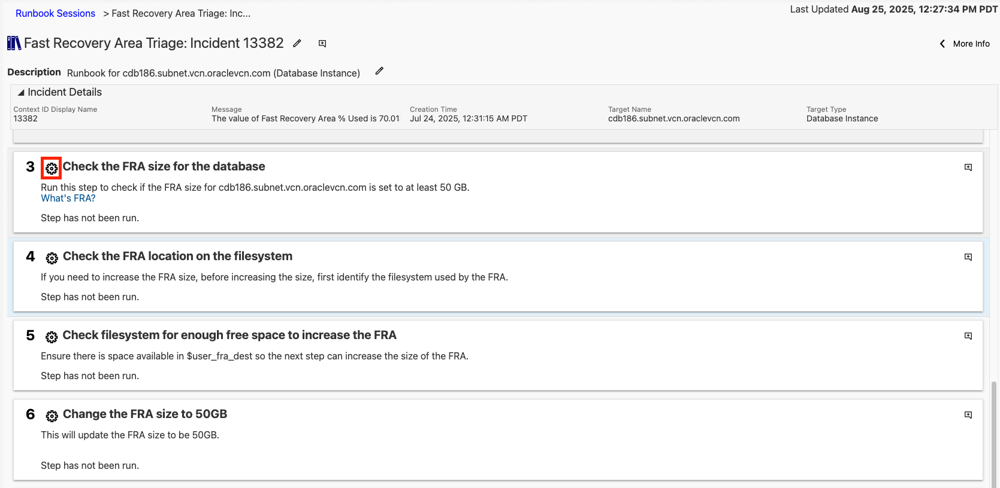 

10. Step 3 requires you to specify the named credential for the target database before you can run the step. 

     CLick on the field, select the following credential: **CDB186\_SYS** in the dropdown menu of Named Credential Name. Click Save.

     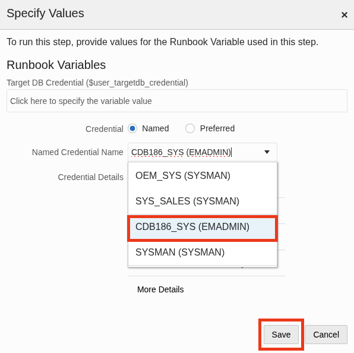     

11. Before running the step, click the hyperlink for “What’s FRA?”. This will open another tab to documentation on Fast Recovery Area. You can add links to external resources or to other EM pages to assist users with additional diagnostic or contextual information.

     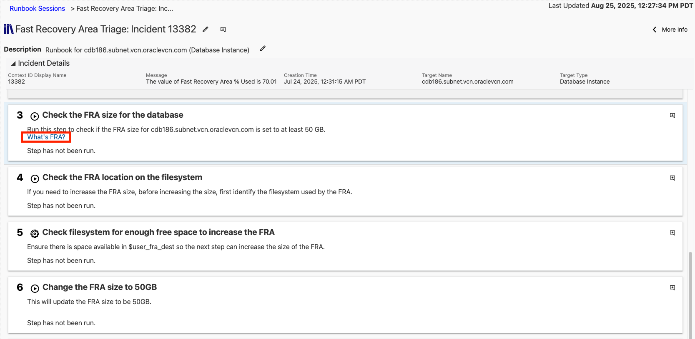

     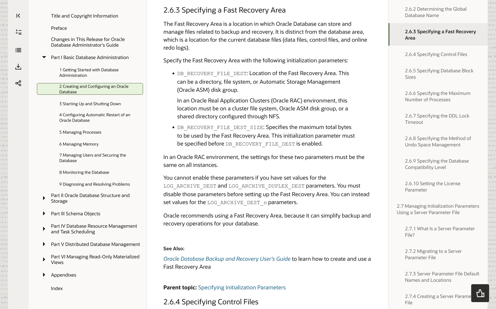

12. Close out of the Oracle documentation tab.

13. In Step 3, click the play icon to check the FRA size of the database. 

     It is 8 Gigabytes (GB). However, the FRA size must be set to at least 50GB. Therefore, you will need to increase the FRA size.

     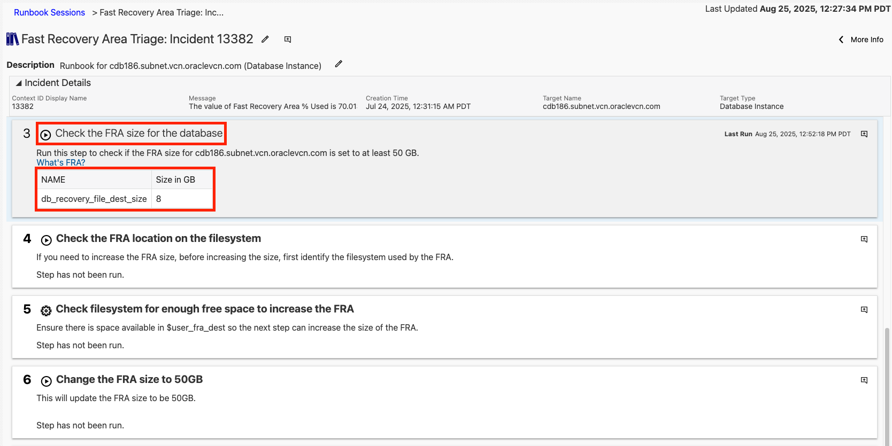

14. Before increasing the size, first identify the filesystem used by the FRA. 

     Click the play icon in Step 4.

     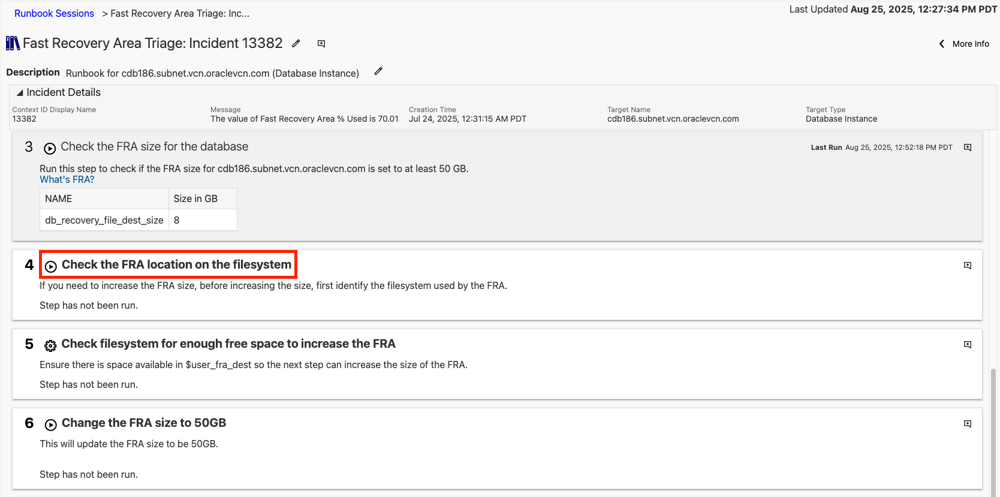

15. A table appears with the FRA filesystem path. This filesystem path will be used in the next Runbook step. 

     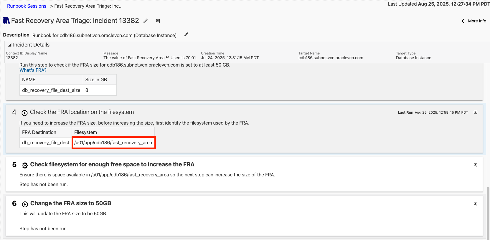

16. Let's move on to Step 5. Before we can increase to meet the requirements, we should check that the filesystem has enough space to increase the FRA size.

17. Notice another gear icon is displayed instead of the play icon for Step 5. 

     Click the gear icon.

     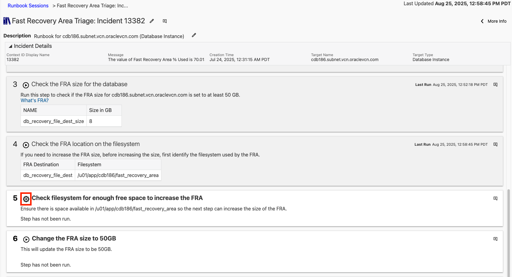

18. Step 5 requires you to specify host credentials before you can run the step. 

     Click on the field, select the following credentials: **ORACLE** in the dropdown menu of Named Credential Name. Click Save.

     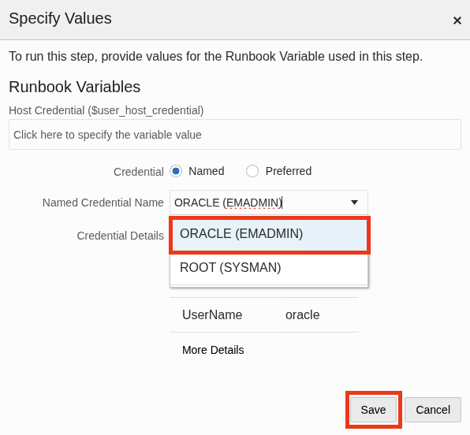

19. Click the play icon. 

     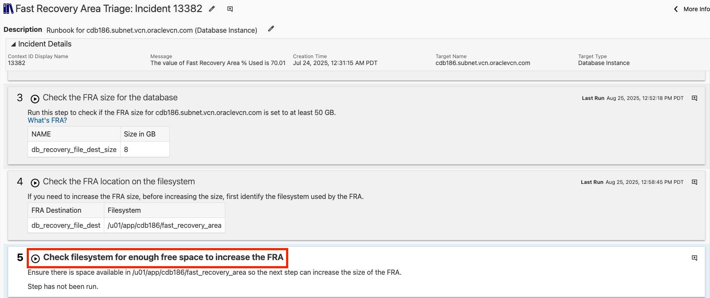

20. There are 342GB available in the filesystem where the FRA is located. This shows that there is enough space for us to increase the FRA size.

     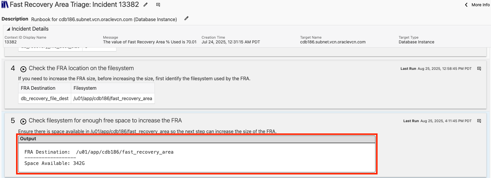

21. To change the FRA size to 50GB, click the play icon in Step 6. 

     You should see a table that indicates that you have successfully increased the FRA size. Increasing the FRA size allows the FRA percent used to decrease.

     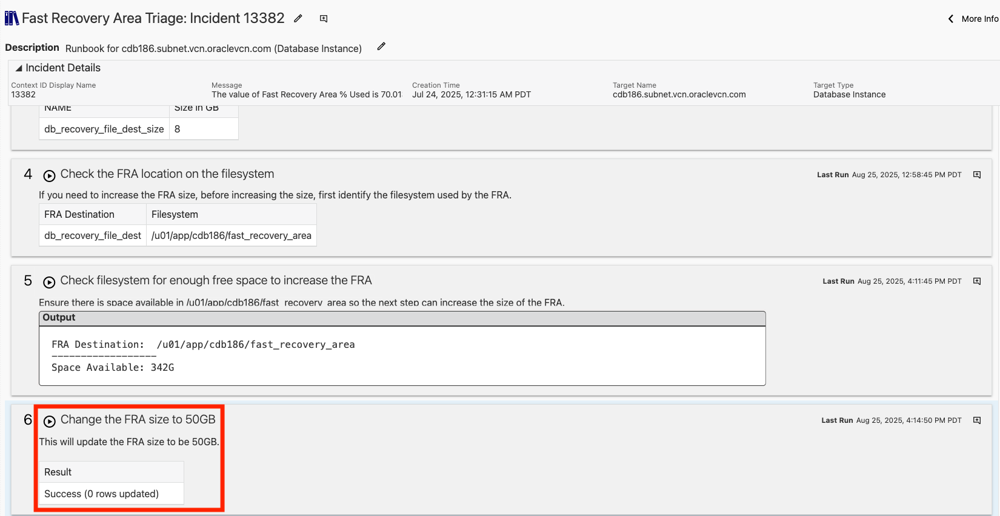

22. Run Step 7 to view the updated FRA size and to confirm that it has been set to at least 50GB which meets the FRA size required for the database.

     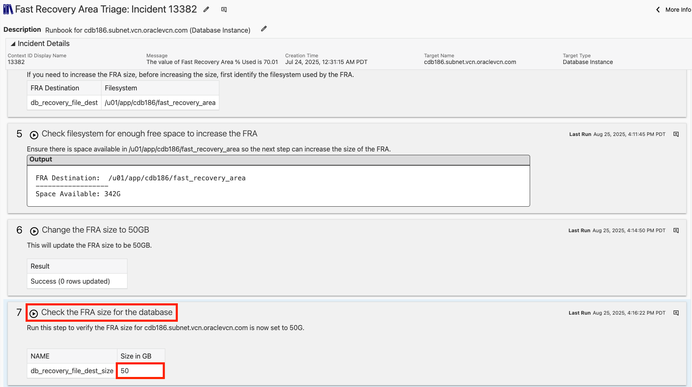

23. Step 8 describes the success criteria: once you have completed all the Runbook steps and the FRA is sized appropriately, then this should eventually resolve the issue. 

     **Note:** For the purpose of this lab, the metric incident was simulated and therefore may still remain in Incident Manager after these steps have been run.

     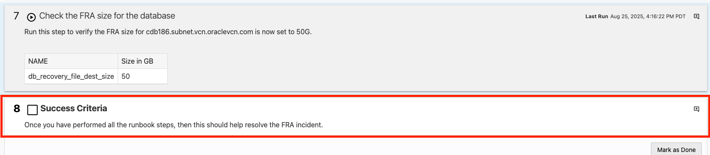

24. Check the checkbox in Step 8 to indicate that you have read and completed all the runbook steps. 

     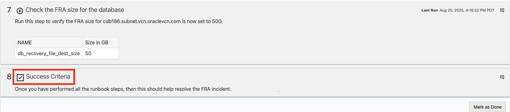

25. The Runbook remains an active session until you Mark as Done. As an active session, your data will be saved which allows you to go back and run (or rerun) your steps. This is useful for cases where you may want to leave the session halfway through and return to complete it later.

26. Click ‘Mark as Done’ to indicate that you have finished all the steps. Once you Mark as Done, you can no longer re-run any steps, but you can continue to view the session in read-only in order to do any post-mortem analysis.

     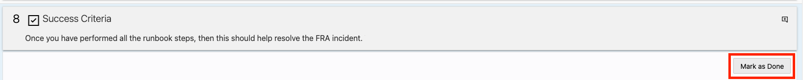

27. Click OK.

     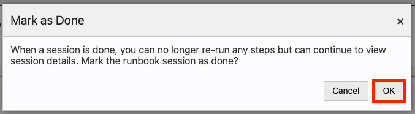

28. Your runbook session will be kept for 14 days to enable you to do postmortem analysis. You can save it for a longer period by going to the Actions menu and extending its expiraiton date.

     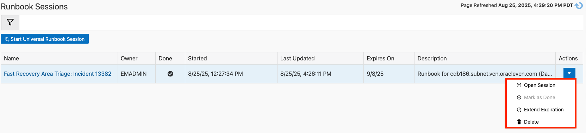
     

## Task 3B: Create Dynamic Runbooks for Incidents

For this task, a Dynamic Runbook **draft** has already been created in the context of an incident. You will go through the process of modifying the Runbook and later publishing it to be used by others.

Runbooks are documented best practice procedures in the form of ordered steps that IT staff follow to prevent or resolve an issue. To create a Dynamic Runbook, you can create it in context of an incident or metric. This runbook in development is called a runbook draft. The runbook draft will contain the incident or metric context against which you can develop and test the runbook steps. Once runbook creation and testing are completed, the runbook can be published for general use.

1. Log into an Enterprise Manager VM (using provided IP). The Enterprise Manager credentials are “emadmin/welcome1”.

     

2. Click the **hamburger menu** icon.

    

3. Navigate to "Enterprise >> Monitoring >> Runbooks".

     

4. The Runbooks page has Draft Runbooks and Published Runbooks. By default, the Drafts tab is opened. You can create a Runbook through this Runbooks page, directly against an incident in the Incident Manager page, or directly against a metric in the All Metrics page. 

     Under the Drafts tab, select the "**New Runbook**" link. This is the Runbook draft that was created for you and that you will modify.
     
     

5. At the top of the page, the previous incident details are carried over. This is the incident that was selected to create a Runbook draft on. 

     You can optionally edit the Runbook name and Description using the pencil icons next to them.

     

6. There is an ‘Add a Step’ drop-down menu, where you can select the desired step type you want to define. There are five step types: Note, Metric Data, Repository SQL, Target SQL and OS Command. We have already added the steps for you in this Runbook draft.

     

7. In the Overview and Prerequisites step you can specify the purpose of the Runbook, and any prerequisites needed to successfully execute the steps. You can include simple formatting via markdown language.

     Select the pencil icon to edit Step 1 (Overview and Prerequisites).

       

8. In Step 1, you are going to make the first sentence a header, add a line underneath it and then add a variable to the text. 

     Copy the following and replace the current text in Step 1: 

     **\### This runbook can be used to triage and resolve FRA incidents.**
     
     **\---**

     **Prior to beginning:**
     
     **1. Make sure you have been granted access to the named credentials for the target database $ora\_target\_name on which the FRA incident has occurred and for the host of the target**
     **2. Use that named credential values for the steps that require DB named credentials and host named credentials**

       

9. Select Save Step. Step 1 should now look like this:
     
      

10. Step 2 is a Metric Data step which is used to show the metric time series chart. 

     Click the pencil icon.

      

11. In this step you are going to modify the time range of the metric data in the chart. 

     Click on the Time Range field. 
     
     Leave the Start Time as "**evt\_time – 1d**". 
     
     Change the End Time to "**evt\_time + 1d**". 
     
     **Note:** evt\_time represents the time when the event (and its incident) was triggered, and you are changing it to show the day before and after the event was triggered. 
     
     Select Done.

     

12. Click the Run button to preview the metric graph. This should now show the graph and display the trend of the metric before and after it triggered the incident.

     

13. Click Save Step to save your changes for Step 2.

     

14. A graph now displays with a red vertical dotted line to indicate when the incident was triggered.

     

15. Step 3 is a Target SQL Step. It allows you to execute SQL against any database target. 

     Select the pencil icon.

     

16. You can add links to external resources or to other EM pages to assist users with additional diagnostic or contextual information. In this step we will add a link to an external FRA doc.

     Add the following to the instruction text in Step 3: 


     \[What's FRA?](https://docs.oracle.com/en/database/oracle/oracle-database/19/admin/creating-and-configuring-an-oracle-database.html#GUID-CE434293-0956-4E62-8D3F-CD92CE66B7D8)

     

17. A SQL query has already been added to check the FRA size. 

     Scroll to the bottom of the page and click Run to test the query. 

     

18. Select Save Step. The "What’s FRA?" text is now hyperlinked to the FRA doc and the SQL output is displayed.

19. Step 4 is another Target SQL step. Data from this step will be saved to a variable for use in another step. You will go through the process of saving the SQL query output into an author-defined variable that was previously created. 

     Select the pencil icon.

     

20. Scroll to the bottom of the step and click the Run button to preview the SQL query results.

     

21. Select the "Save to Variables" tab.

     

22. Click on the cell under the Filesystem header. 

     

23. Under the dropdown for "Runbook Variable", select the pre-defined variable named "FRA Destination (user\_fra\_dest)". Select "Save".

     

24. Now whenever this step is run the Runbook variable, FRA Destination (user-fra-dest), will be populated with the value from the selected cell (i.e., the output of the SQL query). 

     Select Save Step.

     

25. Step 5 is an OS Command Step. This step type allows you to execute a single operation or execute a script as a part of the step definition. 

     Select the pencil icon.

     

26. Let’s create a variable that will contain the credentials that will need to be specified by the runbook session user when running this step. 

     **Note:** Notice that the FRA Destination variable from Step 4 is used in both the instruction text and script for Step 5.

27. Navigate to the Variables section on the right. In the "Author Defined" section select the "Add Variable" button. 

     

28. You will see a pop-up box labeled Add a Runbook Variable. 
     - In the Name field, enter "**user\_host\_credential**".
     - In the Display Name field enter "**Host Credential**".
     - In the Value used in the Draft field, enter "**ORACLE**".
     - And for the Value used in a Runbook Session field, select the dropdown option "**Specified by the session user or by running a step**". 

      

29. Click OK to save the variable. 

       

30. Once the variable is saved, it should appear in the Variables section under ‘Author Defined’.

      

31. Currently, the "Named Credential" field is hardcoded to always use the name credential value **ORACLE** to run the step. 

     Select the ‘Named Credential’ field.

      

32. Select the option to ‘Use existing value from variable’.

      

33. Using the dropdown options, select the variable you just created that is labeled ‘user\_host\_credential’. Select Done.

      

34. Now this step will require the session user to specify the host credentials, **ORACLE**, before they are permitted to run this step. 

     

35. Scroll down to the Run preview section. Run the step to preview the script output and then select Save Step.

     

36. You have now finished making edits to the Runbook and can publish it so that it can be used by others. Your edits are automatically saved. 

     At the top of the Runbook draft page click on the “Runbooks” link to go back to the Runbooks page.

     

37. The Runbook draft that you modified will be displayed in the Drafts tab and will have your updates.

     

38. Select the arrow under the Actions column to publish the Runbook for use.

     

39. When publishing the runbook, you have the option to also keep a draft version in addition to the published version. 

     Select the checkbox to Keep Draft and click OK.

     

40. The "New Runbook" that you made modifications to has now been published and can now be used by other EM users. 

     


## Task 3C: Use Dynamic Runbooks for Metrics

For this task, a Metric-Based Dynamic Runbook has already been published for you to use. You will go through the process of starting a Runbook session against a designated **METRIC**.

Runbooks are documented best practice procedures that IT staff follow to prevent or resolve an issue. In Enterprise Manager, you can create Dynamic Runbooks to encapsulate your best practice procedures in the form of steps that your ITOps teams can execute inside Enterprise Manager in context of a metric or incident. To use runbooks, you choose a runbook, start a Runbook session against a metric or incident, and then follow the steps in the runbook.

1. Log into an Enterprise Manager VM (using provided IP). The Enterprise Manager credentials are “emadmin/welcome1”.

     

2. Click the **hamburger menu** icon.

    

3. Navigate to “Targets >> Databases” to see the list of Database targets.     

     

4. Once at the Database targets page, locate and expand **cdb186.subnet.vcn.oraclevcn.com** to view its pluggable databases (PDBs). Select the PDB target with the name, **cdb186.subnet.vcn.oraclevcn.com_TESTPDB**.

     

5. This takes you to the target homepage for the PDB target.

     

6. From the homepage, navigate to ‘Oracle Database >> Monitoring >> All Metrics’.

     

7. Under All Metrics find the "Tablespace Full" metric group and expand it. Select the ‘Tablespace Space Used (%)’ metric.

     

8. Click on the "DEMO" tablespace row in the Tablespace Space Used (%) table to see its metric data. 

     

9. Notice that the Last Known Value for the metric is 84% and the warning and critical thresholds are 90% and 97%. With this metric value close to the thresholds, use a runbook to triage this before an alert is triggered and an incident is created. 

      
      
10. Navigate to the Runbook Sessions section. 

     

     For lab purposes, locate the **Current Sessions** section and select the runbook for **Database Tablespace Full Triage: 2025-07-31 09:44:49** to open an existing runbook session. 

      

11. A runbook session appears in a new browser tab. Here you can see a detailed view of the steps needed to run the runbook to triage a possible tablespace full issue in advance. Notice the metric details are carried over.

      

12. The Overview & Prerequisites step describes what the Runbook does, and the prerequisites needed to run it. In this lab, the prerequisites have already been completed for you. You should have access to the named credentials: **CDB186_PDB**, for the target database and **ORACLE**, for the host of the target. 

     **Check the checkbox** to indicate you have read and completed the step.
     
     

13. **Click the play icon in Step 2** to review the trend of the tablespace full metric. Note if there is an increasing trend.

      

14. Notice for Step 3 a gear icon is displayed instead of the play icon. The gear icon means some input properties are required before you can execute the step. 

     **Click the gear icon**.

      

15. Step 3 requires you to specify PDB named credentials before you can run the step. 

     Click on the credentials field, select the following PDB named credential: **CDB186_PDB**. Click Save.

      

16. **Click the play icon** to find out which tables in the tablespace are consuming the most space.
      
      

17. A list of tables in the ‘DEMO’ tablespace appears. From the output, the ‘Student’ table appears to be consuming the most space. According to the runbook, review the data in the tables consuming the most space to see if there is any data that can be deleted or if the table itself can be deleted. 

     Assume that all the data in all the tables are necessary and continue to Step 4.

      

18. If you need to increase the tablespace size, first identify the filesystem that is used by the tablespace. 

     **Click the play icon in Step 4**. The filesystem path output will be used in Step 5.

      

19. Notice for Step 5 another gear icon is displayed instead of the play icon. 

     **Click on the gear icon**. 

      

20. Step 5 requires you to specify host named credentials before you can run the step. 
     
     Click on the credentials field, select the host named credential: **ORACLE** under the dropdown menu of Named Credential. Click Save.

      

21. **Click the play icon** to check the filesystem, that was identified in Step 4, for available space. There are 342G available in the filesystem which means that you have enough space to increase the size of the tablespace if needed.

      

22. **Run Step 6** to note if there is a decreasing filesystem space available trend that could impact future growth of tablespace. 

      

23. Scroll to Step 7. If needed and there is space available in the filesystem, add another 100MG datafile from the Tablespace page. Select the hyperlink to navigate to the ‘Tablespace Page’.

     **Note**: Runbooks support navigation links to other Enterprise Manager pages in step instructions for further triaging purposes.

        

24. A new browser tab opens with a database login screen. 
     
     Login to the database using the PDB named credential: **CDB186_PDB**.

       

25. This is the Tablespace page where you can add new datafiles to the tablespace. For lab purposes, we will **NOT** go through the workflow to add a new datafile to the tablespace. 

       

26. Close out of the current tab to return to the Runbook steps.

27. Check the checkbox to indicate you completed the step.

       

28.	The Runbook remains an active session until you Mark as Done. As an active session, your data will be saved which allows you to go back and run (or rerun) your steps. This is useful for cases where you may want to leave the session halfway through and return to complete it later.

29.	Click “Mark as Done” to indicate that you have gone through all the steps. Once you Mark as Done, you can no longer re-run any steps, but you can view the session in read-only to complete a post-mortem analysis.

       

30. Click OK.

      

31. Your runbook session will be kept for 14 days to enable you to do postmortem analysis.  You can save it for a longer period by going to the Actions menu and extending its expiration date.

      


## Task 3D: Dynamic Runbooks for Notification Backlog (Universal Context) 

Dynamic Runbooks are documented best practice procedures in the form of executable steps that ITOps teams follow to prevent or resolve an issue. Dynamic Runbooks can be executed inside Enterprise Manager (EM) in context of a metric, incident, or any other EM context (universal context).

A universal context runbook can be used for any functional area in EM.  

As an example of a universal context runbook, you will review the Triage Notification Backlog runbook.

1. Log into Enterprise Manager using the credentials **emadmin/welcome1**. 

    

2. Click the **hamburger menu** icon.

    

3.	Navigate to **Setup > Manage Enterprise Manager > Health Overview**.

    

    

4.	Scroll down to the **Notification Performance** section.

    

5. Notice the Oracle provided runbook named **Triage Notification Backlog with Runbook**. This is an example of a universal context runbook.  This runbook helps to triage delayed or missing notifications.

    **Click on the "Triage Notification Backlog with Runbook" link to start a runbook session**. It will open a runbook session in a new tab.

    

6. In this runbook session, notice the universal context description.  This means it does not have a pre-defined context, but it has steps to query and take actions on the appropriate EM components.

    

7. **Execute the first 4 steps of the runbook**.  You do not have to execute the remaining steps.

     **Click on the checkbox**.

    

     **Click on the play button**.

    

     **Click on the play button**.

    

     **Click on the play button**.

    


## Task 3E: Access Dynamic Runbook Samples

Runbooks are documented best practice procedures that IT staff follow to prevent or resolve an issue. In Enterprise Manager, you can get started with using Dynamic Runbooks by downloading sample runbooks and installing them to your Enterprise Manager site.

1. Log into an Enterprise Manager VM (using provided IP). The Enterprise Manager credentials are “emadmin/welcome1”.

    

2. Click the **hamburger menu** icon.

    

3. Navigate to "Enterprise >> Monitoring >> Incident Manager".

     

4. Notice a yellow box on the top of the page that says "Use Dynamic Runbooks to triage your incidents". Click on the arrow to expand it.

     

5. In the expanded pane, notice there is a link to a MOS note. While you cannot click on the MOS note link in this lab due to environment restrictions, this is something you can do in your own EM site.

     

6. When you are able to access the MOS note from your EM site, you can see there are three example runbooks available: **FRA (Fast Recovery Area) Runbook**, **Database Tablespace Full Triage Runbook**, and **CPU Utilization Runbook**. Follow the steps in the **Solution** section to download the sample runbooks and install them in your Enterprise Manager site.

     


## Task 3F: Create Dynamic Runbooks from Oracle-provided Runbooks

Dynamic Runbooks capture best practice procedures in the form of executable steps that ITOps teams follow to prevent or resolve an issue. They can be executed inside Enterprise Manager (EM) in context of a metric, incident, or any other EM context (universal context).

In this lab, you will see how you can create a Dynamic Runbook based on an Oracle-provided Runbook. This is useful in scenarios where you would like to customize an Oracle-provided Runbook for your specific requirements.

1. Log into Enterprise Manager using the credentials **emadmin/welcome1**.


2. Click the **hamburger menu** icon.


3. Navigate to **Enterprise >> Monitoring >> Runbooks**.


4. In the Runbooks page, you will see two tabs: **Drafts** and **Published**.

    - The **Drafts** tab contains runbooks that are currently being edited.
    - The **Published** tab contains runbooks that are published and ready for use.


5. Click on the **Published** tab.  


The list of published runbooks should appear.


6. Locate the runbook called **Triage Notification Backlog (Oracle)**. This is an Oracle-provided runbook that you can use when you notice that there is a large backlog of notifications, such as email notifications, pending delivery. To create a new runbook based on this runbook, click the three dots under **Actions** and select **Create Like**.


7. In the confirmation dialog, verify that you want to create a new runbook based on the **Triage Notification Backlog (Oracle)** runbook, and click **OK**.


8. A new runbook is created in draft mode. Click the pencil icon to edit the name of the runbook. Name it **My Triage Notification Backlog**, or choose a similar name. Click the check mark next to the name to save it.


9. Scroll down the page to scan the steps provided to triage the notification backlog.


10. Let's add a new step to check the SMTP gateway server. Click **Add a Step** and select **Note**.


11. A **Note** step can be used to provide instructions, link to a website, or link to another page in Enterprise Manager. In this step, you will add a link to the Mail Servers page in Enterprise Manager.   
For the **Title** field, enter **Check Mail server**.


12. In the body of the step, copy the following lines and paste them into the body of the step:

 ```text
Go to the Mail Servers page and verify that the Mail (SMTP) server has been set up.

Here is the link to the page: [Mail Servers](/em/faces/core-notif-mailServerSetup)
 ```


13. Click **Save Step**.


14. The new step is added at the end of the existing steps. Move it to the top by clicking the **move to first** link.


15. **Scroll up** to verify that the step has been moved to the top, just below the **Overview & Prerequisites** step.


16. You can also choose to have steps set as **auto-run**. When a user starts using the runbook in a runbook session, auto-run steps execute automatically. This is useful for steps that gather preliminary information for the user to review later in the runbook session. Let's enable auto-run for selected steps.

Click the pencil icon on **Step 3** to edit it.


17. In Step 3, move the slider at the top to enable **Auto Run**.
The instruction text describes what this step will do -- counts the pending notification messages. The actual SQL query is not shown because it accesses internal tables.


18. Click **Run** to see the output of the step.


19. Click **Save Step**.


20. Click the pencil icon for **Step 4**.


21. Enable **Auto-Run** for Step 4 and click **Save Step**.


22. Click the pencil icon for **Step 5**.


23. Enable **Auto-Run** for Step 5 and click **Save Step**.


24. Keep the other steps unchanged. Your edits are saved automatically. Click **Runbooks** at the top of the page to return to the main Runbooks page.


25. In the **Actions** menu for your runbook, select **Publish**.


26. In the confirmation dialog, click **OK**.


**Note:** A draft copy of your runbook is automatically created in case you want to make future edits.

27. Your published runbook is now ready for general use.


## Task 3G: Using Dynamic Runbooks Created from Oracle-provided Runbooks

Complete **Task 3F: Create Dynamic Runbooks from Oracle-provided Runbooks** before beginning this task.

This task shows you how to use the runbook created in Task 3F.

1. Click the **hamburger menu** icon.


2. Navigate to **Enterprise >> Monitoring >> Runbook Sessions**.


3. Click **Start Universal Runbook Session**.


**Note:** Because the runbook you created in Task 3F is based on universal context, you can use it from a universal runbook session.  Universal context means it can be used for any EM object.

4. Click the arrow next to your runbook.


5. A session starts using your runbook. **Notice the panel on the right**, which outlines all the steps in the runbook. Some steps are grayed out and have a check mark; these steps were set to **Auto-Run** and executed successfully. The other steps are available to execute.


6. Click **> Less Info** to hide the panel of steps.


7. Use the vertical scrollbar on the right to scroll up to the first step.


8. Review **Step 1: Overview & Prerequisites** and then **click on its checkbox** to indicate that you are done with the step.


9. Review **Step 2**. **Click** the link to **Mail Servers**. 


It should open a new tab showing the configured Mail Servers. For this lab, assume that the configuration is correct.


10. **Click on the first browser tab** to return to your runbook session.


11. **Click Step 2** to mark it done.


12. Review **Step 3**. This step has been auto-run. Check if there is a current notification backlog (i.e., table has a non-zero count of pending notification messages)


**Note:** This EM site does not actually have a notification backlog, but the purpose of the lab is to become familiar with the runbook steps.

13. Review the output of **Step 4**, which has been auto-run.


14. In Step 4's table, if both columns `ENQUEUE_ENABLED` and `DEQUEUE_ENABLED` show **YES**, click **Go to Step 7**.


15. In **Step 7**, click the **Play** button.


16. If the COUNT OF UNASSIGNED QUEUES is zero, there is no problem with notification queues.


17. At this point, you can stop this task. These last two tasks demonstrated how to troubleshoot a notification backlog, customize an Oracle-provided runbook, configure steps to run automatically, and review the output of those steps.

Optional: To become familiar with general runbook features, complete **Tasks 3A, 3B, 3C, and 3D**.


## Task 4: Metric and Collection Settings

Metric and Collection Settings page is where we can view and configure thresholds, collection schedules, and Corrective Actions for the metrics being monitored for the target.

1. Log into an Enterprise Manager VM (using provided IP). The Enterprise Manager credentials are “emadmin/welcome1”.

     

2. Click the **hamburger menu** icon.

    

3. Navigate to “Targets >> Databases” to see the list of Database targets.
     
     

4. Click on “cdb186.subnet.vcn.oraclevcn.com” to go to the target home page.

     

5. Navigate to “Oracle Database >> Monitoring >> Metric and Collection Settings”.

     

6. Oracle ships with out-of-box metric threshold and collection settings for different target types.  You can further customize these based on your requirements. Here are some Best Practices recommendations:
      - Disable collection for metrics you don’t care about.
      - Set thresholds only on metrics you want to be alerted on.
      - If these metric settings apply to multiple targets, save the modified metric settings and apply to targets using monitoring templates.


7. By default, the "Metrics with thresholds" view is displayed. This view will show metrics with a Warning or Critical threshold defined.

     

8. There are other out-of-box views available to select from.

     

9. Scroll down to “Dump Area Used (%) metric and click on the “Every 30 Minutes” Collection Schedule link.

     

10. Change the Collection Schedule to 15 minutes and click Continue.

     

11. Scroll down to Dump Area Used (%) metric again. Currently the Warning threshold is set to > 70%. Change the Warning threshold to 85% and Critical threshold to 95%.

     

12.	Click OK to save changes, then you should see a Confirmation message. Click OK.

      

     

13.	Navigate to “Oracle Database >> Monitoring >> All Metrics”.

     

14.	The All Metrics page shows the collected data for all of the metrics on the target.

     

15.	Expand and highlight the Dump Area Metric Group.

     

16.	Click on Dump Area Used(%) under the All Metrics palette and then click on the ‘background’ first row in the Dump Area Used(%) table.  

     

17.	You should see the metric data for Dump Area Used(%) for the background processes.  By default, the last 24 hours are shown but you can change time periods using the View Data dropdown.  In the metric chart, click on Options to view different options for the chart, then click on the Show Thresholds option.

     

18. The Warning and Critical thresholds for the metric will now be shown with the chart as yellow and red lines respectively.  As you review the metric, you can also visually see how close the metric values are to its Warning and Critical thresholds. Notice the metric has passed the new Warning threshold of 85. When the next metric collection occurs, the metric will be evaluated against the new Warning threshold of 85 and should generate a Warning alert. (Note: You do not have to wait for the alert, you can move on to the next lab).

     


## Task 5: Corrective Actions

Corrective Actions automates response to metric alerts and events. A Corrective Action can start the DB listener when it unexpectedly goes down or it can run shell scripts to collect diagnostic data. You can create a custom Corrective Action once and grant access for other Admins to use. We ship with a long list of pre-defined Corrective Actions to get you started.

1. Log into an Enterprise Manager VM (using provided IP). The Enterprise Manager credentials are “emadmin/welcome1”.

     

2. Click the **hamburger menu** icon.

    

3. Navigate to "Enterprise >> Monitoring >> Corrective Actions".

     

4. Select “Add Space to Tablespace” from the “Create Library Corrective Action” drop down field and click Go. This Corrective Action will automatically increase tablespaces should they reach a user defined threshold.

      

5. Give the Corrective Action a name and click on the “Parameters” tab.

      

6. There are a number of parameters available for the Add Space to Tablespace corrective action. These parameters can be adjusted according to your needs. For the purpose of this lab, we will leave the parameter values as is and click on Save to Library.

      

7. The Corrective Action is created in Draft status. This gives you an opportunity to test your Corrective Action first before making it available for general use.  For this lab, let’s assume we are ready to make it available for general use. Click on Publish to publish the Corrective Action.

      

8. Click on Yes to confirm you want to publish the Corrective Action.

     

9. A Confirmation banner will appear at the top of the page.

      

10. Navigate to “Targets >> Databases”.

      

11.	Click on the link for “finance.subnet.vcn.oraclevcn.com” database instance.

      

12.	Navigate to “Oracle Database >> Monitoring >> Metric and Collection Settings”.

     

13.	Scroll down to “Tablespace Space Used (%)” metric and click on the Edit icon.

     

14.	Click on Edit in the “Monitored Objects” section.

      

15.	Click Add next to the Warning field under the Corrective Actions section.

     

16.	Select the Add Space to Tablespace Corrective Action that you just created and click Continue.

     

17.	Notice there is now a Corrective Action specified for Warning threshold violations. The Corrective Action will trigger when Tablespace Space Used (%) >= 85%. Also notice the Warning message at the top of the screen indicating that the metric settings for the target are managed by the monitoring templates associated through the Administration Groups.  Administration Groups will be discussed in Task 8 below, but this message indicates that if we want to keep this setting (i.e. associating the corrective action for this metric), you will also need to click on the ‘Template Override’ option at the bottom of the screen. Click Continue.

     

    In the screen that comes up, click Continue.

     

18.	Click OK.

      

    Click Continue.

     

    Click OK.

     

## Task 6: Metric Extensions

Metric Extensions expand Oracle's monitoring capabilities to monitor conditions specific to your IT environment. It allows you to create custom metrics on any target type. You can create it once and deploy it to multiple targets at once.

For this lab, a metric extension has already been created and is in Editable status.  As part of creating a metric extension, you can test it against some targets.  You will go through the process of testing the metric extension against some targets.

1. Log into an Enterprise Manager VM (using provided IP). The Enterprise Manager credentials are “emadmin/welcome1”.
    

2. Click the **hamburger menu** icon.

    

3. Navigate to “Enterprise >> Monitoring >> Metric Extensions”.
    

4. Highlight ME$RunawaySQL metric extension.

    

5. Click on Actions >> Edit.

    

6. This Metric Extension was created to detect run-away queries. While it has already been created, we will walk through the steps of how a metric extension is created.

     In the General Properties step, we specify the metric Name, the Adapter which is a method for collecting metric data (in our example we use SQL), and the metric Collection Schedule which is 15 minutes in our example.

     **Click Next**.
     
     

7. In Adapter step, we specify the SQL query that will be used to collect the metric data. The SQL query is expected to return a table of data with one or more columns.

     **Click Next**.

     

8. In the Columns step, we describe the different columns of the table of data returned by the SQL query. For each column, we provide a name, specify if it will be used as a key (unique identifier for the row of data) or contain data, define the data type, and unit. You can enable alerts on any column by specifying the alert comparison operator and warning and critical thresholds.

     **Click Next**.

     

9. In the Credentials step, we identify the credentials used to execute the metric. We will keep the default option of using the monitoring credentials of the target on which the metric will be deployed.

     **Click Next**.

     

10. In the Test step, we can test our Metric Extension against some targets. Click Add to select targets for testing.

    

8. Hold down the Control key (or the Command Key on Mac) and select 2 database instance targets to test the Metric Extension.

    

9. Click on Run Test.

    

10. The Test Results section shows the results of running the Metric Extension on the selected targets. Note: The Test Results may vary based on your lab environment.

    

11.	Click Finish.
 

12.	Highlight ME$RunawaySQL metric extension again and select Actions >> Save as Deployable Draft. At this point, you could deploy the metric extension to different test targets and review the metric data.   If you need to make changes to the metric definition, you will need to create a new version.  For now, let’s assume we’ve reviewed the metric data, verified it is correct and are ready to publish.

    

13.	Click on Actions >> Publish Metric Extension. Once published, the metric extension is ready for general use.  

     

14.	Click on Deploy To Targets.

    

15.	Click Add and select the same targets that you tested on.

    

16.	Click Submit to deploy the metric extension to the selected targets.

    

17.	A confirmation banner will appear confirming the deployment has been submitted. The Status of the deployment will be “Scheduled”. Manually click on the page refresh icon.

    

18.	When the list is empty in the Pending Operations page, it means the deployment has completed. Click on the Metric Extensions link.

    

19.	The Metric Extensions page shows the ME$RunawaySQL metric extension has been deployed to 2 targets. The RunawaySQL metrics will start to be collected for the 2 targets.

    

## Task 7: Monitoring Templates

Monitoring templates enable you to maintain standardized monitoring settings across the targets in your enterprise.  You can define the monitoring settings once in a template, then apply these settings to many targets. When a change is made to a template, you can reapply the template to propagate the new changes. The apply operation can be automated using Administration Groups and Template Collections. For any target, you can also have metric threshold settings specific to that target and prevent it from being overwritten by a template.

1. Log into an Enterprise Manager VM (using provided IP). The Enterprise Manager credentials are “emadmin/welcome1”.

    

2. Click the **hamburger menu** icon.

    

3. Navigate to “Enterprise >> Monitoring >> Monitoring Templates”.

    

4. Click on Create.

    

5. You can initialize the contents of a monitoring template by copying the existing monitoring settings of a target. Click on the Search icon to search for a target.

    

6. Select Database Instance target type then select cdb186.subnet.vcn.oraclevcn.com. Then click the Select button.

    

7. Click Continue.

    

8. Give the Monitoring Template a meaningful name then click on “Metric Thresholds” tab.

    

9. Any changes can be made to Metric Thresholds and Other Collected Items before saving the Monitoring Template. Click OK to save the template.

    

10. The Monitoring Template is created and we will apply the template to another Database Instance target. Highlight the Monitoring Template you just created and click Apply.

    

11.	In the screen that comes up, click on ‘Add’ to add a target.

    

    Select db19c.subnet.vcn.oraclevcn.com target.   

      

12.	Click Finish to apply the Monitoring Template to the selected target.

    

13.	A Confirmation banner will appear and the Status of the Apply Operation shows Pending.

    

14.	Manually click on the Page Refresh icon. The status of the template apply operation is now Passed.

    

## Task 8: Administration Groups and Template Collections

Administration Groups simplify the process of setting up targets for monitoring. First, define the set of Administration Groups where targets in each group have the same monitoring settings. Next for each Administration Group, define the set of monitoring templates, combine them in a Template Collection, and associate it with the appropriate Administration Group. Once that’s done, simply add the target to the appropriate Administration Group, and Enterprise Manager will automatically apply the associated monitoring settings to the target as it joins the group.

1. Log into an Enterprise Manager VM (using provided IP). The Enterprise Manager credentials are “emadmin/welcome1”.

    

2. Click the **hamburger menu** icon.

    

3. Navigate to "Setup >> Add Target >> Administration Groups".
 
    

4. Click on the Overview tab.

     

5. The Overview tab of Administration Groups and Template Collections provides an introduction of how to get started along with detailed steps to walk you through the process. For the purpose of this lab, we have already created the hierarchy, template collections and associations. However, we will look at each step to see how the Administration Group was designed and constructed.

     

6. There are 4 steps involved to setup an Administration Group and Template Collection.
     - Step 1: Setup the Administration Groups Hierarchy
     - Step 2: Create Template Collections
     - Step 3: Associate Template Collections to Administration Groups
     - Step 4: Synchronize the targets with the selected items

     

7. Click on the Hierarchy tab.

     

8. The Hierarchy tab is where you design the levels of your Administration Group hierarchy. Logically, you can think of the top-level group in the hierarchy as a group containing all the targets.  Next consider how you would sub-divide this group of all targets into different sub-groups based on their monitoring settings.  For example, production targets that have one set of monitoring settings would be in one sub-group, and test targets that have a different set of monitoring settings would be in a different sub-group.  These sub-groups represent the next level in the administration group hierarchy.  
To create this hierarchy, use target properties to define the membership criteria for the groups at each level in the hierarchy.  For our example, we used Lifecycle Status target property (with values of Production and Test) to define the membership criteria of the Production and Test groups respectively.

 

9. Click on the Template Collections tab.

      

10. Template Collections is a combination of Monitoring Templates and Compliance Standards that are applied to targets upon joining an Administration Group. In this lab, we have already created two template collections. Highlight “Non-Production Template Collection” and click View.

      

11.	The Non-Production Template Collection contains two Monitoring Templates. Click OK once you are done reviewing the templates.

     - Dev\_Test\_PDB\_Monitoring\_Template: This monitoring template will be applied to Pluggable Database targets that join the Admin Group with their Lifecycle Status target property defined as "Test".

     - Dev\_Test\_DB\_Instance\_Monitoring\_Template: This monitoring template will be applied to Database Instance targets that join the Admin Group with their Lifecycle Status target property defined as "Test".

      

12.	Highlight “Production Template Collection” and click View.

      

13.	The Production Template Collection contains 3 Monitoring Templates. Click OK once you are done reviewing the templates.

     - Prod\_PDB\_Monitoring\_Template: This monitoring template will be applied to Pluggable Database targets that join the Admin Group with their Lifecycle Status target property defined as "Production".

     - Prod\_DB\_Instance\_Monitoring\_Template: This monitoring template will be applied to Database Instance targets that join the Admin Group with their Lifecycle Status target property defined as "Production".

     - Prod\_Host\_Monitoring\_Template: This monitoring template will be applied to Host targets that join the Admin Group with their Lifecycle Status target property defined as "Production". 
      

      

14.	Click on the Associations tab.

      

15.	The Associations tab is where the association between Template Collections and Administration Groups take place. In this lab we have already associated the “Production Template Collection” with “Prod-Grp” Admin Group. Any target that joins “Prod-Grp” Admin Group will automatically have the Monitoring Templates from “Production Template Collection” applied.

      

16.	We will go through the exercise of associating a Template Collection with “Test-Grp”. Select “Test-Grp” Admin Group and click on "Associate Template Collection".

      

17.	Highlight "Non-Production Template Collection" and click Select.

      

18.	A Confirmation window will indicate the number of targets that will have Monitoring Templates applied after associating the Template Collection. Click Continue.

      

19.	A Confirmation banner will display an “Association is successful” message and the “Test-Grp” Admin Group is now associated with “Non-Production Template Collection”.

     

20.	Click on the “Test-Grp” group name to go to its homepage.

     

21.	In the group homepage for Test-Grp, review the Synchronization Status region.  Notice there are 3 targets pending synchronization (i.e. applying of templates) and it is scheduled for a future date specified in the Next Synchronization field.    Instead of waiting for the synchronization to occur, let’s do the synchronization process now by clicking on the “Start Synchronization” button..

      

22.	After about a minute or so, you should see the 3 targets synchronized.   You may have to hit the page refresh button to see this.

      

23.	We will add a target to “Test-Grp” Admin Group and confirm the monitoring template has been being applied to the target. Navigate to “Targets >> Databases”.

      

24.	Click on “cd186.subnet.vcn.oraclevcn.com” target.

      

25.	Navigate to “Oracle Database >> Target Setup >> Properties”.

      

26.	Click Edit and set the Lifecycle Status for this target to “Test”. Click OK.

     

27.	Navigate to “Setup >> Add Target >> Administration Groups”.

     

28.	Click on “Test-Grp” Admin Group link to go to the Admin Group homepage.

     

29.	Notice in the Synchronization Status section, there is now one additional (total of 4) synchronized targets for Monitoring Templates. **Note:** You may need to click on the page refresh icon if the count under Synchronized Targets doesn’t update right away.

     

## Task 9: Incident Rules

Incident Rules specify actions to be taken on events.  For example, when a target down event occurs, you might want to create an incident for the event and send email notification on the  incident. A rule set is a collection of these rules and they apply to a common set of targets such as hosts, databases, groups. Enterprise Manager ships with out-of-the-box rule sets to get you started. Out-of-the-box rule sets have a Lock icon next to them because they cannot be modified. We recommend making a copy of the rule set, and modifying the copy to suit your needs. Alternatively, you can create new rule sets from scratch.

1. Log into an Enterprise Manager VM (using provided IP). The Enterprise Manager credentials are “emadmin/welcome1”.

     

2. Click the **hamburger menu** icon.

    

3. Navigate to "Setup >> Incidents >> Incident Rules".

     

4. Expand “Incident management rule set for all targets” rule set.

      

5. The “Incident management rule set for all targets” rule set covers common use cases for which incidents should be created such as target down events or critical metric alerts. You can enable or disable the rules based on your monitoring requirements. If you want to change a rule, you should make a copy of the rule set and modify it.

   Highlight "Create incident for critical metric alerts" and click View.

      

6. The "Create incident for critical metric alerts" incident rule will create an incident when the event type is a metric alert and the Severity is Critical.

      

7. Click on the “Incident Rules” link to go back to Incident Rules page.

      

8. In this lab, we will create a new rule set and add a rule to notify the DBA when there is a critical DB alert. Click on “Create Rule Set”.

      

9.	Provide a name for the Rule Set and select the following target types.

     - Database Instance
     - Pluggable Database

      

10.	Scroll down and click Create in the Rules section.

      

11.	Keep the default selection of "Incoming events and updates to events" and click Continue.

      

12.	Configure the following fields and click Next. 
     - Type: Metric Alert, All events of type Metric Alert. 
     - Severity: In Critical. 

      

13.	Click Add in the "Create New Rule: Add Actions" page.

      

14.	Configure the following fields and click Continue.                     

    - Conditions for actions
        - Keep the default of “Always execute the actions”
    - Create Incident or Update Incident  
        - Click on option “Create incident (if not associated with one)”   
        - Select “Use Event Compression Policies (Recommended)”

      

15.	Click Next.

      

16.	Enter a name for the Rule and click Next.

      

17.	Click Continue.

      

18.	You’ll be brought back to the main page for Create Rule Set.  Scroll down to the Rules section and click on ‘Create’.

      
 
19.	Choose the option “Newly created incidents or updates to incidents” and click Continue.

      

20.	Choose “Specific Incidents”.   And under this option,  select “Rules that created the incidents” and then select the rule that you just created in the previous step.   Then click Next.

       

21.	Click ‘Add’.

      

22.	In the "Email To” field,  specify DB TARGET USER.       Then click Continue.

      

23.	Click Next.

      

24.	Enter a name for the Rule and click Next.

      

25.	Click Continue.

      

26.	Click Save.

     

27.	The new rule set now appears at the bottom of the Incident Rules page.

      

    **Note:**  Rule Sets are evaluated and executed in the order specified under the Order column.  When you create your own rule set that has an action to create an incident, you typically want to reorder it such that its order is ahead of the out-of-box rule sets.  This is to ensure that your rule set that creates the incident will be used instead of the out-of-box rule set.   However, for this lab exercise, we can skip this step.

## Task 10A: Event Compression Policies

Event Compression is the process of grouping (i.e., compressing) multiple correlated events into a smaller subset of actionable incidents. An Event Compression Policy defines the specific set of related events that should be grouped together. Before incident creation, Event Compression Policies work with Incident Rule Sets to determine if incoming events should be grouped and compressed into a single incident.

1. Log into Enterprise Manager using the credentials **emadmin/welcome1**. 

    

2. Click the **hamburger menu** icon.

    

3. Navigate to **Enterprise > Monitoring > Incident Manager**.

    

     

4. Let’s take a look at an example of an incident with event compression. 

    **Select the incident with the summary text: There are 5 target\_availability events on members of db19c.subnet.vcn.oraclevcn.com\_sys.**

    

5. Click **Open in new tab**.

    

6. From here, take a closer look at the incident details to view:
    - The number of events in the incident
    - The Incident Rule and RuleSet used to create the incident
    - The Event Compression Policy used to group the events into this incident
    - The list of events in the incident

    

7.	Now let’s take a look at how to use and create Event Compression Policies to create these compressed incidents.

8.	Click the **hamburger menu** icon.

    

9.	Navigate to **Setup > Incidents > Event Compression Policies**.

    

    

10. There are 7 Oracle-provided Event Compression Policies. You can also author your own policies for custom compression requirements.

    

11.	Let’s take a look at the policy that created the incident with event compression that we previously viewed.

    **Click the policy with the name: Target down events for a database system and its members**.

    

12. Here you can view the criteria for how the events were grouped together into the incident.

    

13. Click the **X** icon to exit from the screen.

    

14. Now, we will review and edit a custom policy. In this lab, you will edit a custom draft policy that has already been created for you. This policy groups multiple event types into a single incident.

15. Select **Actions > Edit** for the following policy: **Target down, metric alert, and metric evaluation error events for a database system and its members**.

    

    

16.	In the Event Compression Logic sub-section, you can see the policy applies to:
    - Multiple event types: Target Availability/Down, Metric Alert, and Metric Evaluation Error
    - Target Types: Database System, Database Instance, Pluggable Database
    - Event Severity: Fatal and Critical
    - Time Window: 60 minutes
    
     

17. Locate the dropdowns under the header **Compress into One Incident By**. This determines the criteria for grouping the events.

     

18. Select the dropdown for **select Group type**. 

    Search for and click on **Database System**. 
    
    This ensures that the specified events for the Database Instance, Pluggable Database, and Database System targets will be grouped into an incident based on the Database System.

     

19. Click **Save**.

     

20. The custom policy you edited is still in a Draft status. 

     

21. Continue to **Task 10B: Event Compression Analysis** to test out the policy, publish it and enable it for use by other EM administrators.


## Task 10B: Event Compression Analysis

**Complete Task 10A: Event Compression Policies prior to beginning this task.**

Event Compression is the process of grouping (i.e., compressing) multiple correlated events into a smaller subset of actionable incidents. An Event Compression Analysis uses historical monitoring data from your environment to analyze the impact Event Compression Policies would have had on your actual incidents had these policies been enabled. 

1. Before publishing and enabling your policy (created in **Task 10A: Event Compression Policies**) for use, test it out using the Event Compression Analysis tool.

2. First **enable** the policy for testing using the toggle button.

    

    

    

3. Click the **Event Compression Analysis** link.

    

4. The Event Compression Analysis uses real events from your environment to test the effectiveness of these Event Compression Policies against your own events.

    To begin a new analysis, click **Start New Analysis**.

    

6. Enter the following in the pop-up that displays:
    - Name: **Analysis for DB System and its members**
    - Analyze events from these targets:
        - In the dropdown for **Select a Group**, select: **Prod DB Targets**
    - Events occurred within this time range:
        - From: **07/14/2025**
        - To: **07/28/2025**
    - Click **Include Draft Policy** so that your draft policy is used in the analysis

    At the end, your Compression Policy Analysis criteria should look like the following:

    

7. Click **Start Analysis**. 

    

8. A job is submitted that will run the analysis. 

    It takes a few seconds for the analysis to complete so **Refresh your browser** to see analysis results.

    

9. Click on the analysis name.

    

10. The top boxes are a summary of the analysis:
    - 115 events were analyzed
    - 110 incidents were created <u>without</u> the compression policies enabled
    - 26 incidents would have been created <u>with</u> the compression policies enabled
    - There would have been 76% fewer incidents with compression policies enabled
    - On average, 4.42 events would have been compressed into a singular incident 

    

11.	View the graph for a visual breakdown of the compression: 

    - The **navy bars** represent the number of incidents when Event Compression Policies were not enabled. 
    - The **orange bars** represent number of incidents if Event Compression Policies were used. 
    - The **gray line** represents the number of real events analyzed.

    

13. Click on one of the bars for **Jul 22** to see the exact events mapped from incidents without compression policies to incidents with compression policies.

    

14. This view allows you to see compression in action. View how multiple events that used to belong to one incident each would be grouped into a smaller number of incidents with Event Compression Policies enabled.

    

15. Click on the orange **Incidents with compression policies** bar to view more details.

    

    

16. Click **OK** once you are finished reviewing the details.

    

17. Click **OK** again.

    

18. Click the **X icon** to exit out of the analysis.

    

19. Now that you have tested and confirmed your policy is working, you will publish it for use.

    **Navigate back to Setup > Incidents > Event Compression Policies**.

    

    

20.	Click the **Actions** icon under your policy and select **Publish**.

    

    

    

21. Event Compression Policies work hand-in-hand with Incident Rules to create the incidents with compressed events. Now that your policy has been published, let’s see how it would be enabled for use in Incident Rules.

22. Navigate to **Setup > Incidents > Incident Rules**.

    

    

23.	An Incident Rule Set has already been created to work with your compression policy.

24.	Select the rule set **Compress Target Down, Metric Alert, Metric Error Events**. 

    **Click Edit**.

    

25.	Scroll down to the Rules section and view the 3 rules for:
    - Compress **Target Down Events** for Oracle Database System, Database Instance, and Pluggable Databases
    - Compress **Metric Alert Events** for Oracle Database System, Database Instance, and Pluggable Databases
    - Compress **Metric Error Events** for Oracle Database System, Database Instance, and Pluggable Databases

    

26.	Notice in the Action Summary column that all the rules Create Incidents that Use Event Compression Policies.

    

27.	Scroll down to the **Event Compression** section. 

28.	Notice the option, Allow policies to compress events across event types from multiple rules in the rule set (Ruleset Level Compression), has been selected. 

    This enables event compression to work across multiple event types (i.e., target availability/down, metric alert, metric evaluation error).

    

29.	Scroll back up.

30.	Click **Cancel**.

    

31. Since your compression policy has been published, it would now work with this Incident Rule Set to compress the target down, metric alert and metric evaluation error events for your database system and its member targets into a singular incident

    


## Task 10C: Event Compression Policies Using Administration Groups

In Task 10A, you created an Event Compression Policy that compressed, or grouped, events by Database System. In this task, you will see how Enterprise Manager also allows you to compress or group events by Administration Groups.

1. Log into Enterprise Manager using the credentials **emadmin/welcome1**.


2. Click the **hamburger menu** icon.


3. Navigate to **Setup > Incidents > Event Compression Policies**.


4. Review the available policies. Enterprise Manager provides several Oracle-provided Event Compression Policies covering common use cases. You can also author your own custom policies.  In this task you wil review and edit the custom policy that has already been created for you.  

   Locate the policy **Target down, metric alerts for databases in Administration Groups**. Open its **Actions** menu and select **Edit**.


5. In the **Event Compression Logic** subsection, verify that the policy applies to the following:

    - **Event types:** Target Availability, Metric Alert
    - **Target types:** Database Instance, Database System, Pluggable Database
    - **Event severity:** Fatal, Critical, Warning


6. Continue editing the policy by specifying the following settings:

    - **Within this time window:** 60 minutes


- **Compress Into One Incident by:** Same administration group


7. Leave the default values for **Incident Message** unchanged and click **Save**.


10. When this policy is enabled and published, it will compress, or group, all target-down events and metric alerts from database targets belonging to the same administration group into one incident. For example, if 10 events come from database targets that belong to two different administration groups, the events are compressed into two incidents: one incident containing events from targets in the first administration group and a second incident containing events from targets in the second administration group.

 **Note:** We will not publish this policy for this lab.  However, if you were to implement this policy in your own EM sites, in addition to publishing the policy, you must also enable Event Compression in your Incident Rule Sets to use Event Compression Policies.


## Task 11A: Dashboards Overview

Dashboards enable you to create custom solutions to meet specific operational or business requirements. In this task, you will get an overview of Enterprise Manager dashboards and become familiar with using dashboards, creating and editing dashboards, and sharing dashboards.

1. Log into Enterprise Manager using the credentials **emadmin/welcome1**.


2. Click the **hamburger menu** icon.


3. Navigate to **Enterprise > Dashboards**.


4. Review the list of dashboards created by Oracle and other users. The description associated with each dashboard provides a summary of the dashboard's purpose.


5. Locate and click the **Group Summary** dashboard.


6. The Group Summary dashboard provides an overview of the status and health of the members of the group shown at the top of the dashboard.


7. Review the **Composite Target Name** global filter at the top of the dashboard. It allows you to switch to a different group. It is called a global filter because changing its value updates the data shown in all visual elements in the dashboard. These visual elements are called **widgets**.


8. Change the **Composite Target Name** filter to **Demo-Group**. Notice how the data is updated across all widgets.


9. Click the **Dashboards** breadcrumb at the top of the page to return to the main Dashboards page.


10. From the Dashboards page, click **Show widgets**.


11. Review the widgets available for use in dashboards.


12. Click **Close** to return the the Dashboards page.


## Task 11B: Create Dashboard

There are two ways to create a new dashboard: build it from scratch or duplicate an existing dashboard and edit it.  
In this task, you will create a dashboard by duplicating an existing dashboard.

1. If needed, log into Enterprise Manager using the credentials **emadmin/welcome1**.


2. Click the **hamburger menu** icon.


3. Navigate to **Enterprise > Dashboards**.


4. On the main Dashboards page, locate the **Group Summary** dashboard. In the same row, open the three-dot **Actions** menu and select **Duplicate**.


5. In the confirmation dialog, change the name to **My Group Summary** and click **OK**.


6. A new dashboard is created based on the "Group Summary" dashbaord.  Locate and click your **My Group Summary** dashboard.


7. Now let us edit the dashboard.  In the top-right corner, open the **Actions** menu and select **Edit**.


8. This is the dashboard in Edit mode.  In the top section, you can edit and remove global filters.  On the right panel, notice how you can add more widgets or filters to the dashboard.  You can also edit or remove individual widgets.


Remove the existing **Incidents (Last 7 Dasys)** widget by opening its three-dot **Actions** menu and selecting **Delete**.


9. In the confirmation dialog, click **Delete**.


10. In the Widgets list on the right panel of the dashboard, search for **incidents**.


11. Locate the **Incidents – Label** widget. 


   **Click and hold it with the left mouse button, then drag** it to the location of the Incidents widget you deleted.


12. If the Incident widget has moved other widgets, **select it and use the bottom arrow** to make it shorter...


   ... and **use the right arrow** to make it narrower.


   It should eventually look like this:


13. Open the widget's three-dot menu and select **Edit**.


14. In the **Configured widget inputs** section, click the pencil icon next to the first input, **Composite Target Type**.


15. In the dialog, select **Specify the Composite Target Type input**, click on the value field, and choose **Group**, then click **Save changes**.


16. In the **Configured widget inputs** section, click the pencil icon next to the second input, **Composite Target Name**.


17. In the dialog, verify this option is selected:  
    **Link the Composite Target Name input with an existing filter** with 
    **Select an existing filter:** Composite Target Name

   ...and click **Save changes**.
    This links the widget to the group selected in the dashboard's Composite Target Name filter.


**Note:** Periodically click **Save changes** to save your dashboard changes, and then go to its Actions menu and select Edit again.


18. Scroll to the bottom of the dashboard, locate the **Top Transactions (Per Second)** widget, and edit it.


19. On the right panel, change the widget label from **Top Transactions (Per Second)** to **Throughput**.

**Before edit:**


**After edit:**


20. In the **Configured widget inputs** section, click the pencil icon associated with **Metric Column**.


21. In the dialog, select **Is editable by viewers** and click **Save changes**.


22. Review the Transactions widget. Since we made the choice of metric colum to be 'editable by viewers', there is now a local filter that allows viewers to choose the metric column shown in the chart. It is initially set to **Number of Transactions (per second)**.


23. Change the local filter to another metric, such as **I/O Requests (per second)**, and review the updated chart.


24. Scroll to the top of the dashboard and click **Save changes** to save all dashboard changes.


## Task 11C: Share Dashboards with Other Users

In this task, you will learn how to share dashboards with other users.

**Note:**  Make sure you have created a dashboard to share. You can complete **Task 11B: Create Dashboard** to create one.

1. If needed, log into Enterprise Manager using the credentials **emadmin/welcome1**.


2. Click the **hamburger menu** icon.


3. Navigate to **Enterprise > Dashboards**.


4. Locate the dashboard you want to share, such as the **My Group Summary** dashboard created in Task 11B.
   Open its three-dot **Actions** menu and select **Edit privileges…**.


5. In the dialog, click on the **Privilege** dropdown list and select **View Dashboard**.


6. Select the **Users** radio button, click on the **Grantee** dropdown list, and select **DB TARGET USER**.


7. Click **Add**, which adds "DB TARGET USER" to the table of Grantees, and then click **Save**.


8. In the confirmation dialog, note that the **View Saved Search** privilege is also required and will also be granted to **DB TARGET USER**. Click **OK**.


10. The user **DB TARGET USER** can now use your dashboard. However, the user can view data only for target groups for which he has at least **View** privileges.


## Task 11D: Share Dashboards Across EM Sites

In this task, you will learn how to share dashboards across Enterprise Manager sites. For example, you may have developed and tested a dashboard in an EM UAT site and now want to include it in your EM production site.

**Note**: Make sure you have created a dashboard to share. You can complete **Task 11B: Create Dashboard** to create one.

1. If needed, log into Enterprise Manager using the credentials **emadmin/welcome1**.


2. Click the **hamburger menu** icon.


3. Navigate to **Enterprise > Dashboards**.


4. Locate the dashboard you want to share, such as the **My Group Summary** dashboard created in Task 11B.
   Open its three-dot **Actions** menu and select **Export**.


5. The dashboard's definition is exported into a JSON file and is saved in the host's Downloads directory.


Note: In our example, you would then copy the JSON file to a filesystem accessible from the EM console UI on the EM production site. From EM production site's Dashboards page, you would then import the dashboard.

6. Let's walk through the dashboard import process using another dashboard.  From the main Dashboards page, click **Import dashboards**.


7. In the dialog that comes up, select the **Home** then **Scripts** folder ...


... then **emdashboards** folder ...


... then choose **Group\_Summary\_for\_Import.json** then click **Select**.


8. In the confirmation dialog, click **Import**.


9. You should see a message confirming the dashboard was imported successfully.   


Click **Group\_Summary\_for\_Import** to view the dashboard.


## Task 11E: Create Custom Widget

In this task, you will create a custom widget and add it to your group dashboard. The custom widget will show members of the group.

**Note**: Complete **Task 11B: Create Dashboard** before beginning this task.

1. If needed, log into Enterprise Manager using the credentials **emadmin/welcome1**.


2. Click the **hamburger menu** icon.


3. Navigate to **Enterprise > Dashboards**.


4. Locate and click your group dashboard, such as **My Group Summary**.


5. Open its three-dot **Actions** menu and select **Edit**.


6. In the right panel, click the **Widgets** tab.


7. Click **+** and select **Create query-based widget**.


8. In the widget editor, note there are fields for **Data source**, **SQL Query**, and **Visualization**.
   - Data source refers to the source of data for the widget.   These could be the EM Repository, Target database or EM Federation data.   
   - SQL Query refers to the SQL that retrieves the data.   
   - Visualization refers to how the data should be shown: Table, Line chart, Bart chart, etc.


9. Keep **Data Source**  set to **EM Repository**.
   In the **SQL Selector** dropdown, under **Predefined SQLs**, choose **Group – target count by target type**.


10. Select **Convert to Custom sql**.


After 'Convert to Custom sql' has been chosen, it should look like this:


11. In the **SQL Query** field, first remove the existing query...


... and then copy and paste the query below and enter it into the **SQL Query** field:

```sql
    SELECT
        m.member_target_name as "TARGET",
        t.type_display_name AS "TARGET TYPE",
        t.target_type AS "TARGET_TYPE"
    FROM
        mgmt$target_flat_members m
        JOIN mgmt$target_type_def t
          ON m.member_target_type = t.target_type
    WHERE m.aggregate_target_type = ?
    AND m.aggregate_target_name = ?
    ORDER BY
        t.type_display_name,
        m.member_target_name
```
It should look like this:


12. In the right panel, under **Settings**, locate **Configured widget inputs** and click the pencil icon for the first input, **Group Type**.


13. In the dialog, select **Specify the Group Type input**, choose **Group**, and click **Save changes**.


14. Click the pencil icon for the second input, **Group Name**.


15. In the dialog, verify this option is set:  **Link the Group Name input with an existing filter**.
   Verify that the selected filter is **Composite Target Name**.       
   Click **Save changes**.
   This specifies the group input for the widget is taken from dashboard's Composite Target Name filter.

   

16. In the right panel, click the **Visualization** tab.

   

17. From the **Chart type** dropdown, choose **Table**. A table is the most appropriate visualization for this use case.

   

18. In the Columns field, remove the last column **TARGET_TYPE**

   

   It should look like this:

   

19. Click the **About** tab.  Here we specify the widget name and description.
   Enter the following values:

    - **Name:** Group Members
    - **Description:** List of members in the group

   

20. Click **Run** to verify the results.

   

   After running the query, verify it returns a list of member targets for the group:
   
   

21. (Optionall step):  Click the **JSON** button to look at the JSON definition of the widget. 

   

   The `dataConfig` section shows the query used by the widget. 

  

   Click **Cancel** to return to the widget definition UI.

   

22. Click **Save**.

   

23. When you return to the dashboard, scroll down to locate the new widget.

   

27. Resize the widget by dragging its right edge to expand it horizontally and its bottom edge to expand it vertically.

   

   After resizing the widget:

   

25. Scroll up and click **Save changes**.

   

26. Use the **Composite Target Name** filter at the top to change to a different group, such as **Demo-Group** or **ADMPRD0** and verify that the Group Members widget updates accordingly.

   


## Task 11F: Edit a Custom Widget via JSON Editing

As you may have observed in Task 11E, a widget definition is stored as a JSON file. Additional features can be added by editing the JSON definition. In this task, you will edit the JSON of the Group Members widget created in Task 11E to add a link from each group member to its target homepage.

**Note**: Complete **Task 11E: Create Custom Widget** before beginning this task.

1. If necessary, log into Enterprise Manager using the credentials **emadmin/welcome1**.


2. Click the **hamburger menu** icon.


3. Navigate to **Enterprise > Dashboards**.


4. Locate and click your group dashboard, such as **My Group Summary**.


5. Open its three-dot **Actions** menu and select **Edit**.


6. Scroll down, locate the **Group Members** widget, open its three-dot menu in the upper right corner of the widget, and select **Edit**.


7. In the right panel, locate the "Group Members" widget and click **Edit Widget**.


8. The UI to edit the widget comes up.  Since we want to edit the JSON definition, click the button **JSON**.


9. In the JSON definition, **scroll down to the uiConfig** section, around **line 39.** This section describes the behavior of the widget table columns, including **TARGET** and **TARGET TYPE**.


10. Select and **delete the existing entries (lines 43 to 49)** for the **TARGET** column, which look like this:

    ```json
    {
        "val": "TARGET",
        "header": {
            "name": "TARGET"
        },
        "sortable": "disable"
    },
    ```
 

11. **Go to line 43** and and press the **Enter** key to add a new line.  Then **move your mouse back to line 43** (which should be an empty line).   
It should look like this:

 

12. **Copy the JSON entries below and insert them into the JSON file, starting at line 43.** The inserted lines should span from line 43 to line 68.  
These JSON entries include a `drilldownConfig` section specifies that clicking a target in a table row opens the target homepage. The URL for the target homepage is constructed based on the target name and target type taken from that row.

    ```json
    {
        "val": "TARGET",
        "header": {
            "name": "TARGET"
        },
        "drilldownConfig": {
            "url": {
                "path": "/em/redirect",
                "parameters": [
                    {
                        "name": "pageType",
                        "value": "TARGET_HOMEPAGE"
                    },
                    {
                        "name": "target",
                        "value": "$(row.TARGET)"
                    },
                    {
                        "name": "type",
                        "value": "$(row.TARGET_TYPE)"
                    }
                ]
            }
        },
        "sortable": "disable"
    },
    ```
   The inserted JSON entries should look like this:
    

   If an extra blank line appears after inserting the JSON, delete the extra line.

13. Click **Apply** to save your edits.

   

14. In the warning dialog, note that once the widget is edited via JSON editing, all future edits to the widget will require JSON editing.   
Click **OK**.

   

15. Click **Save** to save the widget edits.

   

16. Click **Save changes** to save the dashboard changes.

   

17. On the dashboard page, scroll down to the **Group Members** widget. Each target name should now be a clickable link to its target homepage.

   

18. Right-click a target name and select **Open link in new tab**. Verify that a new browser tab opens with the target's homepage.

   

   New tab opened for the target homepage:
    


## Learn More

  - [Oracle Enterprise Manager](https://www.oracle.com/enterprise-manager/)
  - [Enterprise Manager Documentation Library](https://docs.oracle.com/en/enterprise-manager/index.html)
  - [Enterprise Monitoring](https://docs.oracle.com/en/enterprise-manager/cloud-control/enterprise-manager-cloud-control/24.1/emmon/enterprise-monitoring.html)
  - [Enterprise Manager Monitoring Overview Video](https://www.youtube.com/watch?v=oAnF38qa4EA)
  - [Monitoring Oracle Databases in AWS with Enterprise Manager](https://blogs.oracle.com/observability/post/monitoring-oracle-databases-in-aws-with-enterprise-manager)

## Acknowledgements
- **Authors** - Desiree Abrokwa, Marco Hernandez, Ana McCollum - Product Management
- **Contributors** - Anand Prabhu - Product Management; Chris Roy, Ze Tian Ding, Nikhil Gupta - Product Development
- **Last Updated By/Date** - Ana McCollum, August 2026
